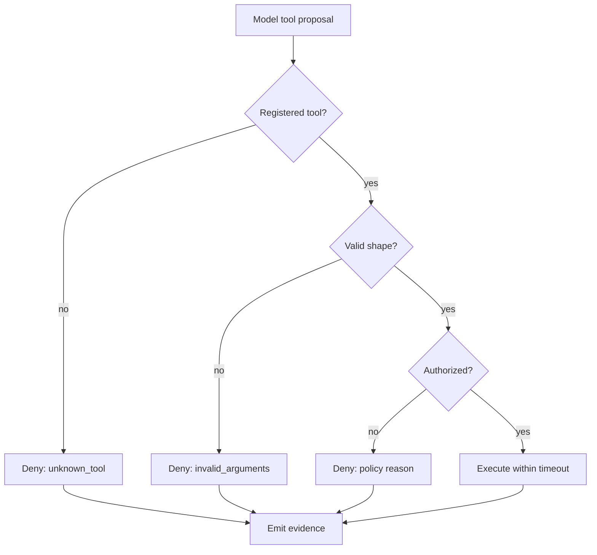

# Inside the Agentic Harness, Part 1: The Loop and the Proposal

Part 1 of [Inside the Agentic Harness](/content/agent-harness.md), the companion implementation track to [The Secure Agent Lifecycle, Part 3: Build](/content/agent-lifecycle-03-build.md). This part builds the explicit loop and establishes the central invariant: a model-generated tool call is a *proposal*, not an instruction. Code — not the model — decides whether it becomes an action.

> **Rendering note.** Diagrams are provided in both a Mermaid block and an ASCII block. Where they disagree, the ASCII form is authoritative.

> The model proposes; deterministic code disposes.

All code excerpts are from the companion repository at [`engineering-change-agent/`](/engineering-change-agent/README.md), and every allowed/denied result shown is captured from its passing tests.

## The problem: a model that can call tools

The moment a model can call tools, it can ask your system to *do* things: read a record, hit an API, change a resource. A naïve harness treats that request as a command — it runs whatever tool name comes back, with whatever arguments, and trusts that the model's instructions kept it in bounds. That is the failure mode this series is built to avoid. Instructions are not a control; a jailbroken or simply mistaken model will happily emit a call your system should never execute.

The alternative is a loop that treats every model output as an untrusted proposal and runs it through a fixed sequence of deterministic checks before anything happens.

## The request flow

Each turn moves the proposal through resolution, structural validation, authorization, and only then execution — each stage gating the next.

```text
model proposes
   → resolve tool from the registry   (unknown → fail closed)
   → validate argument shape (Pydantic) (malformed → invalid_arguments)
   → authorize (policy)                 (denied → stop, no execution)
   → execute within a timeout           (timeout/error → normalized failure)
   → emit content-minimizing evidence
   → append a correlated tool result
   → continue or finish
```



## Pattern: model output is a proposal — and schema validation is not authorization

The clearest way to see that validation and authorization are different questions is to watch a *well-formed* request get denied. In the harness, the argument schema and the authorization policy are separate steps on purpose.

The argument schema establishes shape only:

```python
class DeploymentStatusArguments(BaseModel):
    model_config = ConfigDict(extra="forbid")

    application: str = Field(min_length=1)
    environment: Environment
    deployment_id: str = Field(min_length=1)
```

`Environment` deliberately includes `production` as a *structurally valid* value — the model may legitimately name it. So a request to read production **passes** the schema. Whether it is *allowed* is a separate, deterministic decision made by policy and, independently, by the tool itself:

```python
# Structural validation — establishes shape, not permission.
arguments = tool.arguments_model.model_validate(raw_arguments)

# Authorization — a separate deterministic decision.
decision = self._policy.authorize(
    tool_name=name, arguments=arguments, context=self._context
)
```

Pydantic can establish that fields are present, typed, and free of unexpected keys. It cannot establish that the caller is authorized, that this agent may invoke the tool, or that production is permitted. Conflating the two — letting "well-formed" quietly mean "allowed" — is exactly the mistake that lets a valid-looking request reach data it should never touch.

**Allowed** (a valid `test` request runs):

```text
ALLOWED test -> {"outcome":"success","data":{"deployment_id":"DEP-1003",
"environment":"test","tests_passed":true, ...}}
```

**Denied** (a structurally valid `production` request is refused):

```text
DENIED prod  -> {"outcome":"denied","reason":"production_environment_prohibited"}
```

The `production` request parsed cleanly and was still refused. Validation is not authorization.

## Pattern: tool registries are allowlists

The harness never resolves a tool by importing or calling whatever name the model returns. It looks the name up in an explicit registry and fails closed on a miss:

```python
def resolve(self, name: str) -> RegisteredTool | None:
    # Unknown names return None. No dynamic import of a model-supplied name.
    return self._tools.get(name)
```

A hallucinated or malicious name — `launch_missiles`, `os.system` — resolves to `None`, and the loop turns that into a denial without executing anything:

```text
tool_authorization -> decision "denied", reason "unknown_tool", outcome "not_executed"
```

The same registry is the single source of the tool schemas advertised to the model, generated from the very Pydantic model used for validation — so what the model is told it may send cannot drift from what the harness actually enforces. (One practical note discovered while building this: Pydantic copies class and field docstrings into the generated schema's `description` fields. Advertising those verbatim would leak developer commentary — including how enforcement works — into the prompt, so the harness strips them and sends structure only.)

## Pattern: production is denied twice

Authorization is a deterministic decision about application-derived context, not about the model's words:

```python
def authorize(self, *, tool_name, arguments, context) -> Decision:
    environment = arguments.environment
    # Independent second denial of production; the tool denies it too.
    if environment is Environment.PRODUCTION:
        return Decision.deny(ReasonCode.PRODUCTION_ENVIRONMENT_PROHIBITED)
    if environment not in self._allowed_environments:
        return Decision.deny(ReasonCode.ENVIRONMENT_NOT_PERMITTED)
    return Decision.allow()
```

Production is refused by the policy layer **and**, independently, by the tool itself — the same stable reason code from two enforcement points. Remove either layer and production is still blocked:

```text
DENIED TWICE -> policy.reason = production_environment_prohibited
                | tool.reason = production_environment_prohibited
```

That redundancy is the security property, not an accident. Each layer must hold on its own so that a bug or a future change in one cannot silently expose production data. Notice too that authorization reads only the validated arguments and the application-derived `ExecutionContext` (caller, agent, purpose) — never the model's free-text instructions. There is no sentence the model can produce that flips this decision.

## Limitation and what Part 1 defers

Stage 1A authorizes on environment; caller, tenant, approval, and resource-ownership rules are later stages. Production remains a structurally valid value the model may name — denial is enforced, not hidden. And this part has only covered how a *single* proposal is resolved, validated, and authorized. The loop around it — how the conversation state stays a correct execution protocol, how execution is bounded and its failures normalized, and how evidence is captured without becoming a liability — is [Part 2](/content/agent-harness-02-governing-execution.md).

## Where to go next

- [Part 2 — Governing Execution, Evidence, and the Conversation Protocol](/content/agent-harness-02-governing-execution.md)
- [Inside the Agentic Harness](/content/agent-harness.md) — series landing page.
- [The Secure Agent Lifecycle, Part 3: Build](/content/agent-lifecycle-03-build.md) — where the harness fits in the lifecycle.
- [Microsoft-Native Enforcement for Agent Tool Use and Side Effects](/content/agent-security.md) — the tool-proposal and resource-authorization boundaries this implements.
