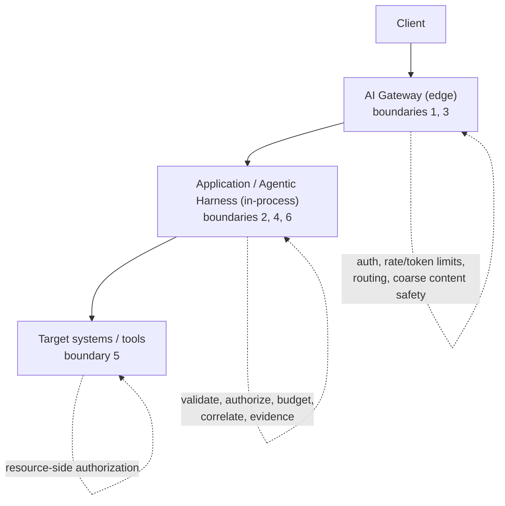

# Inside the Agentic Harness, Part 3: The Harness and the AI Gateway — Layered Enforcement

Part 3 of [Inside the Agentic Harness](/content/agent-harness.md). Parts [1](/content/agent-harness-01-explicit-loop.md) and [2](/content/agent-harness-02-governing-execution.md) built the harness in code. This part steps back to architecture: where an **AI gateway** sits relative to the harness, what each layer can and cannot enforce, and why they are complementary rather than competing. There is no new code here — it references what the earlier parts built.

> **Rendering note.** Diagrams are provided in both a Mermaid block and an ASCII block. Where they disagree, the ASCII form is authoritative.

> An AI gateway governs *traffic to the model*. The harness governs *what the agent is allowed to do*. They enforce different boundaries, and a mature system needs both.

## The question this answers

An AI gateway is one of the first things a platform team puts in front of model traffic, and for good reason: it centralizes authentication and key management, enforces rate and token limits, routes and fails over across model deployments, caches, and applies coarse content safety. Having done that, the natural question is: *"we put a gateway in front — are we covered?"*

For the risks a gateway owns, yes. For the risk that defines an *agent* — that a model can propose an action against a real system — no. That decision lives one layer deeper, and no gateway can make it for you. This part explains why, in terms of the [six control-plane boundaries](/content/pattern.md).

## Two layers, two different jobs

The gateway sits at the **edge**, in front of the model provider. The harness sits **in-process**, wrapped around the model-and-tool loop. They see different things and therefore enforce different things.

```text
Client
  |
  v
+-------------------------------------------------+
| AI GATEWAY  (edge, in front of the model)       |   boundaries 1, 3
|  - authentication / credential management       |
|  - admission, rate limits, token quotas         |
|  - routing / failover / semantic caching        |
|  - coarse content safety on prompt & completion |
+-------------------------------------------------+
  |  (model request / response)
  v
+-------------------------------------------------+
| APPLICATION / AGENTIC HARNESS  (in-process)     |   boundaries 2, 4, 6
|  - conversation state + tool-call correlation   |
|  - validate proposal shape                      |
|  - deterministic authorization (policy)         |
|  - budgets, timeouts, normalized failures       |
|  - content-minimizing evidence                  |
+-------------------------------------------------+
  |  (authorized tool call)
  v
+-------------------------------------------------+
| TARGET SYSTEMS / TOOLS                          |   boundary 5
|  - enforce their own contract + authorization   |
+-------------------------------------------------+
```



The gateway's vantage point is a **request to the model**. The harness's vantage point is a **turn in a governed conversation**: it holds the message history, the assistant's tool proposal, the validated arguments, the caller's identity and approvals, and the tool's contract. Those are exactly the inputs an authorization decision about a *tool call* requires — and they exist only in the application tier.

## The dimensions that distinguish them

| Dimension | AI Gateway | Agentic Harness (application tier) |
|---|---|---|
| Position in stack | Edge / network, in front of the model provider | In-process, around the model-and-tool loop |
| Primary scope | Traffic *to and from the model* | The agent's *decisions and actions* |
| What it enforces | Admission, credential management, rate/token limits, quotas, routing, caching, coarse content safety | Proposal validation, deterministic authorization, tool allowlist, execution budgets, target contracts |
| Granularity | Per request / per token / per key | Per tool proposal, per argument, per caller |
| State knowledge | Largely stateless per request | Full conversation state and tool-call correlation |
| Tool handling | Passes tool calls through; does not interpret or authorize them | Resolves, validates, authorizes, and executes each proposal |
| Identity awareness | Caller/app key; possibly token claims | Caller **and** agent **and** purpose **and** held approvals (`ExecutionContext`) |
| Business context | None — it does not know what a tool *means* | Owns it — environment rules, approvals, resource ownership |
| Observability | Cross-deployment request, latency, cost, token, and safety signals | Decision-level evidence: reason codes, allow/deny, per-proposal outcomes |
| Where policy lives | Gateway configuration and policies | Application code (`policy.py`, tool contracts) |
| Failure mode if missing | Cost blowout, credential sprawl, no rate protection, no org-wide safety net | Unauthorized tool calls, no per-action control, no evidence, no target constraints |

## What a gateway structurally cannot enforce

This is the crux, and it is not a maturity gap that a better gateway closes — it is a *position* gap. To decide whether a specific tool call is allowed, you need four things:

1. **The conversation state** — which proposal this is, correlated by `tool_call_id`.
2. **The validated arguments** — the concrete `environment`, `application`, and `deployment_id`, parsed and shape-checked.
3. **The caller's authorization context** — identity, purpose, and any human approvals held (`ExecutionContext`).
4. **The tool's own contract** — what the tool is even allowed to do.

A gateway at the edge holds none of these as first-class inputs. It sees a model request and a model response; it does not hold the application's notion of "this tool, these arguments, this caller, this policy." So the decision *"deny this call because it targets production"* cannot be made there. It is made in the harness, exactly as Part 1 showed — and, for defense in depth, again by the target tool.

## Defense in depth: how they compose

The right mental model is not *gateway or harness* but *gateway then harness then target*, each owning the boundaries it is positioned to see. Mapped to the [six control-plane boundaries](/content/pattern.md):

| Boundary | Primary owner | Notes |
|---|---|---|
| 1. Admission | AI Gateway | Who/what may reach the model at all. |
| 2. Retrieval authorization | Application / Harness | Identity-derived scoping of retrieved context. |
| 3. Model invocation | AI Gateway | Token limits, quotas, coarse content safety on prompt/completion. |
| 4. Tool proposal | Application / Harness | Validate, authorize, and bound each proposal. |
| 5. Resource authorization | Target system (+ harness) | The tool/API enforces its own contract; the harness constrains what it can be asked. |
| 6. Side effect / approval | Application / Harness | Human approval and controlled execution of consequential actions. |

Each layer is load-bearing on its own for its boundaries, and the important controls are enforced more than once. Production denial is the canonical example: the harness policy denies it, and the target tool denies it independently — the "denied twice" property from [Part 1](/content/agent-harness-01-explicit-loop.md). A gateway adds a third, coarser layer at the edge (it can refuse traffic, throttle, and screen content), but it does not — and cannot — make the per-tool authorization call.

## A request that passes the gateway and is denied by the harness

Take the production case from the harness tests: *"Is DEP-9 ready in prod?"*

- **At the gateway:** nothing is wrong. The request is within rate and token limits, the caller's key is valid, and the text trips no content-safety rule. It is forwarded. A gateway has no basis to object — "production" is just a word in a prompt to it.
- **In the harness:** the model proposes `get_deployment_status(environment="production", ...)`. The proposal is well-formed, so it passes structural validation — and is then refused by policy:

```text
tool_authorization -> decision "denied", reason "production_environment_prohibited",
                      target_environment "production", outcome "not_executed"
```

- **At the target:** even if policy were misconfigured, the tool refuses production on its own.

The gateway was working correctly the entire time. The decision that mattered simply wasn't its decision to make.

## When each is the right tool

Neither replaces the other; they solve different problems.

**Reach for a gateway when the concern is traffic to the model:** centralized credential management, org-wide rate and cost governance, routing and failover across deployments, semantic caching, and a coarse, uniform content-safety net applied everywhere. These are real, valuable controls, and doing them per-application is a mistake — they belong at a shared edge.

**Reach for the harness (application tier) when the concern is what the agent does:** authorizing a specific tool call, enforcing business rules and environment constraints, requiring human approval for consequential actions, bounding an autonomous loop, and producing decision-level evidence. These require conversation state, validated arguments, and caller context that only exist in-process.

A gateway with no application-tier authorization leaves the defining agent risk unmanaged. An application tier with no gateway re-implements admission, cost, and credential controls badly and inconsistently. Mature systems run both, plus target-side authorization — three layers, each owning what it is positioned to see.

## Takeaway

> A gateway governs traffic to the model; the harness governs the agent's actions; the target governs its own resources. The gateway is necessary and not sufficient — the authorization of a tool call is structurally an application-tier decision, because only the application holds the conversation state, the validated arguments, the caller's approvals, and the tool's contract.

## Where to go next

- [Part 1 — The Loop and the Proposal](/content/agent-harness-01-explicit-loop.md) — where the tool-authorization decision is actually made.
- [Part 2 — Governing Execution, Evidence, and the Conversation Protocol](/content/agent-harness-02-governing-execution.md)
- [Agent Runtime, Agentic Harness, and Application Enforcement](/content/agent-runtime-and-enforcement.md) — the deployment shapes and the runtime/harness/enforcement distinction.
- [The AI Control-Plane Pattern](/content/pattern.md) — the six-boundary model this part maps each layer onto.
