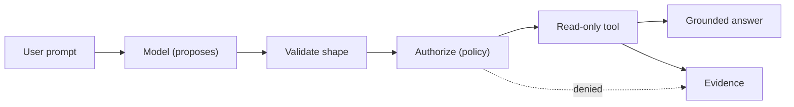

# Inside the Agentic Harness: From Agent Intent to Governed Action

> The harness coordinates the model and tool loop; deterministic application logic retains authorization. The model proposes; code validates and authorizes.

This is the companion implementation track to [The Secure Agent Lifecycle, Part 3: Build](/content/agent-lifecycle-03-build.md). The lifecycle series explains *where* an agentic harness sits and *when* a workflow justifies one, without turning into a file-by-file build. This series builds the harness — a small, tested, reproducible one — and uses its real code and captured test evidence to explain the design and security decisions behind it.

> **Rendering note.** Diagrams are provided in both a Mermaid block and an ASCII block. Where they disagree, the ASCII form is authoritative.

## What this is, and is not

This is a **teaching reference**, built with Microsoft-native model and identity services, using synthetic data only. It is deliberately not production-ready and makes no such claim. Every behavior described here is backed by real code and passing tests in the companion repository; nothing is asserted that the repository does not prove.

The complete implementation lives at [`engineering-change-agent/`](/engineering-change-agent/README.md) in this site's repository. The articles include only the excerpts needed to explain a decision — the repository is the full, runnable source.

## Who this is for

Security architects, AI and cloud architects, engineers building agents, security practitioners, and technical leaders who want to see — concretely, in code — which responsibilities a harness owns, which stay in deterministic application logic, and where the trust boundaries actually fall.

## The running scenario

The series continues the lifecycle's **EngBot** scenario at Stage 1 (Build): an engineering change-readiness assistant. A user asks whether a synthetic deployment is ready for a change request. The model may propose a single read-only tool, `get_deployment_status`. The harness validates the proposal, authorizes it, runs it against bundled synthetic data within a timeout, and returns a grounded answer — emitting content-minimizing evidence at each decision point.

```text
User asks about a synthetic test deployment
    → model proposes get_deployment_status
    → harness validates the proposal (shape)
    → deterministic policy authorizes or denies it
    → read-only tool returns structured synthetic data
    → model produces a grounded readiness assessment
    → harness emits content-minimizing evidence
```



## The two stages

The build is deliberately split so the security boundaries stay visible before a framework is introduced.

| Stage | What it does | Status |
|---|---|---|
| **1A — Explicit harness** | Build the model/tool loop by hand so every responsibility — context, invocation, proposal parsing, correlation, validation, authorization, execution limits, evidence — is inspectable. | Implemented and tested |
| **1B — Framework mapping** | Reimplement the same behavioral and security contract on Microsoft Agent Framework, and document which mechanics the framework absorbs and which security duties stay application-owned. | Planned |

Building the explicit version first is what lets the later comparison be honest: you cannot say what a framework takes over until you have owned the loop yourself.

## The design stance

Three principles run through the whole series:

- **Instructions influence behavior; they are not authorization.** A system prompt steers the model; code enforces policy.
- **A model-generated tool call is an untrusted proposal.** It has no authority until deterministic validation and authorization succeed.
- **Tool output is untrusted data, not instructions.** Returned content cannot override policy, and failures are normalized before they re-enter the model's context.

## Available now

- **Part 1 — [The Loop and the Proposal](/content/agent-harness-01-explicit-loop.md):** the explicit request flow, why model output is a proposal, why schema validation is not authorization, tool registries as allowlists, denying production twice, and where further guardrails belong (with a human-approval example).
- **Part 2 — [Governing Execution, Evidence, and the Conversation Protocol](/content/agent-harness-02-governing-execution.md):** `tool_call_id` correlation, execution budgets and timeouts, normalized failures, content-minimizing evidence, and the application-owned, keyless model target.
- **Part 3 — [The Harness and the AI Gateway: Layered Enforcement](/content/agent-harness-03-gateway-and-harness.md):** an architecture interlude — where an AI gateway sits relative to the harness, what each layer can and cannot enforce, how they compose as defense in depth across the six control-plane boundaries, and when each is the right tool.

Stage 1B (Microsoft Agent Framework mapping) is planned and will be added here when complete.

## Where to go next

- [The Secure Agent Lifecycle, Part 3: Build](/content/agent-lifecycle-03-build.md) — where a harness fits, and when a workflow justifies one.
- [Agent Runtime, Agentic Harness, and Application Enforcement](/content/agent-runtime-and-enforcement.md) — the deployment shapes and the harness/enforcement distinction this series implements.
- [The AI Control-Plane Pattern](/content/pattern.md) — the six-boundary reference the enforcement here maps back to.
