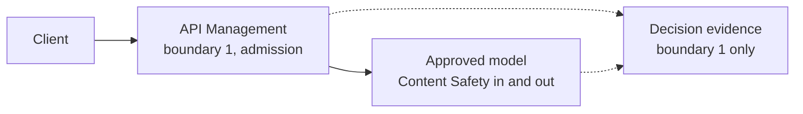

# The Secure Agent Lifecycle, Part 1: Define — Scoping the Engineering Knowledge and Change Agent

Part 1 of [The Secure Agent Lifecycle](/content/agent-lifecycle.md). This article covers the **Define** stage and Stage 1 of the series' running scenario, the **Engineering Knowledge and Change Agent** — a fictional reference implementation, not a real deployment.

> **Rendering note.** Diagrams are provided in both a Mermaid block and an ASCII block. Where they disagree, the ASCII form is authoritative.

> The RFCs describe the system by security boundary. The lifecycle series describes it in the order a team would actually build and operate it.

## The scenario, in full

The Engineering Knowledge and Change Agent grows in five stages across this series: general Q&A with no internal access, authorized document retrieval, read-only tool calls against engineering systems, proposing changes to tickets or configuration, and finally performing approved changes under human oversight. This article is about the first of those five stages, and about one decision that has to happen before any of them: what is this agent actually for, and what does it get to touch on day one.

## Stage 1: general questions, zero internal access

At this stage, the agent answers general engineering questions — "what's a good pattern for retrying a flaky HTTP call," "explain the tradeoffs of optimistic locking" — using an approved model's own knowledge. It has no retrieval, no tools, and no connection to any internal system.

Walking through the same eight questions every stage in this series asks:

- **What new capability was introduced?** Conversational Q&A over an approved model deployment. Nothing else.
- **What new authority did the agent receive?** None. This is the point of Stage 1 — authority is granted deliberately later, not assumed by default because the agent exists.
- **Which identity is acting?** A Microsoft Entra Agent ID agent identity, created now even though it holds no permissions yet (more on why below), calling through a hosting workload's own managed identity.
- **Which data is exposed?** None beyond the model's own training and whatever system prompt the team wrote. No internal documents, no system access.
- **Which policy enforcement point is needed?** Boundary 1 (agent admission) still applies. "No data access" is not the same claim as "no admission control" — every request still needs a validated identity and a purpose before it reaches the model.
- **What evidence must be produced?** A decision event at boundary 1 for every request, per the [Observability RFC](/content/observability.md)'s schema, even though boundaries 2 through 6 never fire at this stage.
- **What can fail?** Prompt injection aimed at extracting the system prompt or producing unsafe content; a user treating a confident-sounding answer as authoritative internal guidance when it's actually generic; low-value cost or abuse from unrelated use.
- **What residual risk remains?** Content-safety and reputational risk, specifically. A Q&A-only agent with no data access is not a zero-risk agent — it's a smaller risk surface, not an absent one.

## Why identity comes before capability

It's tempting to skip identity work at Stage 1 — there's nothing valuable to protect yet, so why set up an [Entra Agent ID](/content/control-plane.md) blueprint and an individual agent identity for a system that just answers generic questions?

Because retrofitting identity after capability is exactly backwards, and it's a common failure mode. An agent identity blueprint, a sponsor, and a named agent identity cost almost nothing to establish at Stage 1 and mean every later stage — retrieval scope at Stage 2, tool grants at Stage 3, RBAC roles at Stages 4 and 5 — attaches to an identity that already exists, has an owner, and already has an audit trail, instead of being bolted onto whatever identity happened to be convenient when the team needed to ship the next capability under deadline pressure.

> An agent is not merely the workload hosting it.

The hosting workload's managed identity secures the container, function, or App Service running the code. It is not the agent. The distinction doesn't matter yet at Stage 1 — there's nothing to attribute an action to. It matters enormously by Stage 4, when the agent proposes its first write. Building the identity now is cheap; building it retroactively under a live incident is not. [RFC-014 §5](/content/control-plane.md) covers this distinction and the full blueprint/agent-identity/sponsor model in depth; this article isn't repeating that, just explaining why it starts on day one instead of day sixty.

## Where this stage actually runs

None of this requires much infrastructure, and it's worth being explicit about what's native, what's configuration, what's custom, and what still needs validation before treating any of it as settled:

| Piece | What it is | Notes |
|---|---|---|
| Model | Azure OpenAI or an applicable Microsoft Foundry model | Microsoft-managed capability. Deployment choice (region, model version) is configuration, not code. |
| Admission (boundary 1) | Microsoft Entra ID token validation, at Azure API Management or in application code | Native capability; how it's wired is configuration. |
| Content safeguards | Azure AI Content Safety, including Prompt Shields | A probabilistic signal, not an authorization decision — same caution [RFC-014 §9](/content/control-plane.md) makes. |
| Agent identity | Microsoft Entra Agent ID blueprint and agent identity | Native capability. Creating it for a Stage 1 agent is an architectural choice, not a requirement Microsoft enforces. |
| Harness | Microsoft Agent Framework, a Foundry hosted agent, or a plain backend that calls the model directly | Illustrative implementation options. A single-turn Q&A agent may not need a harness at all — don't add orchestration machinery to match a diagram if a direct model call does the job. |
| Telemetry | Application Insights and Log Analytics | Native capability; the event schema itself is this site's [Observability RFC](/content/observability.md), not a Microsoft product. |

Don't force a Microsoft product into a role a single line of application code already fills. A harness exists to manage a multi-step execution loop with memory, retries, and tool dispatch. Stage 1 has none of those — a direct call to an approved model deployment, behind an admission check, is the complete architecture. The harness earns its place starting at Stage 2, when retrieval coordination becomes a real problem.

## What Define has to produce before Identify starts

Three things need to exist before the series moves on to the Identify stage:

1. **A stated purpose and scope**, owned by whoever is accountable for the agent — this agent answers general engineering questions, and nothing broader, until a deliberate decision changes that.
2. **An initial risk tier**, assigned by governance rather than inferred by the team building it, per the same principle [pattern.md](/content/pattern.md) states for risk classification generally. Pre-deployment adversarial testing — Microsoft Foundry's AI Red Teaming Agent, covered in [RFC-015 §9](/content/agent-security.md) — is worth running even on a Stage 1 Q&A agent, since jailbreak and harmful-content risk exist independent of data access.
3. **A named agent identity and sponsor**, holding no permissions yet, so every later grant has something real to attach to.

## Request flow at this stage

**ASCII (authoritative):**

```
   Client ──► API Management ──► Approved model
              (boundary 1:         (Content Safety
               validate token,      checks input
               assign purpose)      and output)
                    │                     │
                    └── decision evidence ┘
                          (boundary 1 only)
```

**Mermaid (renders for humans):**



## What's next

Part 2, **Identify**, picks up the agent identity established here and goes deep on the blueprint, sponsor, and workload-identity model before Stage 2 introduces the first real data access. It's outlined but not yet published — see the [series landing page](/content/agent-lifecycle.md) for the full six-part map.

## Where to go next

- [The Secure Agent Lifecycle](/content/agent-lifecycle.md) — series landing page.
- [RFC-014 §5](/content/control-plane.md) — the full Entra Agent ID identity model this article previews.
- [Agent Runtime, Agentic Harness, and Application Enforcement](/content/agent-runtime-and-enforcement.md) — why a harness is a choice, not a requirement.
- [RFC-016 GenAI Observability](/content/observability.md) — the decision-evidence schema referenced above.
