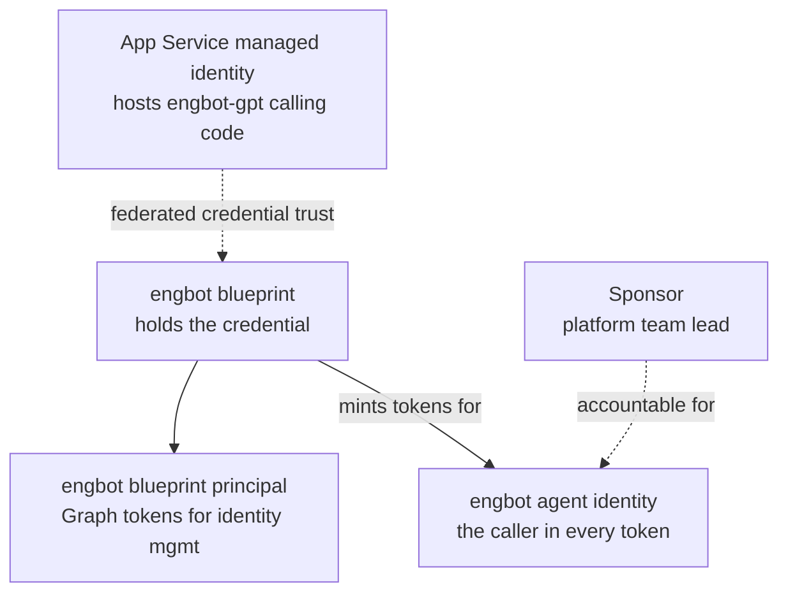

# The Secure Agent Lifecycle, Part 2: Identify — The Agent Identity Model

Part 2 of [The Secure Agent Lifecycle](/content/agent-lifecycle.md). [Part 1](/content/agent-lifecycle-01-define.md) established that EngBot gets a Microsoft Entra Agent ID identity before it gets any capability. This article covers what that identity actually is, who's accountable for it, and how it's governed — the **Identify** stage, still inside Stage 1 of the running scenario, before Stage 2 introduces real data access.

> **Rendering note.** Diagrams are provided in both a Mermaid block and an ASCII block. Where they disagree, the ASCII form is authoritative.

> An agent is not merely the workload hosting it.

## Why "which identity did this" has three different answers

A security review of almost any agent incident eventually asks "which identity did this?" For EngBot, that question has three legitimate, non-interchangeable answers, and a review that collapses them into one misses the point of having separate identities at all:

- **User identity** — the human on whose behalf an interactive agent may act. EngBot doesn't have one of these yet; it's autonomous through Stage 2 (more below).
- **Agent identity** — Microsoft Entra Agent ID's representation of EngBot itself: a distinct, attributable principal, independent of whatever infrastructure happens to run it.
- **Workload identity** — the managed identity of the Azure resource actually executing EngBot's code. It secures the host. It is not EngBot.

[RFC-014 §5](/content/control-plane.md) covers the full blueprint, blueprint principal, individual agent identity, and sponsor model this distinction rests on — this article isn't re-deriving that table, just applying it to one concrete identity.

## The three identities, applied to EngBot

### The concept

An Entra Agent ID agent identity is created from a **blueprint** — a template application object that holds the credential used to mint tokens on the identity's behalf, since an individual agent identity can't hold its own credentials. The blueprint gets its own auto-created **blueprint principal**, a service principal that lets the blueprint obtain Graph tokens to manage agent identities. None of this is the workload's managed identity, which exists purely to let the blueprint authenticate itself without storing a secret.

### Applied to EngBot

EngBot's blueprint is named `engbot`. It holds a federated identity credential that trusts the managed identity of the Azure App Service running `engbot-gpt`'s calling code — the same App Service Article 1 described, now doing double duty as the blueprint's trust source. The blueprint's auto-created blueprint principal exists purely so `engbot` can call Microsoft Graph to manage its own identity. The individual agent identity — also referred to as `engbot` day to day, though it's a distinct object from the blueprint — is what actually shows up as the caller in every token EngBot's requests carry, and in every audit log entry. When Article 1's admission check ran at Stage 1, this is the identity it validated.

| Piece | What it is | Notes |
|---|---|---|
| `engbot` blueprint | Microsoft-managed object type, application-defined instance | Native capability; the specific blueprint is this reference's own choice. |
| Federated identity credential | Native mechanism, trusting the App Service's managed identity | One of a few supported blueprint credential options — a client secret would also work, and is more common for local development. |
| `engbot` blueprint principal | Auto-created by Entra ID when the blueprint is instantiated | Native capability; no application code creates this directly. |
| `engbot` individual agent identity | Created from the blueprint, RFC-014 §5 | Native capability. This is the principal RBAC roles and per-request policy decisions attach to, starting at Stage 4. |

## Sponsor and lifecycle

### The concept

Every agent identity needs a sponsor — a human (or, for the identity itself, a human or group) accountable for its purpose and lifecycle. A sponsor isn't a technical role; it's who a security team contacts during an incident, and who decides whether an agent identity should keep existing. If a sponsor leaves the organization, sponsorship transfers automatically to their manager rather than lapsing into nothing.

### Applied to EngBot

EngBot's sponsor, in this reference, is the platform team's engineering lead — the person accountable for what EngBot is allowed to do, not the person who wrote its code. If that person leaves before Stage 2 ships, sponsorship transfers to their manager automatically; nobody has to remember to reassign it, and EngBot's identity doesn't go orphaned mid-buildout. What "orphaned" would actually mean is worth stating plainly: some governance actions — granting an access package, for instance — may depend on a sponsor being reachable, so a sponsor-less identity isn't just an administrative gap, it can stall the next stage's rollout. Detailed lifecycle remediation — blocking, reassigning, or retiring an agent identity through Microsoft Agent 365's registry actions — belongs to [RFC-015](/content/agent-security.md) and to Article 6 of this series (Observe and Operate), not here; this article only establishes that the sponsor exists and why.

## Autonomous today, delegated later

### The concept

Microsoft Entra Agent ID supports two interaction modes. In **application-only access**, the agent identity acts under its own authority — it's the token subject, using a client-credentials flow. In **delegated access**, the agent acts on behalf of a signed-in user — the user is the token subject, the agent identity is the actor. A policy decision has to know which mode applies, because "who is accountable for this action" is a different answer in each.

### Applied to EngBot

Through Stage 2, EngBot is entirely application-only: there's no signed-in user in the loop, just an engineer typing a question and EngBot answering under its own identity. That's a deliberate, current-state fact, not a permanent architectural constraint. If a later stage needed to attribute a proposed change to the specific engineer who asked for it — rather than to EngBot generically — that would mean adding delegated access for that capability, which is a design decision this series defers to whichever future stage actually needs it, not one Identify has to solve pre-emptively.

## How the pieces relate

**ASCII (authoritative):**

```
   App Service (engbot-gpt host)
   managed identity
          │
          │ federated identity credential (trust source)
          ▼
   engbot blueprint ──────► engbot blueprint principal
   (holds the credential)    (Graph tokens for identity mgmt)
          │
          │ mints tokens on behalf of
          ▼
   engbot individual agent identity ◄──── sponsor
   (the caller in every token           (platform team lead,
    and audit log entry)                 transfers to manager
                                          if they leave)
```

**Mermaid (renders for humans):**



## What Identify has to produce before Build starts

Two things need to be settled before Article 3 picks a harness:

1. **A confirmed sponsor**, not just a created identity — someone who has actually agreed to be accountable for `engbot`, since some later governance actions depend on a sponsor being reachable.
2. **An explicit statement that EngBot is application-only for now** — so Article 3's harness choice doesn't have to account for delegated-access plumbing it doesn't yet need, and so a future stage that does need it can point back here as the moment the assumption was made, not discover it as an accident of how the code happened to be written.

## What's next

Part 3, **Build**, picks up `engbot`'s now-fully-identified agent identity and decides what actually runs the execution loop — Microsoft Agent Framework, a Foundry hosted agent, or the same direct backend call Article 1 already used. It's outlined but not yet published — see the [series landing page](/content/agent-lifecycle.md) for the full six-part map.

## Where to go next

- [The Secure Agent Lifecycle](/content/agent-lifecycle.md) — series landing page.
- [Part 1 — Define](/content/agent-lifecycle-01-define.md) — where `engbot`'s identity was first established.
- [RFC-014 §5](/content/control-plane.md) — the full Entra Agent ID identity model this article applies.
- [RFC-015 Agent Security](/content/agent-security.md) — tool grants and lifecycle remediation this identity will need starting at Stage 3.
