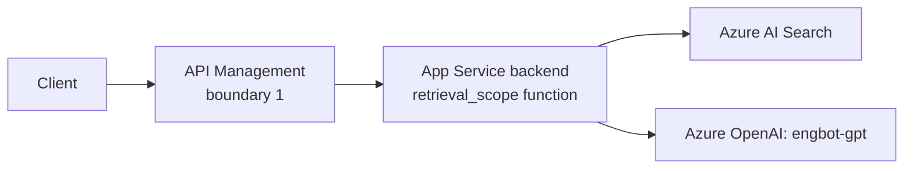

# The Secure Agent Lifecycle, Part 3: Build — Choosing and Building the Harness

Part 3 of [The Secure Agent Lifecycle](/content/agent-lifecycle.md). [Part 2](/content/agent-lifecycle-02-identify.md) settled `engbot`'s identity. This article covers the **Build** stage: what actually runs EngBot's execution, ahead of Stage 2 adding retrieval. It maps to the [Agent Runtime, Agentic Harness, and Application Enforcement](/content/agent-runtime-and-enforcement.md) explainer, not a new RFC boundary — this is an infrastructure decision, not a security boundary the RFCs define.

> **Rendering note.** Diagrams are provided in both a Mermaid block and an ASCII block. Where they disagree, the ASCII form is authoritative.

> The harness runs the workflow. The application enforcement tier constrains what that workflow is allowed to become.

## The three shapes, evaluated for EngBot

### The concept

[Agent Runtime, Agentic Harness, and Application Enforcement](/content/agent-runtime-and-enforcement.md) names three valid deployment shapes: a custom RAG application (client → gateway → application backend → retrieval → model), a Microsoft Foundry hosted agent (client → gateway → hosted agent → knowledge, models, tools), and a simple gateway-managed model application (client → gateway → model, nothing else). None is more "correct" in the abstract — the right shape depends on what the workflow actually needs.

### Applied to EngBot

Stage 1 already ruled out the third shape: a plain gateway-managed model call. Stage 2 adds retrieval, which rules out a *pure* gateway-managed shape entirely — something has to derive the retrieval scope and construct the model context, and API Management's policy language isn't the place for that. That narrows the real choice to two: extend the same App Service backend from Stage 1 into a custom RAG application (Shape A), or move EngBot into a Microsoft Foundry hosted agent (Shape B) now, ahead of need.

| Shape | What it would mean for EngBot at Stage 2 | Verdict |
|---|---|---|
| Custom RAG application (extend the existing App Service backend) | Add a retrieval step to the same backend that already calls `engbot-gpt`. No new deployed component. | Sufficient for Stage 2. |
| Foundry hosted agent | Move EngBot's code into a hosted agent runtime, gaining built-in orchestration EngBot doesn't need yet. | Available, not required — evaluate again at Stage 3. |
| Gateway-managed model only | No component derives or enforces retrieval scope. | Ruled out — retrieval authorization has to live somewhere. |

## Why Stage 2 still doesn't need a harness

### The concept

A harness earns its place when a workflow is genuinely a multi-step loop: the system has to decide whether to call a tool, interpret the result, decide the next step, retry on failure, and remember state across those steps. Retrieval-augmented answering, on its own, isn't that. It's a linear pipeline: receive a question, retrieve authorized context, construct a request, call the model, return the answer. Adding orchestration machinery to a linear pipeline doesn't make it safer — it adds a component that has to be built, secured, and operated for no workflow benefit.

### Applied to EngBot

EngBot's Stage 2 pipeline is exactly that linear shape: receive the question, query Azure AI Search with a filter derived from `engbot`'s validated identity, construct the model context from what came back, call `engbot-gpt`, return the answer. There's no branching decision about whether to retrieve, no multi-step tool sequence, and — because each question is still independent, with no cross-turn memory requirement yet — no session state to manage either. The same App Service backend from Stage 1 gets one new function added to it. No new deployed component, and no harness.

## Where the new logic actually lives

Extending the backend doesn't mean bolting retrieval onto the model call with no structure. The responsibilities [RFC-014 §6](/content/control-plane.md) and the application-enforcement explainer describe still exist; they just live as a module in the same process instead of a separately deployed tier. For EngBot, that's a `retrieval_scope` function the request handler calls before it ever builds a model prompt: it resolves the caller's tenant and group claims from `engbot`'s validated token, builds the Azure AI Search filter from those claims — never from anything the request body supplied — and tags the returned chunks with their source before they're anywhere near the model's context window. [Article 4](/content/agent-lifecycle.md) covers what that function actually has to enforce; this article is only about where it lives.

## The trigger list: what would actually justify a harness

### The concept

Specific, concrete triggers justify introducing a harness — not "agents typically have one." The honest list: a genuine multi-step reasoning loop (the system decides what to do next based on what already happened), tool dispatch across more than one tool with retries and timeouts to manage, memory that has to persist across turns or across a session, and human-interaction checkpoints mid-workflow. Absent those, a harness is unused machinery.

### Applied to EngBot

None of Stage 1 or Stage 2 needs any item on that list. Stage 3 changes that: EngBot gains its first tool call, which means a real decision — does answering this question require calling a tool, and if the tool call fails, what happens next. That's the first genuine loop EngBot has, and it's the point where this series revisits the harness question in earnest, not before.

## What can go wrong once a harness does show up

Whichever shape EngBot eventually adopts, one failure mode is worth stating now so it isn't relearned the hard way later: a harness that contains some enforcement code is not automatically fully enforced everywhere it matters. If Stage 3 or later moves EngBot into a harness that happens to include a retry wrapper or a logging callback, that's not the same thing as the harness enforcing retrieval scope or tool authorization. Each enforcement point has to be identified and verified directly, not assumed from the harness's proximity to the request.

## EngBot's architecture at the end of Build

**ASCII (authoritative):**

```
   Client ──► API Management ──► App Service backend
              (boundary 1)        │
                                  ├─ retrieval_scope()  ──► Azure AI Search
                                  │  (Stage 2, added here)
                                  └─ call engbot-gpt ────► Azure OpenAI

   No harness yet. Revisit at Stage 3 when tool dispatch
   introduces the first genuine multi-step loop.
```

**Mermaid (renders for humans):**



## What Build has to produce before Connect starts

Two things, both deliberately modest:

1. **A decision, recorded, not just implied by the code** — EngBot stays on the extended App Service backend for Stage 2, no harness, and the specific triggers (multi-step tool dispatch, cross-turn memory) that would change that decision.
2. **A named location for enforcement logic** — the `retrieval_scope` function described above, so Article 4 has somewhere concrete to attach the actual retrieval-authorization rules to, instead of leaving "where does this code live" as an open question in the middle of a security-focused article.

## What's next

Part 4, **Connect**, gives `retrieval_scope` its real content — the identity-derived Azure AI Search filter — and adds EngBot's first read-only tool, which is also where this series comes back to test whether Build's "no harness yet" decision still holds. It's outlined but not yet published — see the [series landing page](/content/agent-lifecycle.md) for the full six-part map.

## Where to go next

- [The Secure Agent Lifecycle](/content/agent-lifecycle.md) — series landing page.
- [Agent Runtime, Agentic Harness, and Application Enforcement](/content/agent-runtime-and-enforcement.md) — the three deployment shapes and the harness/enforcement distinction this article applies.
- [Part 2 — Identify](/content/agent-lifecycle-02-identify.md) — the identity `engbot`'s backend calls under.
- [RFC-014 §6](/content/control-plane.md) — the retrieval-authorization rules Part 4 attaches to `retrieval_scope`.
