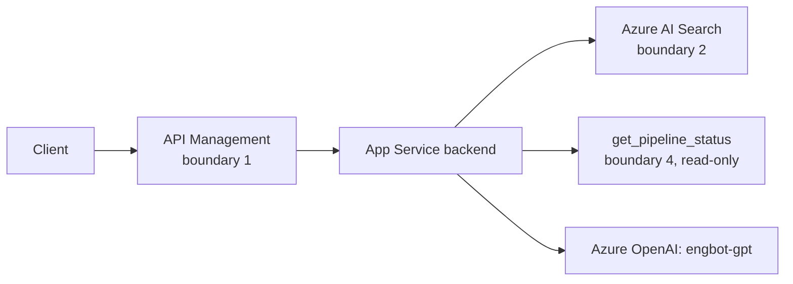

# The Secure Agent Lifecycle, Part 4: Connect — Retrieval and Read-Only Tools

Part 4 of [The Secure Agent Lifecycle](/content/agent-lifecycle.md). [Part 3](/content/agent-lifecycle-03-build.md) added a `retrieval_scope` function to EngBot's backend with no content yet, and concluded no harness was needed. This article gives that function its real content — Stage 2 of the running scenario — and adds EngBot's first tool at Stage 3. It maps to [RFC-014 §6](/content/control-plane.md) (retrieval authorization) and [RFC-015 §5](/content/agent-security.md) (tool proposal), applied specifically to a read-only tool.

> **Rendering note.** Diagrams are provided in both a Mermaid block and an ASCII block. Where they disagree, the ASCII form is authoritative.

## Stage 2: authorized retrieval

### The concept

Retrieval authorization runs on identity-derived filters, never on anything the request body supplied. A caller's validated token claims determine what it can retrieve; the query text determines what matches within that boundary, not what the boundary is. Retrieved content is data, not instructions — a model's system prompt has to treat it that way, because a document an agent retrieves is exactly the kind of place a prompt-injection payload gets planted.

### Applied to EngBot

`retrieval_scope` now does real work: it resolves `engbot`'s validated token claims, builds an Azure AI Search filter from the caller's group membership — never from a field the request supplied — queries the index, and tags each returned chunk with its source document before anything reaches `engbot-gpt`'s context. The system prompt EngBot constructs explicitly instructs the model to treat retrieved text as reference material, not as instructions to follow.

- **What new capability was introduced?** Retrieval from an Azure AI Search index of internal engineering runbooks and wiki pages.
- **What new authority did EngBot receive?** Read access to a specific, bounded document set — not "all internal documents," a named index scoped to what engineering-support Q&A actually needs.
- **Which identity is acting?** Still `engbot`, now holding a retrieval grant it didn't have at Stage 1.
- **Which data is exposed?** Whatever's in the scoped index, filtered further by the caller's group claims at query time.
- **Which policy enforcement point is needed?** Boundary 2 (retrieval authorization), enforced inside `retrieval_scope`.
- **What evidence must be produced?** A `retrieval_provenance` entry per the [Observability RFC](/content/observability.md)'s schema — which documents were retrieved, tagged, never the document text itself.
- **What can fail?** The filter is misapplied and returns documents outside the caller's actual authorization; retrieved content is treated as instructions instead of data, letting a planted instruction in a wiki page redirect EngBot's behavior.
- **What residual risk remains?** Embedding-inversion or cross-tenant-style leakage if the isolation tier chosen below turns out to be too permissive for what actually ends up in the index later.

## Which isolation tier fits EngBot

### The concept

[RFC-014 §6](/content/control-plane.md) compares three retrieval-isolation tiers — a shared index with security filters, a dedicated index per tenant, and a dedicated search service — and is explicit that none of them is universally correct. The right one depends on the actual risk classification of what's being retrieved, a governance decision, not a default.

### Applied to EngBot

EngBot's index holds internal engineering runbooks and wiki content — useful, but not the kind of material a shared-index-with-filters approach is a poor fit for. A shared index, with the filter keyed on Entra group membership rather than a tenant boundary, is the reasonable default here: many engineering teams read from the same index, and the filter — not physical separation — is what keeps a team's more sensitive runbooks out of a caller who isn't in that group. If a future stage adds a genuinely sensitive category of document (say, security-incident postmortems), that's the moment to revisit whether that category belongs in a separate, more isolated index instead of a broader filter rule on the shared one.

## Stage 3: EngBot's first tool

### The concept

A tool proposal is the agent's stated intent to call a specific tool with specific arguments. [RFC-015 §5](/content/agent-security.md) requires two independent checks before it executes: does this specific agent identity have a grant for this specific tool, and do the proposal's arguments match an approved schema. Both checks apply whether the tool reads or writes — a read-only tool that isn't authorized is still an information-disclosure risk, not a harmless one.

### Applied to EngBot

EngBot's first tool is `get_pipeline_status`, a read-only call against the engineering team's build and deployment system. `engbot`'s agent identity is granted an access package for this specific tool — not for "engineering systems" broadly — and every proposed call is validated against a schema requiring a specific pipeline identifier before the tool is invoked.

- **What new capability was introduced?** A read-only tool call: look up whether a named pipeline's last run succeeded.
- **What new authority did EngBot receive?** Permission to call exactly one tool, scoped by an access package granted to `engbot`'s agent identity, not to the App Service hosting it.
- **Which identity is acting?** `engbot`, using the same identity Stage 2 already established — the tool grant attaches to it, per [RFC-014 §7](/content/control-plane.md)'s attribution principle.
- **Which data is exposed?** Pipeline status metadata. Nothing about the pipeline's contents, credentials, or configuration.
- **Which policy enforcement point is needed?** Boundary 4 (tool proposal): the grant check and the argument-schema validation, both before the call reaches the build system.
- **What evidence must be produced?** A `tool_provenance` entry — tool name, argument hash, target resource — per the Observability RFC's schema.
- **What can fail?** A proposal names a pipeline the caller has no reason to query; an argument arrives in an unexpected shape (a list where a single ID was expected) and gets forwarded anyway without validation.
- **What residual risk remains?** Information disclosure about which pipelines exist and their status, bounded by the same access package — not yet any risk of EngBot causing a side effect, because it can't yet.

## Why read-only still needs enforcement, and what it still doesn't

Boundary 4's grant check and argument validation apply to `get_pipeline_status` exactly as they would to a write-capable tool. What doesn't apply yet is boundary 6 (human approval) — there's no side effect here to approve. That changes at [Part 5](/content/agent-lifecycle.md), when EngBot proposes its first change instead of just looking something up. The risk profile at Stage 3 is disclosure, not action; conflating the two would either over-gate a harmless lookup or under-gate the write that comes next.

## EngBot's architecture at the end of Connect

**ASCII (authoritative):**

```
   Client ──► API Management ──► App Service backend
              (boundary 1)        │
                                  ├─ retrieval_scope()  ──► Azure AI Search
                                  │  (boundary 2, filtered
                                  │   by engbot's claims)
                                  ├─ get_pipeline_status() ──► Build/deploy system
                                  │  (boundary 4, grant + schema checked)
                                  └─ call engbot-gpt ────► Azure OpenAI
```

**Mermaid (renders for humans):**



## What Connect has to produce before Authorize starts

1. **A working, identity-scoped retrieval path** — `retrieval_scope` enforcing boundary 2 for every request, not just the ones that happen to need it.
2. **A working, identity-scoped tool grant** — `get_pipeline_status` gated on `engbot`'s specific access package, with argument validation in front of it, so Part 5 can add a second, write-capable tool onto the same pattern instead of inventing a new one.

## What's next

Part 5, **Authorize**, gives EngBot a tool that can actually change something — proposing a work-item update — and adds the approval gate and resource-side authorization that a read-only tool never needed. It's outlined but not yet published — see the [series landing page](/content/agent-lifecycle.md) for the full six-part map.

## Where to go next

- [The Secure Agent Lifecycle](/content/agent-lifecycle.md) — series landing page.
- [Part 3 — Build](/content/agent-lifecycle-03-build.md) — where `retrieval_scope` was named but left empty.
- [RFC-014 §6](/content/control-plane.md) — the full retrieval-isolation comparison this article applies.
- [RFC-015 §5](/content/agent-security.md) — the tool-proposal boundary this article applies to a read-only tool.
