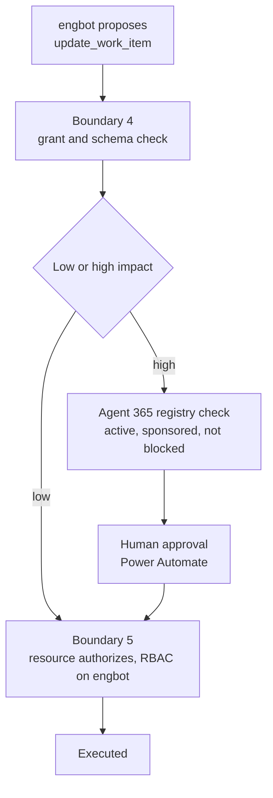

# The Secure Agent Lifecycle, Part 5: Authorize — Proposing and Approving Changes

Part 5 of [The Secure Agent Lifecycle](/content/agent-lifecycle.md). [Part 4](/content/agent-lifecycle-04-connect.md) gave EngBot its first tool, read-only. This article gives it a tool that can change something — Stage 4 of the running scenario — and the approval gate that has to exist before that change actually executes, at Stage 5. It maps to [RFC-015 §6–7](/content/agent-security.md) (resource-side authorization, side effect and human approval).

> **Rendering note.** Diagrams are provided in both a Mermaid block and an ASCII block. Where they disagree, the ASCII form is authoritative.

## Stage 4: proposing a change

### The concept

A model-generated tool call is a proposal, not an authorization. The [runtime and enforcement explainer](/content/agent-runtime-and-enforcement.md) states this directly: the model proposes, the enforcement layer validates and coordinates, the resource system authorizes and executes. Nothing in that chain lets a proposal become an action by itself.

### Applied to EngBot

EngBot's second tool is `update_work_item`, which drafts a comment or status change on an engineering work item. At Stage 4, it only drafts — the tool call is validated and logged, but nothing in the target system changes yet. `engbot`'s agent identity gets an access package for this tool, same pattern as Part 4's read-only tool, with an argument schema requiring a specific work-item ID and a bounded comment length.

- **What new capability was introduced?** A tool that drafts a work-item update. Not yet a tool that commits one.
- **What new authority did EngBot receive?** Permission to propose this specific action, scoped to `engbot`'s agent identity — not permission to perform it.
- **Which identity is acting?** `engbot`, via the same grant model Part 4 established.
- **Which data is exposed?** Nothing new is exposed; a draft is produced, not data retrieved.
- **Which policy enforcement point is needed?** Boundary 4 again (tool proposal, grant and schema check) — and, for the first time, boundary 5 is about to matter, because a real system is on the other end of this tool.
- **What evidence must be produced?** The proposal itself, its argument hash, and the fact that it was drafted but not executed.
- **What can fail?** A proposal targets a work item `engbot` has no legitimate reason to touch; the model drafts a comment containing content that shouldn't be posted, caught before it ever reaches the target system.
- **What residual risk remains?** None yet from execution — Stage 4 can't cause a side effect. The risk is a bad draft reaching a human reviewer's attention, not reaching production.

## Impact classification for EngBot's tools

### The concept

[RFC-015 §2](/content/agent-security.md) requires every tool and action to carry a stated impact tier — low or high — assigned by governance, not inferred by the agent or invented per request. High-impact actions require explicit human approval before execution; low-impact ones don't need that gate.

### Applied to EngBot

For EngBot's tool set specifically: adding a comment to a work item is low-impact, and proceeds without approval once boundary 4 and boundary 5 both pass. Changing a work item's status to something that triggers a downstream workflow, or touching deployment configuration, is high-impact and requires the approval gate below. This split is illustrative, not universal — a different organization might classify the same actions differently, and that's exactly the point: governance sets the tier, this article doesn't.

## Stage 5: executing an approved change

### The concept

An approved, high-impact action still isn't self-executing. [RFC-015 §7](/content/agent-security.md) describes a draft-then-approve pattern: a workflow with a built-in approval step gates the actual side effect on an explicit human decision, and the resource itself authorizes the specific action using the agent identity — not the hosting workload's managed identity — regardless of what happened upstream.

### Applied to EngBot

When `update_work_item`'s target action is high-impact, the drafted proposal goes to an approval workflow (a Power Automate flow with a built-in approval step, in this reference) before anything executes. Once approved, the work-item system itself authorizes the specific update against an RBAC role assigned directly to `engbot`'s agent identity — the same principle [RFC-014 §7](/content/control-plane.md) established for calling Azure OpenAI, applied here to a different resource.

- **What new capability was introduced?** Execution of a previously-approved, high-impact work-item change.
- **What new authority did EngBot receive?** Write access to the specific work item, granted to `engbot`'s agent identity via RBAC, exercised only after approval.
- **Which identity is acting?** `engbot`, authorized independently by the work-item system itself — it doesn't trust boundary 4's earlier "allowed to propose" as sufficient.
- **Which data is exposed?** None beyond the change itself, which is exactly what was drafted and approved.
- **Which policy enforcement point is needed?** Boundary 5 (resource-side authorization) and boundary 6 (human approval), both, before execution.
- **What evidence must be produced?** The original proposal, the approval decision and who made it, the resource-side authorization outcome, and the executed result — a full chain, not just the final state.
- **What can fail?** The approval workflow is unavailable when the change is time-sensitive; an approver approves without actually reviewing what they approved.
- **What residual risk remains?** An approver who rubber-stamps proposals reintroduces the exact excessive-agency risk this stage exists to prevent — no technical control here substitutes for that judgment.

## Microsoft Agent 365 as a pre-approval check, not just a dashboard

Before the approval workflow finalizes a decision, it checks `engbot`'s current status in the Microsoft Agent 365 registry: active, sponsored, not flagged or blocked. This is the same registry data [RFC-014 §5](/content/control-plane.md) already ties to admission ("agent lifecycle and risk state"), applied here at the moment of approval instead of only at the start of a request. An agent identity that's been flagged or blocked doesn't get a proposal approved, regardless of what its tool grant says — the tool grant answers "is this action normally allowed," and the registry check answers "is this agent currently in good standing at all."

## What can fail, beyond the tool itself

An approval workflow going down during an on-call window is a real operational question, not a hypothetical: does the change simply wait, or does someone override the gate manually? If an override happens, it has to produce the same evidence an ordinary approval would — who authorized it, why, and through what path — otherwise the override itself becomes the least-observed action in the whole system, which defeats the reason boundary 6 exists.

## EngBot's architecture at the end of Authorize

**ASCII (authoritative):**

```
   engbot proposes update_work_item
              │
              ▼
   Boundary 4: grant + schema check ──► deny if ungranted or malformed
              │
              ▼
   Low-impact?──yes──► Boundary 5: resource authorizes ──► executes
              │no
              ▼
   Agent 365 registry check (active, sponsored, not blocked)
              │
              ▼
   Human approval (Power Automate) ──► deny if rejected or timed out
              │approved
              ▼
   Boundary 5: resource authorizes, RBAC on engbot's identity ──► executes
              │
              ▼
   Evidence: proposal, registry check, approval, authorization, result
```

**Mermaid (renders for humans):**



## What Authorize has to produce before Observe and Operate starts

1. **A confirmed impact tier for every EngBot tool and action**, owned by governance, not inferred by whoever wrote the tool integration.
2. **A working approval path for high-impact actions**, including the Agent 365 registry check ahead of the approval decision itself.
3. **A full evidence chain per executed or rejected proposal**, not just a log line for the final outcome.

## What's next

Part 6, **Observe and Operate**, is where all five stages' decision evidence actually gets used — dashboards, drift detection, and what happens the day `engbot` gets retired. It's outlined but not yet published — see the [series landing page](/content/agent-lifecycle.md) for the full six-part map.

## Where to go next

- [The Secure Agent Lifecycle](/content/agent-lifecycle.md) — series landing page.
- [Part 4 — Connect](/content/agent-lifecycle-04-connect.md) — the read-only tool pattern this article extends to a write-capable one.
- [RFC-015 §6–7](/content/agent-security.md) — resource-side authorization and side-effect approval in full.
- [RFC-015 §12](/content/agent-security.md) — the approver-diligence limitation this article restates.
