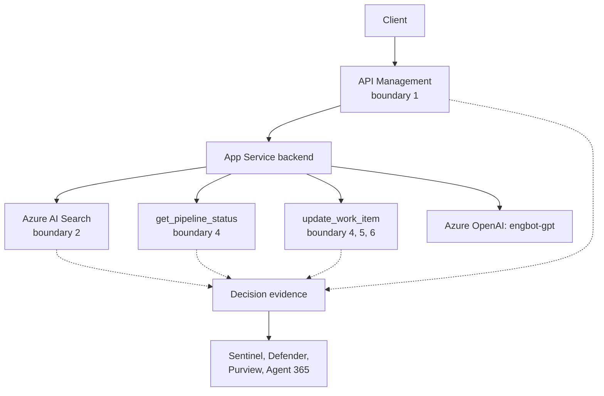

# The Secure Agent Lifecycle, Part 6: Observe and Operate — Running It, Detecting Drift, Retiring It

Part 6 of [The Secure Agent Lifecycle](/content/agent-lifecycle.md), and the last one. [Part 5](/content/agent-lifecycle-05-authorize.md) gave EngBot a complete propose-approve-execute path. This article is about what changes once that path is live and running, not being built — the **Observe and Operate** stage, covering all five running-scenario stages continuously, plus the day `engbot` eventually gets retired. It maps to [RFC-016](/content/observability.md) in full.

> **Rendering note.** Diagrams are provided in both a Mermaid block and an ASCII block. Where they disagree, the ASCII form is authoritative.

## What changes when you move from building to operating

### The concept

Every stage in this series asked the same eight questions once, at launch: what capability, what authority, which identity, which data, which enforcement point, what evidence, what can fail, what residual risk. Operating an agent means asking those same questions again, continuously, because the answer that was true at launch doesn't stay true on its own. A classifier's score distribution shifts. A permission grant added for a pilot never gets removed. An approver, months in, starts clicking approve without reading the proposal.

### Applied to EngBot

Nothing about `engbot`'s architecture changes for this stage — no new component gets added. What changes is that someone is now watching the decision-evidence stream every one of the last five articles' enforcement points already produces, per [RFC-016](/content/observability.md)'s schema, instead of treating that stream as a one-time build artifact.

| Stage | What "operating" actually means for it |
|---|---|
| 1 — general Q&A | Is the content-safety classifier's decision distribution still what it was at launch, or has it drifted? |
| 2 — retrieval | Is `retrieval_scope`'s filter still resolving to the document set it was designed for, or has the underlying group-membership mapping drifted under it? |
| 3 — read-only tool | Is `engbot`'s `get_pipeline_status` grant still exactly what governance intended, or has permission creep crept in since Part 4? |
| 4–5 — propose and approve | Is approval latency and override rate still within the range Part 5 was designed for, or is the human step turning into a rubber stamp under load? |

## Dashboards and queries for EngBot specifically

### The concept

[RFC-016 §7](/content/observability.md) gives an illustrative pattern for querying the normalized event schema — a policy-drift query and a Defender-correlation query, both against a hypothetical `AIObservabilityEvents_CL` table. This article doesn't invent a new query language or a new schema; it applies that same pattern to `engbot`'s own event stream.

### Applied to EngBot

```kql
// Illustrative, matching the pattern in RFC-016 §7 — not a literal production query.
// Stage 1: has engbot's classifier review-rate shifted for the same policy version?
AIObservabilityEvents_CL
| where TimeGenerated > ago(30d) and boundary_d == 1
| where principal_agent_id_s == "engbot"
| summarize ReviewRate = countif(decision_s == "review") * 1.0 / count()
    by policy_version_s, bin(TimeGenerated, 1d)
| where ReviewRate > 0.15
```

```kql
// Illustrative. Stage 2-3: blocked retrieval or tool-proposal decisions for engbot,
// worth investigating even without a hard threshold.
AIObservabilityEvents_CL
| where TimeGenerated > ago(7d) and boundary_d in (2, 4)
| where principal_agent_id_s == "engbot" and decision_s == "block"
| summarize BlockCount = count() by boundary_d, decision_reason_s, bin(TimeGenerated, 1d)
```

```kql
// Illustrative. Stage 4-5: approval latency and manual-override rate for engbot's
// high-impact proposals.
AIObservabilityEvents_CL
| where TimeGenerated > ago(30d) and boundary_d in (5, 6)
| where principal_agent_id_s == "engbot"
| summarize
    Approved = countif(decision_s == "allow"),
    Overridden = countif(decision_reason_s == "manual_override"),
    AvgLatencyMs = avg(latency_ms_d)
  by bin(TimeGenerated, 1d)
```

## Microsoft Agent 365: the registry `engbot`'s own approval gate already reads from

### The concept

Agent 365's registry isn't a separate operational concern from the enforcement points earlier articles built — it's the same posture data [Part 5](/content/agent-lifecycle-05-authorize.md)'s approval workflow already checks before finalizing a decision. Operating an agent means an operator has their own view of that same registry, not a second copy of it.

### Applied to EngBot

```kql
// Illustrative, adapted from the AIAgentsInfo sample queries referenced in RFC-016 §4.2.
AIAgentsInfo
| where RegistrySource == "A365"
| summarize arg_max(Timestamp, *) by AIAgentId
| where AIAgentName == "engbot"
| project AIAgentName, AgentStatus, Instructions, EntraBlueprintId, LastModifiedTime
```

A month after Stage 5 shipped, this is where an operator checks whether `engbot`'s registry entry — its owner, its sponsor, the tools it's configured with — still matches what Parts 2 through 5 actually built, or has quietly drifted from it.

## Microsoft Defender: two distinct angles, not one

### The concept

[RFC-016 §4.2](/content/observability.md) is explicit that Defender XDR's posture table and Defender for Cloud's threat-protection alerts answer different questions. Blending them into one "Defender dashboard" loses that distinction.

### Applied to EngBot

The posture angle is the same `AIAgentsInfo` query above — is `engbot`'s configuration still what it should be. The alert-correlation angle is different: does a Defender for Cloud AI Threat Protection alert line up with `engbot`'s own decision-evidence stream for the same principal.

```kql
// Illustrative, adapted from RFC-016 §7's correlation pattern for engbot specifically.
AIObservabilityEvents_CL
| where TimeGenerated > ago(1h) and principal_agent_id_s == "engbot"
| where decision_s in ("block", "review")
| join kind=inner (
    AlertEvidence
    | where DetectionSource == "Microsoft Defender for AI Services"
    | where TimeGenerated > ago(1h)
) on $left.principal_agent_id_s == $right.AccountObjectId
| project TimeGenerated, correlation_id_g, boundary_d, decision_s, Title
```

## Microsoft Purview: the content-based backstop on what EngBot proposes

### The concept

[RFC-015 §6](/content/agent-security.md) describes Purview's DLP, Insider Risk Management, and Communication Compliance as a content-based backstop layered on identity-based authorization, not a replacement for it — catching sensitive content in an action's actual payload even after the identity check already passed.

### Applied to EngBot

Every work-item update `engbot` drafts or executes at Stage 4–5 is exactly the kind of output this backstop exists for. A DLP or Communication Compliance policy scoped to `engbot`'s outputs can still flag a proposed comment that contains something it shouldn't, independent of whether boundary 4's grant check and boundary 5's resource-side authorization both already passed. Identity-based authorization answered "is `engbot` allowed to update this work item." This is the separate question: "should this specific content go out at all."

## Decommissioning EngBot

### The concept

Retiring an agent identity is not the same as an application team simply no longer calling it. An Entra Agent ID identity that's been granted access packages, RBAC roles, and a sponsor stays exactly as capable the day after its application stops being invoked as it was the day before — unless something actually disables it.

### Applied to EngBot

Retiring `engbot` means disabling its agent identity and revoking its access packages and RBAC roles through the same Microsoft Agent 365 registry actions this series has deferred throughout — block, reassign, or retire — not just decommissioning the App Service that used to call it. The retirement itself should produce evidence: who retired it, when, and confirmation that its grants were actually revoked rather than left dangling. This series doesn't design that remediation workflow in detail; [RFC-015 §13](/content/agent-security.md) defers it to itself, and that's an honest gap this article isn't closing, only naming.

## EngBot's complete architecture

**ASCII (authoritative):**

```
   Client ──► API Management ──► App Service backend
              (boundary 1)        │
                                  ├─ retrieval_scope() ────► Azure AI Search (boundary 2)
                                  ├─ get_pipeline_status() ─► Build/deploy system (boundary 4)
                                  ├─ update_work_item() ────► Boundary 4 → Agent 365 check →
                                  │                            Approval → Boundary 5 → executes
                                  └─ call engbot-gpt ───────► Azure OpenAI (boundary 3)

   Every boundary's decision evidence ──► Log Analytics ──► Sentinel, Defender, Purview, Agent 365
```

**Mermaid (renders for humans):**



## Closing the series

Six articles built one agent, one deliberate capability at a time: a Q&A agent with an identity and nothing else, a fully specified identity model, a decision not to add infrastructure it didn't need, a retrieval path and a read-only tool, a write-capable tool with real authorization and approval, and finally the operational discipline to keep all of that honest after launch. None of it required a new security boundary this series invented — every boundary traces back to [the pattern overview](/content/pattern.md) and the three RFCs, in the order a team actually builds toward them rather than the order a reference architecture lists them.

If you arrived at this series first: the [AI Control-Plane Pattern](/content/pattern.md) is where the six-boundary model itself lives, and [RFC-014](/content/control-plane.md), [RFC-015](/content/agent-security.md), and [RFC-016](/content/observability.md) are where each boundary is specified in full, independent of any one running scenario.

## Where to go next

- [The Secure Agent Lifecycle](/content/agent-lifecycle.md) — series landing page and the full six-stage map.
- [Part 5 — Authorize](/content/agent-lifecycle-05-authorize.md) — the approval path this article's queries observe.
- [RFC-016 GenAI Observability](/content/observability.md) — the full event schema and native-telemetry mapping this article applies.
- [RFC-015 §13](/content/agent-security.md) — the lifecycle-remediation gap this article names but doesn't close.
