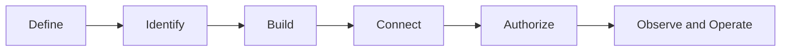

# The Secure Agent Lifecycle: From Prototype to Production

> The RFCs describe the system by security boundary. The lifecycle series describes it in the order a team would actually build and operate it.

The [AI Control-Plane Pattern](/content/pattern.md) and its three RFCs — [Control-Plane](/content/control-plane.md), [Agent Security](/content/agent-security.md), and [Observability](/content/observability.md) — describe a reference architecture organized by security boundary: admission, retrieval, model invocation, tool proposal, resource authorization, side effect. That's the right organization for reviewing whether a system is enforced correctly. It is not the order anyone actually builds one in.

This series describes the same system in build order: define what the agent is for, establish its identity, build the execution loop, connect it to real data and tools, authorize the actions that have consequences, then operate and eventually retire it. Each article names the RFC boundaries it touches rather than re-deriving them, so this series complements the architecture RFCs instead of summarizing them. If you want the six-boundary model itself, start with the pattern overview. If you want to understand how a team gets from a blank prototype to something running safely in production, start here.

> **Rendering note.** Diagrams are provided in both a Mermaid block and an ASCII block. Where they disagree, the ASCII form is authoritative.

## Who this is for

Security architects, AI and cloud architects, engineers building agents, security operations teams, governance and identity teams, technical leaders, and hiring managers evaluating practical AI security depth. You don't need to have read the RFCs first — each article links to the specific section it depends on.

## The running scenario

Every article in this series follows one reference implementation: an internal **Engineering Knowledge and Change Agent**. It is not a real system, a real customer, or a real employer's deployment — it's a fictional reference scenario used consistently so the series can show concrete decisions instead of abstractions. Its capability grows in five stages:

| Stage | Capability |
|---|---|
| 1 | Answers general engineering questions. No access to internal data or tools. |
| 2 | Retrieves authorized internal engineering documents. |
| 3 | Calls read-only tools to inspect engineering systems. |
| 4 | Proposes changes to tickets, configuration, or deployment systems. |
| 5 | Performs approved changes under strict authorization and human oversight. |

At every stage the series asks the same eight questions: what new capability was introduced, what new authority the agent received, which identity is acting, which data is exposed, which policy enforcement point is needed, what evidence must be produced, what can fail, and what residual risk remains after the stage is built.

## The six lifecycle stages

```text
Define
  → Identify
  → Build
  → Connect
  → Authorize
  → Observe and Operate
```



| Stage | Article | Covers | Running-scenario stage(s) | Maps to |
|---|---|---|---|---|
| Define | 1 | Purpose, scope, threat model, initial risk tier, why identity gets established before capability | 1 | Governance and risk classification ([pattern.md](/content/pattern.md)) |
| Identify | 2 (planned) | Entra Agent ID blueprint, agent identity, sponsor, workload identity, and how they differ | 1 (identity groundwork) | [RFC-014 §5](/content/control-plane.md) |
| Build | 3 (planned) | Choosing a harness (Microsoft Agent Framework, a Foundry hosted agent, or a plain backend), the execution loop, where enforcement code actually runs | 1–2 | [Agent Runtime, Agentic Harness, and Application Enforcement](/content/agent-runtime-and-enforcement.md) |
| Connect | 4 (planned) | Retrieval authorization, read-only tool calls, treating retrieved content as untrusted | 2–3 | [RFC-014 §6](/content/control-plane.md), [RFC-015 §5](/content/agent-security.md) |
| Authorize | 5 (planned) | Write-capable tools, resource-side authorization, human approval for high-impact actions | 4–5 | [RFC-015 §6–7](/content/agent-security.md) |
| Observe and Operate | 6 (planned) | Evidence, detection, drift, incident response, and decommissioning an agent identity | Ongoing, all stages | [RFC-016](/content/observability.md) |

## Recommended reading order

Building something: read this series in order, following the links back into the RFCs at the point where each article names a specific boundary. Reviewing or auditing an existing system: start with [pattern.md](/content/pattern.md) and the RFCs, and use this series as the narrative companion when you need to explain a design decision to someone who hasn't read all three.

## Available now

- [Part 1 — Define: Scoping the Engineering Knowledge and Change Agent](/content/agent-lifecycle-01-define.md)

## Planned

Parts 2 through 6 (Identify, Build, Connect, Authorize, Observe and Operate) are outlined but not yet published. They'll appear here, and in [llms.txt](/llms.txt), once drafted.

## Where to go next

- [The AI Control-Plane Pattern](/content/pattern.md) — the six-boundary model this series maps back to.
- [Agent Runtime, Agentic Harness, and Application Enforcement](/content/agent-runtime-and-enforcement.md) — the identity and harness terminology this series uses consistently.
