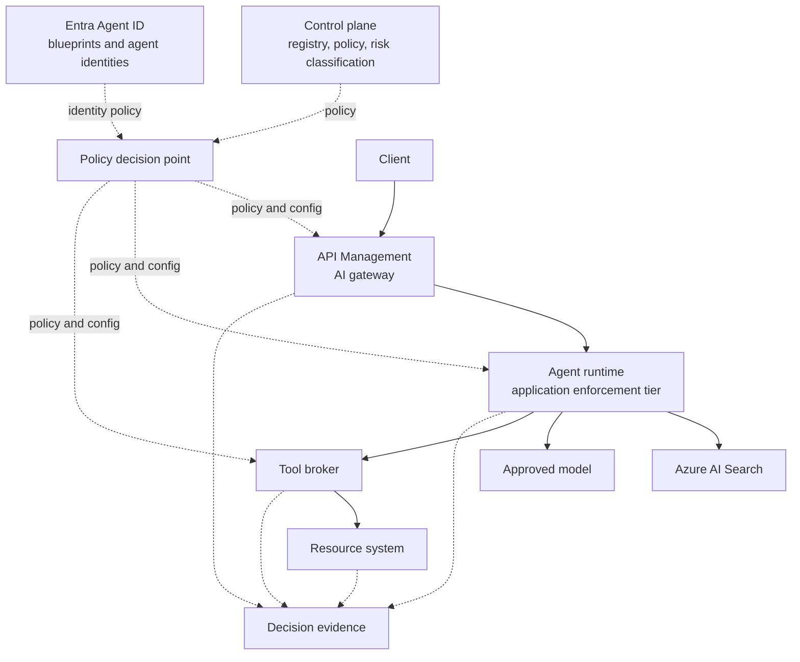
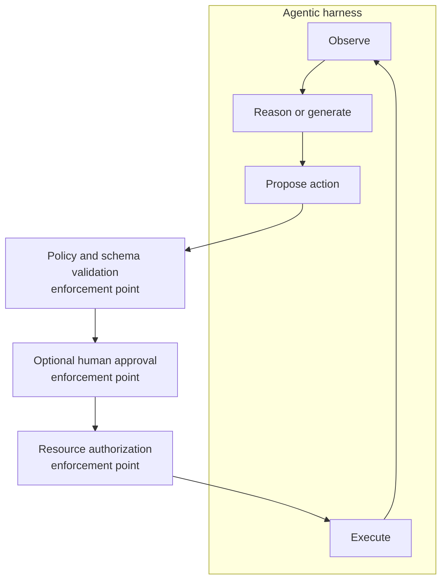

# Agent Runtime, Agentic Harness, and Application Enforcement

This page exists to resolve a specific confusion, not to introduce a fourth RFC. Readers of the [Control-Plane RFC](/content/control-plane.md) and the [Agent Security RFC](/content/agent-security.md) reasonably ask where "AI mediation service" actually runs, how it relates to an agent framework's own execution loop, and whether it's a Microsoft product. It isn't. Neither is the term this page prefers instead: **application enforcement tier**. Both names describe a responsibility, not a thing you can buy.

> **Rendering note.** Diagrams are provided in both a Mermaid block and an ASCII block. Where they disagree, the ASCII form is authoritative.

> The harness runs the workflow. The application enforcement tier constrains what that workflow is allowed to become.

> An agentic harness manages the execution loop. The application enforcement tier applies policy at consequential transitions in that loop. They may run in the same process, but they are different responsibilities.

## Why this terminology matters

A traditional application has a familiar shape:

```
Client → API gateway → application service → database or business system
```

An AI application keeps that shape and adds a layer of decisions the traditional one never had to make:

```
Client → AI gateway → application enforcement tier → retrieval, model, and tools
```

The application service in the traditional flow mostly moves data and enforces business rules. The AI application still needs that ordinary logic, but it also has to assemble model context, derive the caller's authorized retrieval scope, select an approved model deployment, apply whatever policy obligations a decision carries, constrain which tools and capabilities are available for this request, validate model output that's about to trigger a consequential action, and produce evidence of why it decided what it decided.

None of that requires a new deployed service. It requires someone to own those decisions somewhere. "Application enforcement tier" names that ownership. It says nothing about topology.

## The five components

| Component | Primary question | Typical responsibilities | Example implementation |
|---|---|---|---|
| Control plane | What is allowed in principle? | Agent, model, tool, and MCP registry; Microsoft Entra Agent ID blueprints; ownership and sponsorship; lifecycle state; policy definitions; risk classifications; approved models and data paths; policy versions and exceptions. | Governance-owned configuration and identity state, not a single deployed service every request calls. |
| AI gateway or Azure API Management | May this caller reach this published AI capability? | Token validation, gateway-level authorization, request limits, token quotas, model routing, backend authentication, content-safety policy, correlation identifiers, shared telemetry, publishing governed model/agent/tool endpoints. | Azure API Management's `llm-token-limit`, `llm-semantic-cache-lookup`/`-store`, and `llm-content-safety` policies; its newer AI Gateway tier and its Foundry integration for registering agents and MCP tools are both currently in preview. |
| Agentic harness | How does the agent workflow run? | Conversation and session state, system instructions, model calls, retrieval coordination, tool definitions, tool proposals, tool dispatch, retries and timeouts, memory, multi-step execution, human-interaction checkpoints. | An agent framework's orchestration loop, or a hosted agent runtime's execution engine. |
| Application enforcement tier | How may this specific request safely execute? | Interpret policy decisions and obligations, derive trusted application context, select authorized retrieval scope, construct model context, treat retrieved content as untrusted, remove or restrict capabilities, select an approved model path, validate proposed actions, trigger required approval, produce decision evidence. | Code inside the harness, the application backend, framework middleware, or a Microsoft Foundry hosted agent — not a separately named product. |
| Resource system | May this identity perform this exact operation on this resource? | Row-level and record-level authorization, transaction limits, object permissions, business rules, final authorization of the operation. | The CRM, ERP, storage account, or database's own authorization model, independent of anything upstream. |

A gateway or agent-level authorization decision does not replace resource-side authorization. That check runs regardless of what happened upstream. Verify current API Management and Microsoft Foundry capabilities against official Microsoft Learn documentation before treating any specific feature as generally available — several of the AI-gateway capabilities above are still marked preview at the time of writing.

API Management can perform real AI-gateway enforcement — token limiting, semantic caching, content-safety checks, backend credential management. It shouldn't become a container for every application-specific retrieval or orchestration decision a request needs; those decisions belong in the application enforcement tier, wherever that tier happens to live.

Centralized governance does not mean every request makes a remote call to one central service. The control plane holds authority; policy is evaluated close to where the request already is.

## The identity model

Three identities show up in this flow, and they are not interchangeable:

1. **User identity** — identifies the human in a delegated interaction.
2. **Microsoft Entra Agent ID** — identifies and governs the logical AI agent, connecting it to its blueprint, lifecycle, sponsor, and authorization context.
3. **Managed identity** — identifies an Azure hosting or supporting workload: an App Service, Container App, Function, API, or Foundry resource.

> An agent is not merely the workload hosting it.

A policy decision at a consequential transition can reasonably evaluate: the user identity, the agent identity, the agent identity blueprint, the hosting workload identity, the tenant, the purpose, the requested capability, the target model or resource, and whether the interaction is autonomous or delegated. Not every Microsoft service supports every one of these dimensions today, and preview capabilities should be qualified as such rather than assumed generally available — check current Microsoft Entra Agent ID and Microsoft Foundry documentation for the specific combination in use before designing around it.

## A secure RAG example

A user asks an internal assistant to summarize engineering documents.

```
User → Azure API Management → RAG application / application enforcement tier → Azure AI Search → approved model endpoint
```

**Azure API Management** authenticates or validates the caller, applies shared admission policy, enforces quotas and limits, adds or propagates a correlation identifier, and routes to an approved application endpoint. It does not decide which documents this user is authorized to see.

**The application enforcement tier** resolves the trusted user and agent context, derives the authorized index and document filter, prevents the client from choosing an arbitrary tenant or index, retrieves only authorized documents, preserves source provenance, treats retrieved text as untrusted content rather than instructions, constructs the model request, selects the approved model deployment or alias, and emits policy-decision evidence.

**Azure AI Search** validates the calling workload, applies the authorization filter it was given, and returns only matching content. It doesn't decide what the filter should be.

**The model endpoint** accepts the invocation through the approved path. It does not decide whether the user was entitled to retrieve the documents it's now summarizing.

The pattern to avoid is a client-controlled request that names its own scope:

```json
{
  "tenant": "contoso",
  "index": "executive-documents",
  "filter": "*"
}
```

Tenant, index, and authorization filter belong to validated identity and policy, not to a field the client is trusted to fill in honestly.

## A restricted-execution example

A policy decision doesn't have to be binary. An illustrative response, with a threshold model this page doesn't prescribe a universal number for:

```json
{
  "decision": "restrict",
  "obligations": {
    "retrieval": "disabled",
    "tools": "disabled",
    "model": "restricted-model",
    "maximum_output_tokens": 500
  }
}
```

The policy decision point returns the decision and its obligations. API Management can enforce the gateway-level parts of that obligation set. The application enforcement tier removes retrieval and tools for this request. The runtime follows the reduced-capability path it was handed. The model never decides whether the restriction applies — it just runs inside whatever capability it was given. Every enforcement point involved emits the policy version, the decision, the reason, and the outcome.

> The policy decision states what must happen. The enforcement point changes the request or execution so that it actually happens.

## An agent tool-proposal example

A model-generated tool call is a proposal, not an authorization:

```json
{
  "tool": "issue_refund",
  "arguments": {
    "customer_id": "123",
    "amount": 5000
  }
}
```

The harness receives the model's proposal. Enforcement verifies the tool is registered and permitted for this agent identity. Arguments are validated against an approved schema before anything downstream sees them. User, agent, purpose, target, limits, and risk are evaluated together, not just the tool name in isolation. Human approval is required when policy calls for it, before execution, not after. The correct scoped identity — the agent identity, not the hosting workload's managed identity — is used to call the target system. The target system independently authorizes the transaction on its own terms. The proposal, the decision, the approval, the target, and the outcome all produce evidence.

> The model proposes. The enforcement layer validates and coordinates. The resource system authorizes and executes.

Detailed tool-authorization and approval design — argument schemas, impact tiers, approval workflows — stays in the [Agent Security RFC](/content/agent-security.md). This page explains the concept once; it doesn't duplicate that RFC's detail.

## Deployment shapes

Three shapes are all valid. None is more "correct" than the others in the abstract.

**Shape A — custom RAG application.** Client → Azure API Management → a Python or .NET application on App Service or Container Apps → Azure AI Search → an approved model endpoint. The application backend performs the application enforcement role directly.

**Shape B — Microsoft Foundry hosted agent.** Client → Azure API Management → a Foundry hosted agent → knowledge, models, and approved tools. The hosted-agent runtime and whatever custom agent code sits inside it perform much of the application enforcement role.

**Shape C — simple gateway-managed model application.** Application → Azure API Management's AI gateway → an approved model. There may be no separate application enforcement component at all, when there's no RAG, no tools, no complex session state, gateway controls already cover the shared policies, and the existing application backend handles whatever's left.

Do not introduce another service or network hop simply to make the architecture match a diagram.

## Agentic harness versus application enforcement

**The harness** runs the loop, coordinates state, calls models, retrieves information, proposes and dispatches tools, and handles retries and memory.

**Application enforcement** constrains transitions in that loop, applies identity and policy, restricts context and capabilities, validates proposals, enforces approval requirements, and produces decision evidence.

The two frequently run in the same process. Enforcement inside a harness commonly shows up as middleware, filters, hooks, callbacks, policy clients, tool wrappers, retrieval wrappers, or explicit orchestration code the harness calls at the right moment. None of that makes the entire harness a trusted security boundary. A harness that contains some enforcement code is not automatically fully enforced everywhere it matters — identify the actual policy enforcement points inside it rather than assuming coverage from proximity.

## How the pieces fit together

**ASCII (authoritative):**

```
                         ┌───────────────────────────────────────┐
                         │              Control plane               │
                         │  registry · policy · risk classification │
                         └───────────────┬─────────────────────────┘
                                         │ policy
                                         ▼
                         ┌───────────────────────────────────────┐
   Entra Agent ID ──────►│         Policy decision point           │
   blueprints and         └───────────────┬─────────────────────────┘
   agent identities                       │ policy and config
                    ┌────────────────────┼────────────────────┐
                    ▼                    ▼                    ▼
             ┌───────────┐        ┌─────────────┐       ┌───────────┐
   Client ──►│ API        │──────►│ Agent runtime│──────►│  Tool     │──►Resource
   traffic   │ Management │       │ / application│       │  broker   │   system
             │ (AI gateway)│       │ enforcement  │       └───────────┘
             └───────────┘        │ tier         │──────►Azure AI Search
                                  └──────┬───────┘──────►Approved model
                                         │
                                         ▼
                              ┌─────────────────────┐
                              │  Decision evidence    │
                              └─────────────────────┘
```

**Mermaid (renders for humans; source for PNG export):**



The second diagram shows enforcement inside the agent loop itself, at the transitions that actually carry consequence:

**ASCII (authoritative):**

```
   ┌── Agentic harness ────────────────────────────────┐
   │  Observe ──► Reason/generate ──► Propose action    │
   │     ▲                                     │        │
   │     │                                     ▼        │
   │  Execute ◄── Resource authz ◄── Approval ◄── Policy/schema
   │              (enforcement)      (enforcement) validation
   │                                              (enforcement)
   └─────────────────────────────────────────────────────┘
```

**Mermaid (renders for humans):**



## How this maps to the RFC series

The [Control-Plane RFC](/content/control-plane.md) covers agent admission, retrieval authorization, and model invocation. The [Agent Security RFC](/content/agent-security.md) covers tool proposals, resource-side authorization, and side-effect approval. The [Observability RFC](/content/observability.md) correlates the evidence every enforcement point above produces, regardless of which boundary or which component emitted it.

Application enforcement crosses all three documents. It isn't a boundary of its own, and it doesn't need a fourth RFC — it's the responsibility that makes boundaries 1 through 6 actually executable inside a real request, wherever that code happens to run.

## Where to go next

- [The AI Control-Plane Pattern](/content/pattern.md) — the six-boundary model this page's components implement.
- [RFC-014 Microsoft-Native Control-Plane Enforcement](/content/control-plane.md) — boundaries 1–3.
- [RFC-015 Agent Security](/content/agent-security.md) — boundaries 4–6.
- [RFC-016 GenAI Observability](/content/observability.md) — the evidence model every enforcement point here feeds.
