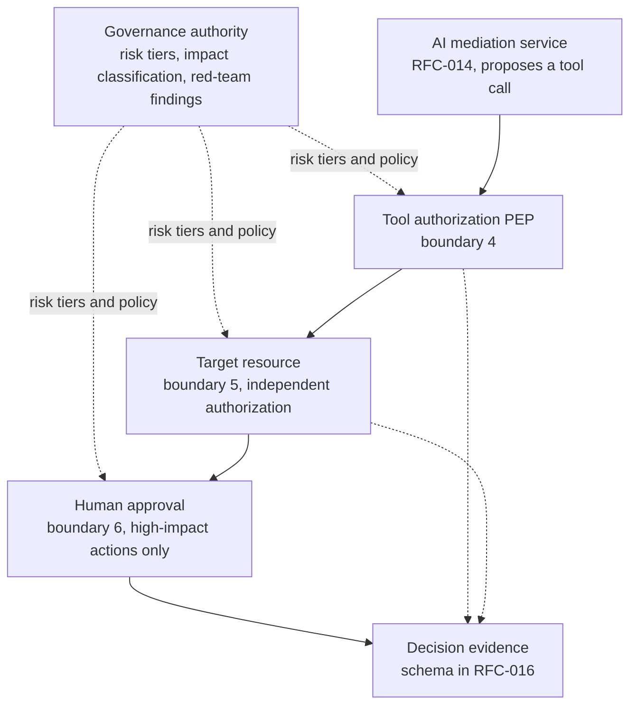
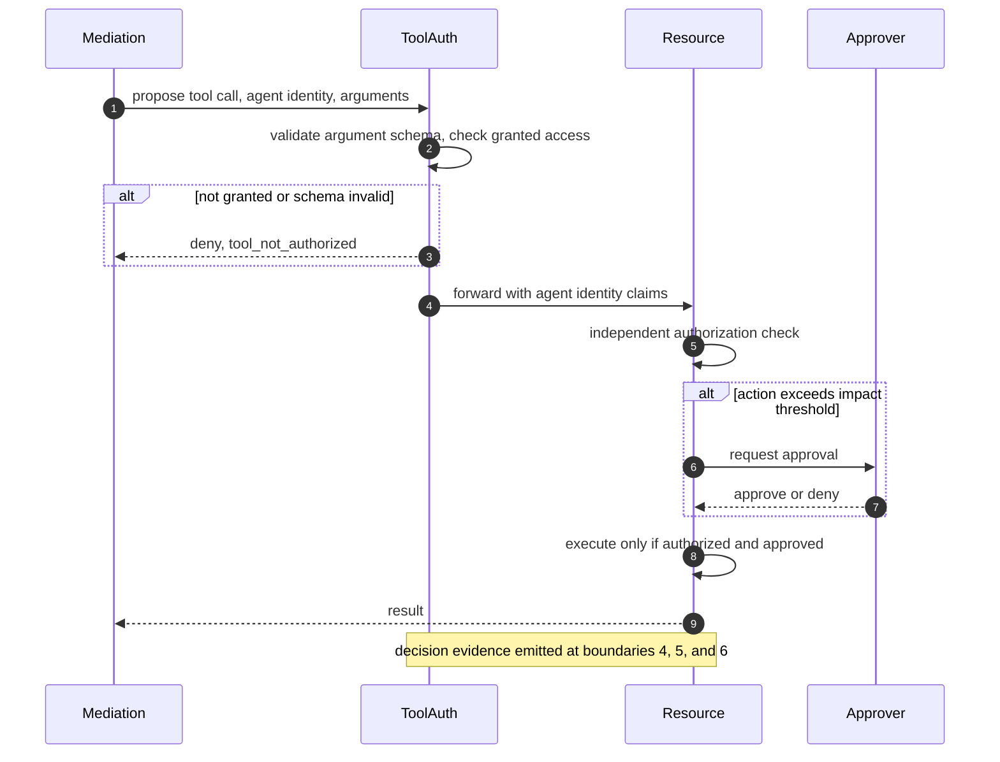

# RFC-015: Microsoft-Native Enforcement for Agent Tool Use and Side Effects

**Status:** Reference architecture — public portfolio design. Not a description of a deployed system, a customer implementation, or an internal Microsoft document.
**Scope:** Boundaries 4–6 of the [AI Control-Plane Pattern](/content/pattern.md) — tool proposal, resource-side authorization, and side effect (human approval).
**Related:** [RFC-014 Microsoft-Native Control-Plane Enforcement](/content/control-plane.md) covers boundaries 1–3 and is a prerequisite here: this RFC assumes the Entra Agent ID identity model (blueprint, agent identity, sponsor) that RFC-014 §5 establishes, and doesn't redefine it. [RFC-016 GenAI Observability](/content/observability.md) covers the event schema, including the `tool_provenance` field this RFC's boundaries populate.

> **Prerequisite reading:** [The AI Control-Plane Pattern](/content/pattern.md) and [RFC-014](/content/control-plane.md). This RFC picks up where RFC-014 leaves off: an admitted, authenticated agent identity is now proposing to call a tool or cause a side effect, and that is a different authorization problem than admission.

> **Labeling convention.** Every quantitative value in this document is a design assumption or an illustrative example unless stated otherwise. Nothing is described as deployed, measured, or production-proven. Where a claim needs validation against a real threat model, it's marked **requires validation**.

> **Rendering note.** This document is authored for two audiences: human reviewers and automated agents or crawlers reading the raw Markdown. Diagrams are provided in both a Mermaid block and an ASCII block. Where they disagree, the ASCII form is authoritative.

---

## Status and scope

This is a public reference design implementing boundaries 4–6 of the control-plane pattern using Microsoft-native services. Its purpose is to show a credible path from the portable pattern to a concrete set of native controls, not to document something running in production. Boundaries 1–3 and the observability model belong to the other two RFCs in this series and are explicitly out of scope here (§13).

## 1. Context and design goals

RFC-014 answers "is this identity allowed to reach a model or a retrieval system at all." This RFC answers a different question: once an admitted agent identity is talking to tools and business systems, what is it actually allowed to *do*, and who checks that before an action with real consequences happens.

The industry name for what happens when this isn't answered is excessive agency — OWASP's Top 10 for LLM applications lists it as LLM06. Microsoft's own Zero Trust threat catalog describes the same failure mode plainly: an agent is granted overly broad permissions or insufficient guardrails, and takes an unintended or unauthorized action as a result. MITRE ATLAS maps the attack path across a few adjacent techniques rather than one single technique — prompt injection (AML.T0051), AI agent tool invocation (AML.T0053), and LLM jailbreak (AML.T0054) all funnel into the same external-harm outcome (AML.T0048) when a tool-use boundary doesn't hold. This RFC doesn't invent its own taxonomy for that; it points at the existing one and builds the enforcement points the recommended mitigations actually require: least privilege, human approval for high-impact steps, and behavioral monitoring (MITRE's own mitigation IDs are AML.M0019, AML.M0020, AML.M0021, and AML.M0024).

Three boundaries are in scope, each answering a distinct question from [the pattern overview](/content/pattern.md):

- **Boundary 4 — tool proposal.** Is the specific agent identity allowed to call this specific tool, with these specific arguments, right now?
- **Boundary 5 — resource-side authorization.** Does the target system independently authorize this specific action, on its own terms, rather than trusting an upstream "this agent may call this tool" decision?
- **Boundary 6 — side effect.** Was human approval obtained for the high-impact operations that require it, before the action executed rather than after?

Skipping boundary 5 in particular is how confused-deputy incidents happen: a resource that trusts the gateway's word for who the caller is, instead of authorizing the specific action itself.

## 2. Requirements and assumptions

| Area | Requirement | Status |
|---|---|---|
| Tool authorization scope | Every tool grant is scoped to a specific agent identity, not to the application hosting it. | Requirement, per RFC-014 §7's attribution model |
| Resource independence | The target resource authorizes each action on its own terms. It does not treat an upstream tool-authorization decision as sufficient. | Requirement |
| Argument validation | Tool call arguments are validated against a schema before execution, not assumed to match whatever shape the model produced. | Requirement |
| Impact classification | Every tool and action has a stated impact tier (low / high), assigned by governance, not inferred by the agent or by this RFC at request time. | Design assumption |
| Human approval | Actions above the impact threshold require an explicit approval decision before execution. | Requirement |
| Agent lifecycle state | A blocked, retired, or sponsor-less agent identity's tool calls are rejected before boundary 4 is evaluated. | Requirement |
| Pre-deployment assessment | An agent's initial impact tier and tool allowlist are informed by adversarial testing results, not assigned by default. | Design assumption, requires validation against real evaluation coverage |
| Failure behavior | A boundary that cannot reach its authorization or approval source does not silently allow. | Requirement |

## 3. Microsoft service mapping

| Pattern component | Microsoft service | Native or custom | Notes |
|---|---|---|---|
| Per-agent tool access grants | Microsoft Entra ID Governance — entitlement management access packages, scoped to individual agent identities | Native | Requestable by the agent identity itself, or by its sponsor or owner on its behalf. |
| Resource-side authorization | Azure RBAC (or the target application's own authorization model), assigned directly to the agent identity | Native | The agent identity — not its hosting workload's managed identity — is the principal RBAC roles attach to (RFC-014 §7). |
| Excessive/unused permission detection | Microsoft Defender for Cloud — Cloud Infrastructure Entitlement Management (CIEM) | Native | A posture/detective control, not a per-request PEP. Flags permission creep across human and non-human identities, agent identities included. |
| Agent and tool posture (registry) | Microsoft Agent 365, surfaced via Defender XDR's `AIAgentsInfo` / `AgentsInfo` advanced hunting table | Native | Snapshot posture, not a decision event — see RFC-016 §4.2. Concretely surfaces configured MCP tools, missing instructions, and unauthenticated agents today. |
| Conditional access on agent risk | Microsoft Entra Conditional Access for Agent ID (autonomous agent access policy, on-behalf-of agent access policy, block high-risk agent identities) | Native | Cross-cutting: applies at admission (RFC-014) and can also gate a specific tool grant's effective access. |
| Data-loss and oversharing prevention on tool output | Microsoft Purview — Data Loss Prevention, Insider Risk Management, Communication Compliance | Native | A content-based backstop layered on top of identity-based authorization, not a replacement for it. |
| Human approval workflow | Microsoft Power Automate or Azure Logic Apps approval steps | Native | The agent drafts an action; a workflow with a built-in approval step gates execution. |
| Pre-deployment adversarial testing | Microsoft Foundry AI Red Teaming Agent (PyRIT-based) | Native | Development-time, not a runtime PEP. Informs impact-tier assignment; does not itself enforce anything at request time. |
| Per-tool policy logic the above can't express | Custom policy engine or embedded application logic | Custom | Only where native products don't cover a specific decision. |

## 4. Architecture

**ASCII (authoritative):**

```
                         ┌───────────────────────────────────────┐
                         │           Governance authority          │
                         │  risk tiers · impact classification ·   │
                         │  pre-deployment red-team findings (§9)   │
                         └───────────────┬─────────────────────────┘
                                         │ risk tiers and policy
                       ┌─────────────────┼─────────────────┐
                       ▼                 ▼                 ▼
                 ┌───────────┐    ┌────────────┐    ┌─────────────┐
   AI mediation  │  Tool      │──►│  Target     │──►│  Human      │
   service ─────►│  authz PEP │   │  resource   │   │  approval   │
   (RFC-014)      │  (boundary │   │  (boundary  │   │  (boundary  │
                  │  4)        │   │  5)         │   │  6, high-   │
                  └───────────┘    └────────────┘   │  impact     │
                                                      │  only)      │
                                                      └──────┬──────┘
                                                             │
                                                             ▼
                                             ┌─────────────────────────┐
                                             │     Decision evidence     │
                                             │     (schema: RFC-016)      │
                                             └─────────────────────────┘
```

**Mermaid (renders for humans; source for PNG export):**



## 5. Boundary 4: Tool proposal

A tool proposal is the agent's stated intent to call a specific tool with specific arguments. The boundary 4 PEP checks whether the specific agent identity making the call — not the application hosting it — has been granted access to that specific tool.

The grant itself lives in Microsoft Entra ID Governance. Shared baseline permissions can be declared on the agent identity blueprint so every instance created from it inherits them, but Azure RBAC is an exception: blueprints can't hold Azure RBAC roles, so any tool that requires one has that role assigned directly to the individual agent identity. Tool-specific OAuth permissions and Entra roles can also be requested through an access package: the agent identity itself can request it, or its sponsor or owner can request it on the agent's behalf, and access can be time-bound rather than persistent.

Argument validation happens at this boundary too, and it's a distinct check from the permission grant: an agent being allowed to call a tool at all doesn't mean every argument shape the model produced is safe to forward. Validate the proposal against a schema before execution — don't assume, for example, that a "recipient" field is a single string when the tool actually accepts a list, or that a numeric field arrived as a number rather than a string the model happened to format that way.

MCP tools deserve a specific mention, because they widen this boundary's attack surface in a way a simple allowlist doesn't fully capture: a single MCP server can expose many operations behind one grant, some of which the agent's actual task never needs. Defender XDR's `AIAgentsInfo` / `AgentsInfo` table already lets an organization query which agents have MCP tools configured today (§3), which is a posture check worth running before assuming a given agent's tool surface is what its owner thinks it is.

Because permission grants accumulate over time — a role added for a pilot that's never removed, several narrow grants that combine into something broader than any one of them — a point-in-time grant check at boundary 4 isn't sufficient by itself. Microsoft Defender for Cloud's CIEM capability analyzes the agent identity's aggregate effective permissions on a recurring basis, not just what a single request needed, and flags unused or excessive grants for cleanup. That's a detective control, not a request-time PEP, and this RFC treats it as one (§11).

## 6. Boundary 5: Resource-side authorization

The core rule at this boundary: a target resource never treats "the tool-authorization PEP said this agent may call this tool" as sufficient authorization for the specific action being requested. The resource authorizes the action itself, using the same validated agent identity that boundary 4 already checked, propagated end to end rather than re-derived from a request header the resource has to trust blindly.

Concretely, this means the agent identity — the same Entra Agent ID service principal from RFC-014 §5, not the hosting application's managed identity — is the principal Azure RBAC roles are assigned to on the target resource:

```bash
az role assignment create \
    --assignee "<agentIdentityId>" \
    --role "Storage Blob Data Contributor" \
    --scope "/subscriptions/<subscription-id>/resourceGroups/<resource-group>/providers/Microsoft.Storage/storageAccounts/<storage-account>"
```

For resources that aren't Azure RBAC-governed, the same principle still applies: the application's own authorization model must check the agent identity's specific permission for the specific record or operation, not a blanket "this is a trusted service" flag.

Purview's Data Loss Prevention and Communication Compliance sit alongside this identity-based check as a content-based backstop, not a replacement for it: a DLP policy scoped to AI interactions can still block a tool's output from reaching the agent, or block an agent-authored message from being sent, if the content itself matches a sensitivity rule — independent of whether the identity-based authorization already passed. Both Copilot Studio agents and Microsoft Agent 365 agent instances support DLP, Insider Risk Management, Communication Compliance, eDiscovery, and Data Lifecycle Management today; encryption without a sensitivity label is the one listed capability that currently is not.

The honest limitation here: not every system in a real estate has been updated to authorize an agent identity distinctly from the application's own identity. A legacy system that only understands "the app" as a single trusted caller is a known gap, and it has to be tracked as one rather than assumed away by the presence of a tool-authorization check further up the chain.

## 7. Boundary 6: Side effect and human approval

A side effect is any action with consequences outside the AI system itself — sending an email, transferring funds, deleting a record, changing a permission. Boundary 6 exists because an authorized tool call is not the same thing as an approved one: the fact that an agent identity is allowed to call the "send email" tool at all doesn't mean every email it drafts should go out without review.

The pattern Microsoft's own Zero Trust guidance recommends for this is draft-then-approve, not direct execution: the agent proposes the action, and a workflow with a built-in approval step — Power Automate or Logic Apps, in the Microsoft-native case — gates the actual side effect on an explicit human decision. Which actions require that gate is an impact-classification decision owned by governance (§2), not something the agent or this boundary infers per request. A low-impact action skips the gate; a high-impact one doesn't execute until approved.

This is a real, present-day gap, not a hypothetical one. Defender XDR's `AIAgentsInfo` / `AgentsInfo` table already includes a documented sample query for exactly this failure mode: agents configured with a generative-orchestration email tool whose input values are fully populated by the model rather than hardcoded, which is precisely the shape of risk that lets an indirect prompt injection (XPIA) redirect output to an arbitrary recipient. That a posture query can already find this is worth sitting with: visibility into the risk existing is not the same thing as an enforcement point that stops it, and this RFC's boundary 6 is what closes that specific gap — a registry entry that only lists the tool configuration is inventory, not enforcement, the same distinction RFC-014 and the pattern overview make about agent registries generally.

## 8. Request lifecycle

**Mermaid (renders for humans):**



**ASCII (authoritative):**

```
  Mediation service      Tool authz PEP       Target resource      Approver
        │                      │                     │                │
        │─ propose tool call ─►│                     │                │
        │                      │─ validate args ─────│                │
        │                      │─ check grant ────────│                │
        │  ┌── not granted ────────────────────────┐  │                │
        │◄─┤  deny, tool_not_authorized              │  │                │
        │  └─────────────────────────────────────────┘  │                │
        │                      │─ forward, agent claims ►│                │
        │                      │                     │─ independent authz check │
        │                      │                     │  ┌── high-impact ──────────┐
        │                      │                     │──┤  request approval ──────►│
        │                      │                     │◄─┤  approve or deny ────────│
        │                      │                     │  └──────────────────────────┘
        │                      │                     │─ execute only if authorized
        │                      │                     │  and approved
        │◄───────────────────────────── result ───────│                │
        │                      │─ decision evidence at boundaries 4, 5, 6 ─────────►
```

1. The AI mediation service (RFC-014) proposes a tool call on behalf of a validated agent identity.
2. Boundary 4 validates the argument schema and checks the agent identity's granted access for that specific tool. A missing grant or an invalid argument shape denies the call before it reaches the resource.
3. Boundary 5 forwards the call to the target resource with the agent identity's claims. The resource authorizes the specific action on its own terms.
4. If the action's impact tier requires it, boundary 6 requests human approval before execution. Actions below the threshold proceed without this step.
5. The resource executes only if both the resource-side authorization and any required approval succeeded.
6. Each boundary emits a decision-evidence event, in the schema RFC-016 defines.

## 9. Pre-deployment risk assessment

Microsoft Foundry's AI Red Teaming Agent is a development-time control, not a runtime PEP, and this RFC treats it as an input to governance's impact-tier decision rather than an enforcement point in its own right. It's built on Microsoft's open-source PyRIT framework: it automatically scans a model or application endpoint with adversarial prompts across a set of risk categories, applies attack strategies (encoding transforms, character-level obfuscation, and similar techniques designed to bypass a model's existing safety alignment), and scores the result as an Attack Success Rate — the percentage of probes that got through.

Two limitations are worth stating rather than glossing over, because they bound what this control actually tells you: as of this writing it supports single-turn, text-only interactions, so it doesn't itself test multi-turn escalation patterns or the tool-invocation-specific risks boundaries 4–6 exist for, and it's a public-preview capability with regional availability constraints. A high Attack Success Rate on an agent's underlying model is a real signal that should raise its assigned impact tier and narrow its default tool allowlist; a clean scan is not evidence that its tool-use boundaries are sound, because tool invocation isn't what this control is testing.

## 10. Reference implementation

Three illustrative examples. None is production-ready as written; each needs testing and validation in a real environment.

### 10.1 Requesting a tool's access grant for an agent identity (boundary 4)

```python
# Illustrative and conceptual, not a verified Microsoft Graph request body.
# The actual entitlement-management assignment-request schema should be
# checked against current Microsoft Graph documentation before use.

def request_tool_access(agent_identity_id: str, access_package_id: str) -> dict:
    """
    Request the access package that grants a specific tool's permission for
    one agent identity. In Entra ID Governance this can be requested by the
    agent identity itself, or on its behalf by its sponsor or owner, and can
    be time-bound rather than persistent.
    """
    return graph_client.entitlement_management.assignment_requests.post(
        access_package_id=access_package_id,
        target_id=agent_identity_id,
    )
```

### 10.2 Resource-side authorization (boundary 5)

```bash
# Assign the RBAC role directly to the agent identity, not to the hosting
# application's managed identity. This is the same principle as RFC-014 §7,
# applied to a tool's target resource instead of a model deployment.
az role assignment create \
    --assignee "<agentIdentityId>" \
    --role "Storage Blob Data Contributor" \
    --scope "/subscriptions/<subscription-id>/resourceGroups/<resource-group>/providers/Microsoft.Storage/storageAccounts/<storage-account>"
```

### 10.3 Human approval gate for a high-impact side effect (boundary 6)

```python
# Illustrative. High-impact actions are drafted, not executed directly.
# The approval mechanism itself (Power Automate, Logic Apps, or a custom
# workflow) is an implementation detail; what matters is that execution is
# gated on an explicit approval decision, not on agent output alone.

def propose_side_effect(agent_identity: str, action: dict, impact_tier: str):
    if impact_tier == "high":
        approval = request_approval(agent_identity, action)  # e.g. an
                                                               # approval step
                                                               # in a Power
                                                               # Automate flow
        if approval.decision != "approved":
            emit_decision_event(boundary=6, decision="block",
                                 reason="approval_denied_or_pending")
            return None
    return execute_action(action)
```

## 11. Failure modes and security responses

| Failure | Expected behavior | Security decision | Availability impact | Evidence emitted |
|---|---|---|---|---|
| Access-package or permission lookup failure | Boundary 4 can't confirm the agent identity's grant | Fail-closed; deny the tool call | Tool calls fail until the permission service recovers | Event marked `tool_authz_unavailable` |
| Resource-side authorization service down | Boundary 5 can't perform its own check | Fail-closed. An upstream "allowed" from boundary 4 never substitutes for this | Resource-dependent actions fail | Event marked `resource_authz_unavailable` |
| Approval workflow unavailable | Boundary 6 can't obtain a human decision for a high-impact action | Block the action; do not auto-approve, and do not silently drop the request | High-impact actions are delayed until the workflow recovers | Event marked `approval_unavailable` |
| Agent identity blocked or retired mid-session | A previously admitted agent identity's status changes during an active session | Reject any subsequent tool call immediately; don't honor calls already past this check | That agent's remaining actions in the session fail | Event marked `agent_identity_blocked` |
| Purview DLP or Communication Compliance unavailable | Boundary 5's content-based backstop can't evaluate a tool's output or an agent-authored message | Fail-closed for content that requires that check; don't release it ungated | Content-sensitive tool outputs or messages are blocked until the service recovers | Event marked `dlp_unavailable` |
| CIEM or permission-posture pipeline stale | Aggregate permission analysis (§5) hasn't run recently | This is a detective control, not a live PEP: existing grants keep functioning | None directly; investigation and attestation confidence degrades until posture data refreshes | Event marked `posture_data_stale` |

## 12. Security limitations

- **The Red Teaming Agent tests the model, not the tool boundary.** A clean adversarial-probing scan says the underlying model resisted a set of single-turn, text-only attacks. It says nothing about whether boundaries 4–6 correctly reject an unauthorized tool call or an unapproved side effect, because that isn't what it's testing.
- **Not every resource in a real estate authorizes agent identities distinctly from application identities.** Until a legacy system is updated to do so, the confused-deputy risk boundary 5 exists to close remains open for that specific system, regardless of how well boundary 4 is enforced upstream.
- **Content-based DLP and Communication Compliance policies are pattern-based, not perfect.** They reduce the risk of a tool output or an agent message carrying sensitive content past a boundary; they don't eliminate false negatives, and shouldn't be the only control a high-impact action depends on.
- **CIEM's permission analysis is periodic, not real-time.** A permission grant misused between analysis runs isn't caught until the next cycle. It's a detective and cleanup control, not a substitute for scoping the grant correctly at request time.
- **A human approval step is only as good as the scrutiny behind it.** An approver who rubber-stamps requests without reviewing them reintroduces the excessive-agency risk boundary 6 exists to prevent. This RFC doesn't have a technical control for approver diligence, and doesn't claim to.

## 13. Out of scope

- Boundaries 1–3 — agent admission, retrieval authorization, model invocation — [RFC-014 Microsoft-Native Control-Plane Enforcement](/content/control-plane.md).
- The full decision-evidence schema, correlation model, and drift detection — [RFC-016 GenAI Observability](/content/observability.md).
- Adversarial-testing methodology beyond what Microsoft Foundry's AI Red Teaming Agent documentation already covers.
- Legal or regulatory compliance mapping. This RFC does not claim alignment with any specific framework (NIST AI RMF or otherwise); Compliance Manager's AI regulation assessments are a governance-owned activity separate from this RFC's enforcement points.

## 14. Open design questions

- Should resource-side authorization ever be allowed to trust the tool-authorization PEP's decision for genuinely low-risk, read-only tools, or is independent authorization required universally regardless of impact tier? A universal rule is simpler to reason about; a risk-tiered exception is cheaper to operate at scale.
- What granularity should impact classification actually use — per tool, or per argument pattern within a tool? "Send email" is a different risk to an internal distribution list than to an arbitrary external address, and a single per-tool tier can't express that difference.
- Is a custom approval workflow ever justified over Power Automate or Logic Apps' built-in approval steps, and under what constraint would that trade-off actually make sense?
- How much weight should a Red Teaming Agent finding carry in an agent's initial impact-tier assignment — an automatic gate, or advisory input to a human governance decision? Treating it as automatic risks over-indexing on a single-turn, text-only signal for a multi-turn, tool-using system.

## Where to go next

- [The AI Control-Plane Pattern](/content/pattern.md) — the six-boundary model this RFC's boundaries 4–6 implement.
- [RFC-014 Microsoft-Native Control-Plane Enforcement](/content/control-plane.md) — the Entra Agent ID identity model this RFC assumes, and boundaries 1–3.
- [RFC-016 GenAI Observability](/content/observability.md) — the event schema, including `tool_provenance`, that boundaries 4–6 populate.
- [Microsoft Foundry AI Red Teaming Agent](https://learn.microsoft.com/en-us/azure/foundry/concepts/ai-red-teaming-agent) — the pre-deployment control referenced in §9.
- [Secure AI agents at scale using Microsoft Agent 365](https://learn.microsoft.com/en-us/security/security-for-ai/agent-365-security) — how Agent 365 extends Defender, Entra, and Purview to agents.
- [Excessive Agency (Agents) — Zero Trust attack technique catalog](https://learn.microsoft.com/en-us/security/zero-trust/catalog-ai-attack-techniques/excessive-agency) — the threat model referenced in §1.
- [Use Microsoft Purview to manage data security and compliance for Microsoft Agent 365](https://learn.microsoft.com/en-us/purview/ai-agent-365) — the DLP, Insider Risk Management, and Communication Compliance support referenced in §6.

