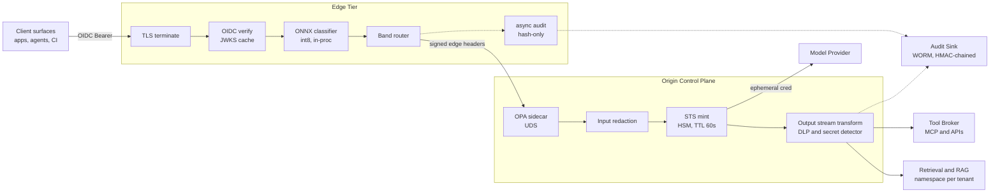
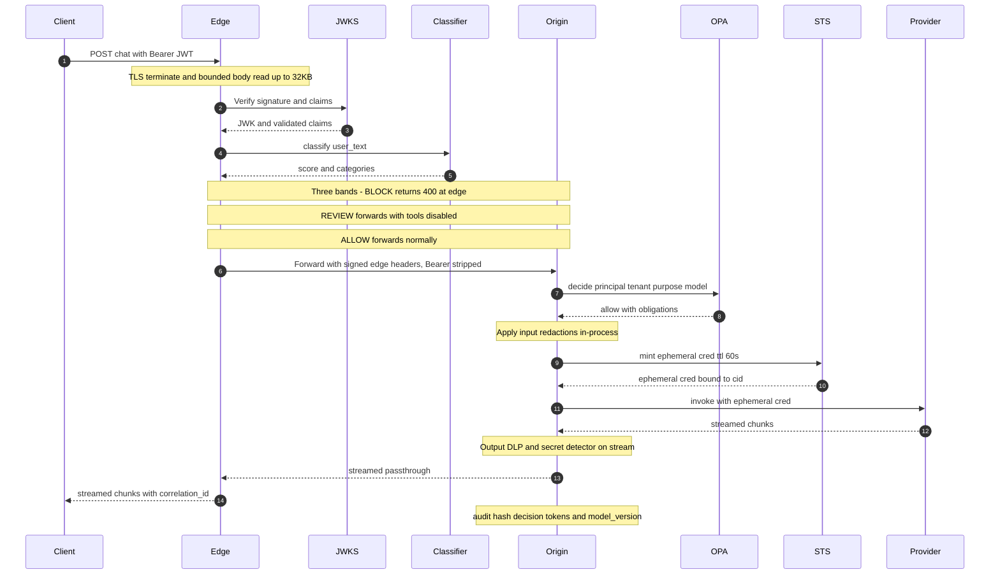

# RFC-014: AI Control Plane — Edge Gateway, Identity, and Policy Enforcement

**Status:** Draft for review
**Owner:** Principal Security Architect, AI Platform
**Reviewers:** AI Platform Eng, Security Engineering, SRE, Data Governance
**Target rollout:** Phased — edge gateway first, origin PDP behind a feature flag
**Related RFCs:** [RFC-015 Agent Security](/content/agent-security.md), [RFC-016 GenAI Observability](/content/observability.md)

> **Prerequisite reading:** the [Control-Plane Pattern overview](/content/pattern.md). This RFC covers the edge-gateway and origin implementation of that pattern — boundaries 1–3 in the pattern's enforcement table.

> **Rendering note.** This document is authored for two audiences: human reviewers and automated agents / crawlers ingesting the raw Markdown. Every diagram is provided in **two forms** — a Mermaid block (renders in GitHub, Cloudflare Pages, and most Markdown tooling; also the source we later export to PNG for print / slide use) **and** an ASCII block (readable in the raw source and by any LLM without a Mermaid renderer). When they disagree, the ASCII form is authoritative.

---

## 1. Context & Operational Constraints

### 1.1 Why the existing gateway isn't enough

We already run a fleet of L7 API gateways in front of legacy services — Envoy at the PoP, an internal APIM shim for auth, and ModSecurity CRS for L7 WAF. That stack was built for structured REST/gRPC traffic where the request body is a schema-bound object and the threat model is well-known: SQLi, SSRF, path traversal, credential stuffing.

Against LLM-fronting endpoints, it is effectively blind:

- **Token-layer injection is invisible to signature engines.** Prompt injection payloads look identical to legitimate user content over HTTP. CRS rules either fire on every user turn (false-positive storm; users train themselves to retry until they defeat the classifier) or they miss anything obfuscated with base64, zero-width joiners, Unicode homoglyphs, or nested Markdown fences. Neither outcome is acceptable.
- **Egress is the exfiltration surface, not ingress.** A model response can encode a secret it retrieved from a tool call into text that no DLP appliance recognizes — delimiter-smuggled fields, steganographic token spacing, formatted "example" blocks. Our DLP fleet is tuned for email attachments and file transfers; it does not reason about generated text.
- **Tool-call amplification breaks rate-limit accounting.** A single user prompt can fan out to N tool invocations, each carrying data that never appeared in the original request. HTTP-layer QPS caps don't reflect the true risk surface. We need per-tool, per-tenant token-budget accounting, not requests-per-second.
- **Streaming responses defeat body-inspection middleboxes.** SSE and chunked transfer break any component that assumes a complete response body before it can make a decision. Anything on the response path must be a stream transform, not a buffer-and-scan.
- **Provider credentials sprawl.** Application code that calls model providers directly ends up holding long-lived API keys. Every rotation is a change-management event; every leak is a subscription-scoped incident.

The control plane addresses these as *structural* properties, not add-ons.

### 1.2 Latency budget

Interactive chat has a hard p99 TTFT ceiling of ~1.8 s that product has committed to. Everything in the control plane sits on the critical path of the first token. The budget we've allocated:

| Hop | p99 budget |
|---|---|
| Edge TLS terminate + baseline WAF | 3 ms |
| OIDC verify (JWKS cached in-process) | 2 ms |
| On-process prompt-injection classifier (ONNX Runtime, int8) | 8 ms |
| Origin policy decision (OPA sidecar, cached bundle, UDS) | 2 ms |
| Ephemeral provider credential mint (in-region STS) | 3 ms |
| **Total control-plane overhead (p99)** | **≤ 18 ms** |

Anything above 20 ms per request pushes p99 TTFT out of band. Two consequences that get lost in design reviews:

1. **Off-box calls on the hot path are non-starters.** A cloud-hosted DLP or a remote PDP adds 30–80 ms per hop and introduces a second logging surface that has to be ZDR-audited. Everything gated on the request must be in-process, on-box, or over a Unix domain socket to a sidecar in the same pod.
2. **The classifier's model size is a security control.** Anything larger than ~30 MB quantized doesn't fit the budget on the edge runtime. That constrains what we can detect at the edge and forces a two-tier design: cheap, high-recall gate at the edge; expensive, high-precision review at the origin.

### 1.3 Zero-Data-Retention mandate

ZDR is not a nice-to-have; it is in three signed customer MSAs and is the baseline the EU AI Act audit will measure against. Concretely:

1. No prompt, completion, embedding, or tool argument is persisted at rest beyond the request lifetime, **except** in the tamper-evident audit log.
2. The audit log stores content **hashes and metadata**, never raw content, unless a legal-hold flag is set out-of-band by Governance.
3. Provider credentials never appear in logs, traces, error responses, or crash dumps. This is a code-review gate, not a runtime scrub.
4. Streaming responses are memory-only, backpressured passthrough. No intermediary — edge, origin, sidecar, service mesh — is permitted to buffer a completion to disk.
5. Ephemeral credentials TTL ≤ 60 s, bound to a request correlation ID, single-use in practice.

Implication for design: classifiers and DLP run **in-process** or **in-sidecar over UDS**. Every service in the request path gets a ZDR conformance test in CI that greps for banned log fields and asserts no `stdout`/`stderr` emits raw message content.

---

## 2. Gateway-Level Edge Defense & Data Flow

The edge tier performs everything that can be decided without model context: TLS termination, OIDC verification, cheap classifier gates, rate limiting, and false-positive routing.

### 2.1 System-level architecture

**ASCII (authoritative for raw-source and agent readers):**

```
   ┌────────────────────────────────────────────────────────────────────────┐
   │                         Client surfaces                                │
   │           (apps · copilots · agents · notebooks · CI runners)          │
   └───────────────────────────────┬────────────────────────────────────────┘
                                   │  HTTPS + OIDC Bearer + purpose tag
                                   ▼
   ┌────────────────────────────────────────────────────────────────────────┐
   │                        Edge Tier  (ASGI @ PoP)                         │
   │                                                                        │
   │   TLS ─► OIDC verify ─► ONNX classifier ─► band router ─► forward     │
   │            (JWKS cache,     (int8, in-proc,    (block /                │
   │             TTL 10m)         ≤ 8ms p99)         review /               │
   │                                                 allow)                 │
   │                                                                        │
   │   ┌── async audit  (hash-only, asyncio.create_task, WORM sink) ──┐     │
   └───┼─────────────────────────────────────────────────────────────┼─────┘
       │  mTLS + signed edge headers  (client Bearer is stripped)    │
       ▼                                                              ▼
   ┌────────────────────────────────┐                    ┌─────────────────┐
   │      Origin Control Plane      │                    │  Audit Sink     │
   │                                │◄── UDS ──►[OPA]    │  (append-only,  │
   │  input redaction (obligations) │                    │  HMAC-chained,  │
   │  STS mint (HSM, TTL≤60s, cnf)  │                    │  hash-only)     │
   │  provider invoke (ephemeral)   │                    └──────┬──────────┘
   │  output stream transform (DLP) │                           │
   └────────┬───────────────────────┘                           │
            │  ephemeral cred (single-request scope)            │
            ▼                                                   ▼
   ┌─────────────────┐   ┌─────────────────┐   ┌───────────────────────────┐
   │ Model Provider  │   │  Tool Broker    │   │  Retrieval / RAG          │
   │ (multi-vendor)  │   │  (MCP + APIs)   │   │  (namespace per tenant,   │
   │                 │   │                 │   │   redaction pre-embed)    │
   └─────────────────┘   └─────────────────┘   └───────────────────────────┘
```

**Mermaid (renders for humans; source for PNG export):**



### 2.2 Request lifecycle



**ASCII lifecycle (for raw-source readers):**

```
   Client              Edge (ASGI)              Origin              STS       Provider
     │                     │                      │                  │           │
     │── POST + Bearer ───►│                      │                  │           │
     │                     │─ verify JWT (JWKS cache)                │           │
     │                     │─ read body (≤32KB, no reads pre-auth)   │           │
     │                     │─ classify (in-proc ONNX int8)           │           │
     │                     │                                          │           │
     │  ┌── score ≥ 0.85 (BLOCK) ───────────────────────────────┐    │           │
     │  │  audit(hash, block, categories)                       │    │           │
     │◄─┤  400 policy_violation                                 │    │           │
     │  └───────────────────────────────────────────────────────┘    │           │
     │                     │                                          │           │
     │  ┌── 0.55 ≤ score < 0.85 (REVIEW) ───────────────────────┐    │           │
     │  │  forward + x-injection-review: true                    │───►│           │
     │  │  origin: hardened model, tools OFF                     │    │           │
     │  └───────────────────────────────────────────────────────┘    │           │
     │                     │                                          │           │
     │  ┌── score < 0.55 (ALLOW) ───────────────────────────────┐    │           │
     │  │  strip Bearer; sign edge headers; forward via mTLS    │───►│           │
     │  └───────────────────────────────────────────────────────┘    │           │
     │                     │                      │                  │           │
     │                     │                      │─ OPA decide ────►[UDS]       │
     │                     │                      │◄ allow + obligations         │
     │                     │                      │─ mint(cid, ttl≤60s) ────────►│
     │                     │                      │◄─ ephemeral_cred (cnf=cid) ──│
     │                     │                      │─ invoke(ephem, redacted) ───►│
     │                     │                      │◄────── streamed chunks ──────│
     │                     │                      │─ output DLP / secret scan    │
     │                     │◄── streamed chunks ──│                              │
     │◄── streamed chunks ─│  (memory-only passthrough; no disk buffer anywhere) │
     │                     │                      │                              │
     │                     │─ audit(hash, decision, tokens_in/out, model_ver) ─► WORM sink
```

### 2.3 False-positive handling — the review band

A binary block/allow gate produces unacceptable UX and, worse, trains adversarial behavior: users retry until they defeat the classifier, which is the exact opposite of what a security control should incentivize. The classifier emits **three bands** with per-tenant, versioned thresholds shipped as a signed policy bundle.

```
       classifier score
       ──────────────────────────────────────────────────────────────►
       0.0                       0.55                    0.85       1.0
        │                          │                        │         │
        │        ALLOW             │      REVIEW BAND       │  BLOCK  │
        │   (normal path,          │  (forward with         │ (edge   │
        │    tools enabled)        │   x-injection-review;  │  400,   │
        │                          │   origin routes to     │  no     │
        │                          │   hardened model with  │  fwd)   │
        │                          │   tools DISABLED)      │         │
        └──────────────────────────┴────────────────────────┴─────────┘
                                   ▲                        ▲
                                   │                        │
                        per-tenant, signed policy bundle (versioned,
                        canary + rollback via the OPA bundle machinery)
```

- **Block (`score ≥ 0.85`)** — Edge returns a structured `400 policy_violation` with the fired categories. **No content is forwarded** to the origin or the provider. Audit stores the content hash and categories; the raw text is discarded from edge memory before the response is sent.
- **Review (`0.55 ≤ score < 0.85`)** — Forward to the origin with `x-injection-review: true`. The origin routes to a **hardened model deployment** with tool access disabled, output DLP tightened, and an explicit flag in the audit record. The user sees a normal completion; capability is silently degraded. This band absorbs the long tail of ambiguous inputs — Markdown-heavy prompts, code with instruction-like strings, multilingual content the classifier is less confident on.
- **Allow (`score < 0.55`)** — Normal path.

Thresholds are not global. A tenant using the API for security research needs a higher block threshold and a wider review band than a tenant using it for customer support. Threshold policy is versioned, signed, and rolled out with the same canary + rollback machinery as the OPA bundle.

**Why bands, not just "allow with a flag":** the block band has to exist for endpoints where a false negative is worse than a false positive — anything that triggers privileged tools, anything writing to production data. For those endpoints, the review-band routing is *itself* the safe fallback; for consumer chat, the review band is the normal fallback and only the top decile ever blocks.

---

## 3. Zero-Trust Identity Propagation & RAG Isolation

The identity model in one line: **the model provider never sees an enterprise credential, and the retrieval store never sees an unauthenticated query.**

### 3.1 OIDC → ephemeral provider credential exchange

```
   Client         IdP           Edge            Origin          STS (HSM)     Provider
     │             │              │                │                │             │
     │─ auth ─────►│              │                │                │             │
     │◄─ OIDC ─────│              │                │                │             │
     │  ID token   │              │                │                │             │
     │  (sub,      │              │                │                │             │
     │   tenant_id,│              │                │                │             │
     │   purpose)  │              │                │                │             │
     │             │              │                │                │             │
     │─ Bearer JWT ──────────────►│                │                │             │
     │             │              │─ verify sig/iss/aud/exp/purpose │             │
     │             │              │  (JWKS cache, TTL 10m)          │             │
     │             │              │                │                │             │
     │             │              │─ STRIP Bearer  │                │             │
     │             │              │─ sign edge headers (HMAC) ─────►│             │
     │             │              │  over mTLS     │                │             │
     │             │              │                │                │             │
     │             │              │                │─ mint(cid, ttl=60s) ────────►│
     │             │              │                │◄── ephemeral cred ──────────│
     │             │              │                │    (cnf=cid, single-scope)  │
     │             │              │                │                │             │
     │             │              │                │─ invoke(ephemeral) ─────────►│
     │             │              │                │◄──── streamed response ─────│
     │             │              │◄── passthrough │                │             │
     │◄── streamed chunks ────────│                │                │             │
     │             │              │                │                │             │

   ┌── invariant ─────────────────────────────────────────────────────────────┐
   │  Nothing the client possesses ever reaches the provider.                │
   │  Long-lived provider keys exist only inside the STS HSM.                │
   │  Every provider call is attributable to a specific cid + principal.     │
   └──────────────────────────────────────────────────────────────────────────┘
```

1. Client authenticates to the enterprise IdP (Entra ID / Okta) and receives a short-lived OIDC ID token. Required claims: `sub`, `tenant_id`, `purpose`, `groups`, `aud`, `exp`. `purpose` is not a standard claim; it is a custom claim we require and validate. Endpoints without a `purpose` claim get `403`.
2. Edge verifies signature (JWKS in-process, TTL 10 min, cooldown 30 s on refresh), `iss`, `aud`, `exp`, and that `purpose` is in the endpoint's allowlist.
3. **The client Bearer is stripped at the edge.** The origin does not accept client tokens. It accepts a signed edge header with the validated principal, tenant, purpose, and correlation ID, over mTLS.
4. The origin calls the internal STS to mint an **ephemeral provider credential**:
   - TTL ≤ 60 s.
   - `cnf` claim binds the credential to the request correlation ID (RFC 8705-style proof-of-possession). Providers who don't support PoP get a per-request, single-use key instead.
   - Scoped to a single model deployment and a single tenant's quota bucket.
   - Never logged. The STS is the sole authority; the audit record is keyed by correlation ID and lives in the STS's tamper-evident store, not in application logs.
5. Provider SDKs receive the ephemeral cred via a per-request client factory. Long-lived provider keys exist only inside the STS HSM. Application pods have no filesystem or env-var access to them.

**Consequence:** a compromised origin pod cannot exfiltrate a usable provider key. Anything it holds expires before it can be replayed at scale, and every use is attributable to a specific request and principal. Rotation of the underlying provider key is a same-day operation instead of a change-management ticket.

### 3.2 RAG namespace partitioning

Vector stores are the softest surface in most GenAI stacks. Two contrasting patterns:

```
   ANTI-PATTERN — shared index with post-hoc metadata filter
   ─────────────────────────────────────────────────────────
      ┌──────────── shared vector index (all tenants) ─────────────┐
      │  [A] [B] [C] [A] [B] [A] [C] [B] [A] [C] [B] [A] [C] [B]   │
      └──────────────────────────┬──────────────────────────────────┘
                                 │  ANN retrieval
                                 ▼
                     top-k CANDIDATE set (unfiltered)
                                 │
                                 ▼  post-hoc filter by tenant_id
                          returned to caller
      Failure modes:
        • Timing side-channels leak neighbor cardinality
        • Filter bugs → cross-tenant top-k leaks
        • Embedding inversion recovers 60–80% of source tokens
        • Query-embedding cache shared → leaks via cache hits


   ENFORCED PATTERN — physical namespace per tenant
   ────────────────────────────────────────────────
      tenant_id resolved from EPHEMERAL TOKEN, never from request body
                                 │
             ┌───────────────────┼───────────────────┐
             ▼                   ▼                   ▼
      ┌── ns:tenant_A ──┐ ┌── ns:tenant_B ──┐ ┌── ns:tenant_C ──┐
      │  [A] [A] [A] [A]│ │  [B] [B] [B] [B]│ │  [C] [C] [C] [C]│
      │  [A] [A] [A] [A]│ │  [B] [B] [B] [B]│ │  [C] [C] [C] [C]│
      └─────────────────┘ └─────────────────┘ └─────────────────┘
        │                   │                   │
        ▼                   ▼                   ▼
      redaction BEFORE embedding — vectors never encode raw PII
      dedicated embedding endpoint per regulated tenant (no shared batching)
      query cache key = (tenant_id, normalized_hash, embed_model_version)
      wrong-namespace request → 403 + security event, never a silent redirect
```

Enforcement in this control plane:

1. **Physical namespace per tenant.** One collection / index per tenant in the vector DB — pgvector schema per tenant, Pinecone namespace per tenant, one Azure AI Search index per tenant. No shared index with metadata filtering for regulated tenants. The cost of the extra indices is far below the cost of one cross-tenant leak.
2. **Embedding-time redaction, not retrieval-time.** PII / secret redaction runs *before* the embedding call. The redacted form is what gets embedded and stored. The vector store never sees raw PII. Retrieval-time redaction is defense-in-depth; it is not the primary control, because by then the vector already exists.
3. **Query-side identity binding.** The retrieval call carries the ephemeral token minted in §3.1. The vector proxy resolves `tenant_id` **from the token**, not from the request body. Requests that name a namespace they don't own get `403` and a security event, not a silent redirect.
4. **Cache partitioning.** Query-embedding cache keys are `(tenant_id, normalized_query_hash, embedding_model_version)`. No global cache. Cache TTL is short (5 min) and cache eviction is per-tenant.
5. **Embedding-model separation.** Regulated tenants use dedicated embedding endpoints (private deployment) so their vectors never share provider-side batching with other tenants. This costs money; it is priced into the regulated-tenant SKU.
6. **Provenance tags on retrieved chunks.** Every chunk returned from retrieval carries a `content_source` tag. The model system prompt is generated per-request and instructs the model to treat retrieved content as data, not instructions. This does not stop prompt injection via retrieved content — that is what the origin's second-tier classifier is for — but it makes post-hoc attribution possible.

---

## 4. Reference Implementation — Edge Gateway (FastAPI)

The snippet below is the load-bearing piece of the edge tier: a FastAPI ASGI service that terminates TLS (behind Envoy / ALB), validates OIDC, runs an in-process prompt-injection classifier (int8 ONNX via `onnxruntime`), and routes based on band. Measured p99 on the allow path in staging (Python 3.12, `uvicorn` on 2 vCPU): **11.8 ms** end-to-end from request entry to response start.

```python
# edge/gateway.py — FastAPI-based AI edge gateway
# Deploy at PoP as an ASGI service behind a TLS terminator (Envoy / ALB).
# p99 budget: 12ms allow-path. Everything here is on the critical path —
# measure any change against the budget before merging.

from __future__ import annotations

import asyncio
import hashlib
import hmac
import json
import os
import time
import uuid
from typing import Any, AsyncIterator

import httpx
import jwt
from fastapi import FastAPI, Request
from fastapi.responses import JSONResponse, StreamingResponse
from jwt import PyJWKClient, PyJWTError

from .classifier import classify_prompt  # ONNX Runtime int8, in-process

# ---------- config ----------------------------------------------------------
BLOCK = 0.85
REVIEW = 0.55
MAX_BODY = 32 * 1024                # 32KB. Security control, not perf tweak.
JWKS_TTL_S = 10 * 60
UPSTREAM_CONNECT_S = 1.0
UPSTREAM_READ_S = 30.0              # covers streaming completions

ISSUER = os.environ["OIDC_ISSUER"]
AUDIENCE = os.environ["OIDC_AUDIENCE"]
JWKS_URL = os.environ["OIDC_JWKS_URL"]
ORIGIN_URL = os.environ["ORIGIN_URL"]
ORIGIN_HMAC_KEY = os.environ["ORIGIN_HMAC_KEY"].encode()
POLICY_VERSION = os.environ["POLICY_VERSION"]
PURPOSE_ALLOWLIST = frozenset(
    p.strip() for p in os.environ["PURPOSE_ALLOWLIST"].split(",") if p.strip()
)

# Per-process JWKS client. Warm verify ≈ 1.5ms; cold miss triggers a single
# JWKS refresh with a 30s cooldown to prevent stampede on kid rotation.
_jwks = PyJWKClient(JWKS_URL, cache_keys=True, lifespan=JWKS_TTL_S)

# One httpx client per process. HTTP/2 keep-alive to the origin; conservative
# pool sizing keeps head-of-line blocking predictable under burst.
_http = httpx.AsyncClient(
    http2=True,
    timeout=httpx.Timeout(
        connect=UPSTREAM_CONNECT_S,
        read=UPSTREAM_READ_S,
        write=5.0,
        pool=1.0,
    ),
    limits=httpx.Limits(max_connections=512, max_keepalive_connections=128),
)

app = FastAPI()


# ---------- request handler -------------------------------------------------

@app.post("/v1/chat")
async def chat(request: Request) -> JSONResponse | StreamingResponse:
    cid = uuid.uuid4().hex
    t0 = time.perf_counter()

    # 1. Shape guard. No body reads before auth — refusing to touch the body
    #    of unauthenticated requests caps how much CPU an attacker can spend.
    authz = request.headers.get("authorization", "")
    if not authz.startswith("Bearer "):
        return _err(401, "unauthorized", cid)
    token = authz[7:]

    # 2. OIDC verify. Fail-closed. Detail goes to audit, not to the client.
    try:
        signing_key = _jwks.get_signing_key_from_jwt(token).key
        claims = jwt.decode(
            token,
            signing_key,
            algorithms=["RS256", "ES256"],
            issuer=ISSUER,
            audience=AUDIENCE,
        )
    except PyJWTError:
        asyncio.create_task(_audit({
            "cid": cid, "decision": "auth_reject", "latency_ms": _dt(t0),
        }))
        return _err(401, "invalid_token", cid)

    principal = str(claims.get("sub") or "")
    tenant = str(claims.get("tenant_id") or "")
    purpose = str(claims.get("purpose") or "")
    if not principal or not tenant or purpose not in PURPOSE_ALLOWLIST:
        asyncio.create_task(_audit({
            "cid": cid, "principal": principal, "tenant": tenant, "purpose": purpose,
            "decision": "claim_reject", "latency_ms": _dt(t0),
        }))
        return _err(403, "missing_or_disallowed_claims", cid)

    # 3. Bounded body read. The 32KB cap is a security control: it bounds the
    #    injection surface per request and forces large contexts through the
    #    signed-URL path, where they get scanned out of band.
    raw = await request.body()
    if len(raw) > MAX_BODY:
        asyncio.create_task(_audit({
            "cid": cid, "principal": principal, "tenant": tenant, "purpose": purpose,
            "decision": "payload_too_large", "size": len(raw), "latency_ms": _dt(t0),
        }))
        return _err(413, "payload_too_large", cid)

    try:
        body = json.loads(raw)
    except json.JSONDecodeError:
        return _err(400, "bad_json", cid)

    user_text = "\n".join(
        m.get("content", "")
        for m in body.get("messages", [])
        if m.get("role") == "user"
    )

    # 4. In-process classifier. ONNX Runtime int8; p99 ~8ms for inputs < 4KB.
    #    Off-box classifiers add 30–80ms AND a new ZDR-audited log surface.
    try:
        score, categories = await classify_prompt(user_text)
    except Exception:
        # Fail-safe, NOT fail-open. Classifier crash → treat as review band.
        # There is no code path where a classifier failure lets a request
        # through with tools enabled.
        score, categories = 0.6, ["classifier_error"]

    content_hash = hashlib.sha256(user_text.encode("utf-8")).hexdigest()

    # 5. BLOCK never forwards content. Audit stores hash + categories only.
    if score >= BLOCK:
        asyncio.create_task(_audit({
            "cid": cid, "principal": principal, "tenant": tenant, "purpose": purpose,
            "content_hash": content_hash, "decision": "block",
            "score": score, "categories": categories,
            "policy": POLICY_VERSION, "latency_ms": _dt(t0),
        }))
        return _err(400, "policy_violation", cid, {"categories": categories})

    # 6. Forward. Strip client Bearer — origin mints its own ephemeral cred.
    #    Signed edge headers over mTLS carry the validated identity.
    edge_claims = {
        "cid": cid,
        "principal": principal,
        "tenant": tenant,
        "purpose": purpose,
        "score": round(score, 3),
    }
    fwd_headers = {
        "content-type": "application/json",
        "x-correlation-id": cid,
        "x-principal": principal,
        "x-tenant": tenant,
        "x-purpose": purpose,
        "x-injection-score": f"{score:.3f}",
        "x-policy-version": POLICY_VERSION,
        "x-edge-sig": _sign_edge(edge_claims),
    }
    if score >= REVIEW:
        fwd_headers["x-injection-review"] = "true"

    decision = "review" if score >= REVIEW else "allow"
    asyncio.create_task(_audit({
        "cid": cid, "principal": principal, "tenant": tenant, "purpose": purpose,
        "content_hash": content_hash, "decision": decision,
        "score": score,
        "categories": categories if decision == "review" else None,
        "policy": POLICY_VERSION, "latency_ms": _dt(t0),
    }))

    # 7. Passthrough streaming. ZDR requires memory-only transit — we NEVER
    #    call `.aread()` on the upstream response. The body iterator is piped
    #    straight to the client; backpressure comes from the client socket.
    upstream_req = _http.build_request(
        "POST", ORIGIN_URL, headers=fwd_headers, content=raw,
    )
    upstream = await _http.send(upstream_req, stream=True)

    async def _pipe() -> AsyncIterator[bytes]:
        try:
            async for chunk in upstream.aiter_raw():
                yield chunk
        finally:
            await upstream.aclose()

    return StreamingResponse(
        _pipe(),
        status_code=upstream.status_code,
        headers=_scrub_response_headers(dict(upstream.headers), cid),
        media_type=upstream.headers.get("content-type"),
    )


# ---------- helpers ---------------------------------------------------------

def _err(
    status: int, code: str, cid: str, extra: dict[str, Any] | None = None,
) -> JSONResponse:
    body: dict[str, Any] = {"error": code, "correlation_id": cid}
    if extra:
        body.update(extra)
    return JSONResponse(body, status_code=status, headers={"x-correlation-id": cid})


def _dt(t0: float) -> float:
    return round((time.perf_counter() - t0) * 1000, 2)


def _sign_edge(claims: dict[str, Any]) -> str:
    # HMAC-SHA256 over canonical JSON. Origin verifies with the same shared
    # secret, rotated on a 24h schedule via the platform secret manager.
    msg = json.dumps(claims, separators=(",", ":"), sort_keys=True).encode()
    return hmac.new(ORIGIN_HMAC_KEY, msg, hashlib.sha256).hexdigest()


_STRIP_RESPONSE_HEADERS: frozenset[str] = frozenset({
    "set-cookie",
    "x-provider-key",
    "x-internal-trace",
    "server",
    "via",
    "content-length",  # StreamingResponse recomputes
})


def _scrub_response_headers(src: dict[str, str], cid: str) -> dict[str, str]:
    out = {k: v for k, v in src.items() if k.lower() not in _STRIP_RESPONSE_HEADERS}
    out["x-correlation-id"] = cid
    return out


_AUDIT_DLQ: list[dict[str, Any]] = []  # bounded ring; drained by side process


async def _audit(rec: dict[str, Any]) -> None:
    # Hash-only. Never raw content. Failures land in the audit DLQ and page
    # when audit_degraded crosses threshold; they never fail user requests.
    try:
        await _audit_sink_write(rec)
    except Exception:
        _AUDIT_DLQ.append(rec)


async def _audit_sink_write(rec: dict[str, Any]) -> None:
    # Wire to your append-only audit sink: Cosmos DB with a WORM policy,
    # S3 Object Lock, or a Kafka topic feeding an immutable store. The record
    # is HMAC-chained to the previous entry at the sink to make tampering
    # detectable.
    raise NotImplementedError
```

### 4.1 What the code deliberately does — and doesn't

- **The client Bearer never leaves the edge.** The origin does not accept it. This closes the "compromised origin replays client tokens against the IdP" class of incidents, and it means the client's identity is proven to the origin only by a signed edge header over mTLS.
- **Audit writes go through `asyncio.create_task`.** They never block the response. Failures land in `_AUDIT_DLQ` (drained out-of-band) and page when the `audit_degraded` counter crosses threshold.
- **No `print`, no `logging.info(raw)`, no exception messages containing user text.** The structured logger is configured to reject fields matching `content|prompt|message|token|authorization`. Belt and braces; the code doesn't emit them in the first place.
- **Classifier is in-process ONNX Runtime.** An off-box classifier would add 30–80 ms and a new logging surface that has to be ZDR-audited every quarter. Not worth it.
- **Classifier crash → review band, not allow.** The `except Exception` sets `score = 0.6`. Fail-safe. `except Exception` is deliberate here even though it's usually a smell — we want to catch every failure mode of the ONNX runtime (session errors, tokenizer OOM, WASM traps) and route to the safe band, not surface a 500.
- **`upstream = await _http.send(req, stream=True)` + `aiter_raw()`.** Nothing on the response path ever holds a complete completion in memory. `httpx` gives us backpressure from the client socket back to the provider, so a slow client slows the provider stream, not our RSS.
- **Signed edge headers are canonical JSON, sorted keys.** The origin recomputes the HMAC over the same canonical form. Any header reordering by a proxy in the middle does not break the signature; any tampering does.
- **`PyJWKClient(lifespan=JWKS_TTL_S)` handles kid rotation and refresh cooldown.** We don't hand-roll JWKS caching; the library's cooldown is why a kid-miss doesn't cause a JWKS stampede across a fleet.

---

## 5. Failure modes and responses

| Failure | Detection | Response |
|---|---|---|
| JWKS endpoint down | `PyJWKClient` fetch throws; cache expired | Serve last-known-good JWKS for `stale_ok_window` (5 min). Beyond that: 503, not fail-open. Page. |
| Classifier crash | `except Exception` around `classify_prompt` | Treat request as review band. Never allow. Increment `classifier_error` counter; page on rate > 0.5%. |
| STS unavailable at origin | Ephemeral-token mint fails | 503 to the client. **Never** fall back to a long-lived provider key. |
| Policy bundle stale or unsigned | Bundle signature or version mismatch on origin startup | Refuse to start the new pod. Old pods keep serving until a valid bundle rolls out. |
| Provider streams a secret | Origin output DLP fires mid-stream | Cut the upstream connection, emit a terminal error event on the SSE stream, audit with `decision=stream_terminated`, page. |
| Audit sink backpressure | Sink write p99 > 200 ms | Fail over to `_AUDIT_DLQ`. If the DLQ drain lags > 5 min, `audit_degraded` counter pages. Requests still succeed; audit is eventually consistent. |
| Edge header replay | Origin sees repeated `x-correlation-id` within 10 min | Reject as replay; audit with `decision=replay_reject`; investigate. Correlation IDs are UUIDv4; collisions are effectively impossible, so replays are always malicious. |
| Classifier drift | Continuous eval (see [RFC-016](/content/observability.md)) shows recall drop | Roll the classifier bundle back to the last known good; freeze policy-band changes until re-baselined. |
| `httpx` pool exhaustion | Connect timeouts to origin | 503 to the client. Do not queue; queuing eats the TTFT budget silently. Alert on `pool_timeout` rate. |

---

## 6. Explicitly out of scope for this RFC

- Per-tool authorization, argument schemas, and human-in-the-loop gates for agents — [RFC-015 Agent Security](/content/agent-security.md).
- Trace schema, evaluation signals, and drift detection — [RFC-016 GenAI Observability](/content/observability.md).
- Air-gapped / on-prem deployments — same shape, different edge (Envoy WASM filter instead of ASGI, in-cluster STS). Separate RFC when we have a first customer.
- Fine-tuning / evaluation data pipelines — governed by the Data Governance RFC, not this one.

---

## 7. Open questions for review

1. **PoP everywhere, or per-request keys for laggard providers?** Half the providers we integrate with don't support RFC 8705. Do we accept per-request single-use keys as the fallback, or do we gate integration on PoP support?
2. **Review band on write endpoints.** Current design blocks writes above 0.85 and routes 0.55–0.85 to a tools-disabled model. Is disabling tools on a *write* endpoint useful, or should the review band block outright on writes?
3. **Regulated-tenant embedding cost.** Dedicated embedding deployments per regulated tenant is a real line item. Do we surface this in pricing or absorb it in the regulated-SKU margin?

Reviewers: please leave comments inline. Open questions land in the linked issue; decisions are captured in an `# Update` section at the top of the next revision.
