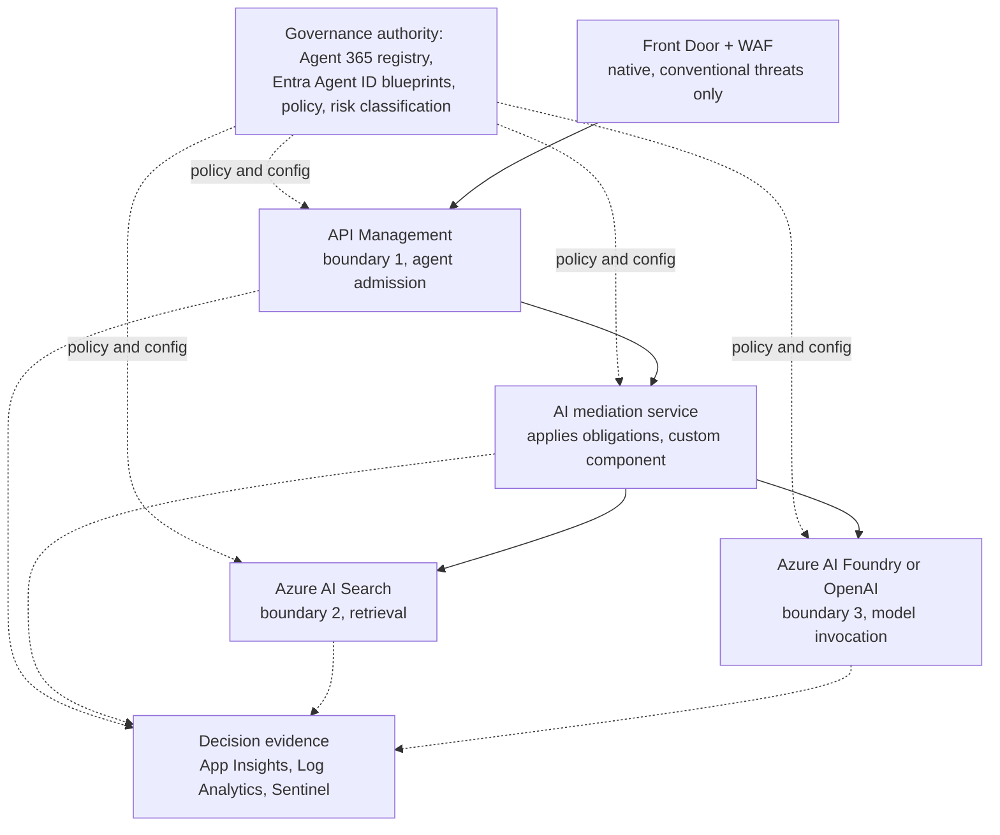
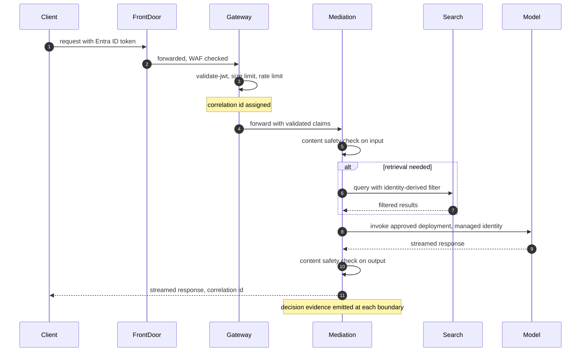

# RFC-014: Microsoft-Native Enforcement for the AI Control-Plane Pattern

**Status:** Reference architecture — public portfolio design. Not a description of a deployed system, a customer implementation, or an internal Microsoft document.
**Scope:** Boundaries 1–3 of the [AI Control-Plane Pattern](/content/pattern.md) — agent admission, retrieval authorization, and model invocation.
**Related:** [RFC-015 Agent Security](/content/agent-security.md) covers boundaries 4–6 (tool proposals, resource-side authorization, side-effect approval). [RFC-016 GenAI Observability](/content/observability.md) covers trace schema, decision evidence, audit integrity, detection, and drift.

> **Prerequisite reading:** [The AI Control-Plane Pattern](/content/pattern.md). This RFC does not redefine that pattern. Governance authority is centralized; enforcement is distributed across the boundaries the pattern describes. Nothing here should be read as re-centralizing all AI traffic through one proxy.

> **Labeling convention.** Every quantitative value in this document is a design assumption or an illustrative example unless stated otherwise. Nothing is described as deployed, measured, or production-proven. Where a claim needs validation against real traffic or a real threat model, it's marked **requires validation**.

> **Rendering note.** This document is authored for two audiences: human reviewers and automated agents or crawlers reading the raw Markdown. Diagrams are provided in both a Mermaid block and an ASCII block. Where they disagree, the ASCII form is authoritative.

---

## Status and scope

This is a public reference design implementing boundaries 1–3 of the control-plane pattern using Microsoft-native services. Its purpose is to show a credible path from the portable pattern to a concrete Azure architecture, not to document something running in production. Boundaries 4–6 and the observability model belong to the other two RFCs in this series and are explicitly out of scope here (§13).

## 1. Context and design goals

The pattern overview lays out why fragmentation happens when every application team makes its own identity, data-boundary, and logging decisions. This RFC doesn't repeat that argument. What it adds is specific: which Microsoft services satisfy each requirement, where the substitutions are native and where a custom component is still necessary, and why.

Conventional L7 gateways and WAFs are built for schema-bound REST or gRPC traffic, where the threat model is well understood: SQL injection, SSRF, path traversal, credential stuffing. Against LLM-fronting endpoints, that model doesn't transfer cleanly:

- A prompt-injection payload looks identical to legitimate user content at the HTTP layer. A WAF signature engine has no semantic understanding of the text it's inspecting. Azure Front Door and a Web Application Firewall address conventional web and network threats at the edge — malformed requests, known attack signatures, volumetric abuse. They do not reliably interpret semantic prompt injection, and this RFC does not claim otherwise.
- Egress is where model-specific exfiltration risk concentrates, not ingress. A model response can encode a secret retrieved by a tool call into ordinary-looking text. A DLP appliance tuned for file attachments has no reason to flag it.
- A single request can fan out into several tool or retrieval calls, each carrying data that never appeared in the original payload. Request-level rate limits at the edge don't reflect that.
- Streaming responses break inspection components that assume a complete response body before making a decision.

The design goal for boundaries 1–3 is to place enforcement where each of these properties can actually be evaluated, using Azure-native services first and custom components only where a native service doesn't cover the requirement.

## 2. Requirements and assumptions

| Area | Requirement | Status |
|---|---|---|
| Identity | Every request reaching boundary 1 carries a validated Microsoft Entra ID token before any policy decision is made. | Design assumption |
| Agent identity | Where the caller is an agent, a distinct Microsoft Entra Agent ID identity represents it, separate from the identity of whatever workload happens to host it. | Requirement |
| Latency | Enforcement adds sub-second overhead to a request. No specific millisecond figure is claimed here. | Illustrative goal, requires validation against real traffic |
| Data minimization | See "Content-Minimizing Telemetry Requirement" below. | Design assumption |
| Regional deployment | Model invocation is constrained to an approved set of regions and deployments per tenant and data class. | Design assumption |
| Tenant isolation | Tenant identity is resolved from a validated token claim, never from an unauthenticated field in the request body. | Requirement |
| Availability | Each boundary has a stated failure posture (§11). Default is fail-closed unless explicitly justified otherwise. | Design assumption |
| Failure behavior | A boundary that cannot reach its policy source does not silently allow. | Requirement |

### Content-Minimizing Telemetry Requirement

This section used to be labeled "Zero-Data-Retention." That name implies a legal or provider-level guarantee this design doesn't make. What this RFC actually controls is what the *application layer* writes into decision evidence: hashes and metadata, not raw prompts, completions, or retrieved document bodies. That's an application logging discipline, and it is not the same thing as:

- **Provider data handling** — what Azure OpenAI or another model provider does with a request internally, which this RFC does not control and does not claim to know without checking the provider's own data-handling documentation and configuration.
- **Diagnostic settings** — Azure services often have their own diagnostic logging that can capture more than the application layer intends. Diagnostic settings on API Management, Azure AI Search, and Azure OpenAI need to be reviewed against this requirement, not assumed to already comply with it.
- **Security audit evidence** — the decision-evidence stream this RFC and RFC-016 define, which is deliberately hash-only.
- **Temporary in-memory processing** — content that passes through a process's memory during a request is not "retained" in the sense this requirement cares about, but it can still appear in a crash dump or a debugger attach.
- **Downstream monitoring systems** — anything this stream feeds (Log Analytics, Sentinel, a SIEM) inherits whatever retention policy that system is configured with, independent of what the application wrote.

This RFC does not claim legal or regulatory compliance with any specific framework. Application logs that omit raw prompts do not by themselves establish zero data retention across a system. Actual retention behavior needs validation across, at minimum: Azure OpenAI configuration, Azure AI Content Safety, API Management request tracing, Application Insights, Log Analytics, crash dumps, any reverse proxy in the path, dead-letter mechanisms, support and abuse-monitoring processes on the provider side, and any third-party model provider in use.

## 3. Microsoft service mapping

| Pattern component | Microsoft service | Native or custom | Notes |
|---|---|---|---|
| Internet edge | Azure Front Door, Web Application Firewall, DDoS Protection | Native | Conventional web and network threats. Not a semantic security boundary. |
| Agent admission (boundary 1) | Azure API Management | Native | A policy enforcement point. Not the entire control plane. |
| Token validation | Microsoft Entra ID, APIM `validate-jwt` | Native | |
| Agent identity (the logical agent) | Microsoft Entra Agent ID — agent identity blueprint, blueprint principal, per-instance agent identity | Native | Represents the agent itself, distinct from the workload hosting it. See §5. |
| Agent registry and cross-platform governance | Microsoft Agent 365 | Native | Registry, access control, and lifecycle surface for agents across Foundry, Copilot Studio, and other platforms. Detailed governance actions belong to RFC-015. |
| Workload identity (hosting component) | Microsoft Entra ID managed identity, optionally via workload identity federation | Native | One option for authenticating the agent identity blueprint to Entra ID without a stored secret, recommended for Azure-hosted production blueprints. Local development typically uses a client secret instead. Preferred over an application-held model-provider key. Does not itself represent the agent. |
| Multi-provider credential handling | Custom credential broker | Custom | Only for providers that don't support Entra-based auth. See §7. |
| Models | Azure AI Foundry, Azure OpenAI, approved deployments | Native | |
| Prompt and content signals | Azure AI Content Safety, Prompt Shields | Native | A probabilistic risk signal, not an authorization authority. |
| Retrieval (boundary 2) | Azure AI Search, identity-derived security filters | Native | Isolation tier chosen per tenant risk level (§6). |
| Network and secrets | Azure Private Link, VNet integration, Private DNS, Azure Key Vault | Native | |
| Deployment-time governance | Azure Policy | Native | Not a per-request authorization engine for GenAI traffic. |
| Per-request policy logic (application and retrieval tier) | Custom policy engine (for example, OPA) or embedded application logic | Custom | Only where APIM policy expressions can't express the decision. |
| Decision evidence | Application Insights, Log Analytics, Microsoft Sentinel, immutable Azure Blob Storage | Native | Schema defined in RFC-016, not repeated here. |

## 4. Architecture

Governance authority (registry, policy definitions, risk classification) is centralized, per the pattern overview. Enforcement is distributed across four points: the edge, the gateway, the AI mediation service, and the retrieval and model backends.

**ASCII (authoritative):**

```
                         ┌───────────────────────────────────────┐
                         │           Governance authority          │
                         │  Agent 365 registry · Entra Agent ID     │
                         │  blueprints · policy · risk classification│
                         └───────────────┬─────────────────────────┘
                                         │ signed policy / config
                       ┌─────────────────┼─────────────────┬───────────────┐
                       ▼                 ▼                 ▼               ▼
                 ┌───────────┐    ┌────────────┐    ┌─────────────┐  ┌───────────┐
   Client ──────►│ Front Door │──►│ API Mgmt    │──►│ AI mediation │─►│ AI Search  │
   traffic        │ + WAF      │  │ (boundary 1)│   │ service      │  │(boundary 2)│
                 └───────────┘    └────────────┘    │              │  └───────────┘
                                                     │ applies      │        │
                                                     │ obligations  │        ▼
                                                     │              │  ┌───────────┐
                                                     │              │─►│ AI Foundry │
                                                     └──────┬───────┘  │ / OpenAI   │
                                                            │          │(boundary 3)│
                                                            │          └───────────┘
                                                            ▼
                                             ┌─────────────────────────┐
                                             │     Decision evidence     │
                                             │ App Insights / Log        │
                                             │ Analytics / Sentinel       │
                                             │ (schema: RFC-016)          │
                                             └─────────────────────────┘
```

**Mermaid (renders for humans; source for PNG export):**



## 5. Boundary 1: Agent admission

Three identity concepts show up at this boundary, and treating them as interchangeable is a design mistake this RFC deliberately avoids:

- **A user identity** represents the human on whose behalf an interactive agent may act.
- **A managed identity** represents the Azure workload or hosting component running the agent's code — a container app, a function, a VM. It authenticates that piece of infrastructure to Azure. It does not represent the agent.
- **A Microsoft Entra Agent ID agent identity** represents the logical AI agent itself: a distinct, attributable principal, independent of whatever infrastructure happens to host it today. Entra Agent ID is a first-class part of this architecture, not something a managed identity substitutes for. A managed identity is scoped to the host; an agent identity is scoped to the agent.

| Concept | Role |
|---|---|
| Agent identity blueprint | The template application object an agent identity is created from. Holds the credential used to mint tokens: a federated identity credential trusting a managed identity is the recommended option for an Azure-hosted production blueprint, a client secret is common for local development. Conditional Access and permission grants applied at the blueprint level are inherited by every agent instance created from it. |
| Individual agent identity | A service principal created from a blueprint, representing one specific agent instance. It can't hold its own credentials; it relies on the blueprint to acquire tokens for it. It's the principal that RBAC role assignments and per-agent policy decisions should attach to. |
| Agent sponsor | The human (or, for an agent identity, a human or group) accountable for that agent's purpose and lifecycle. Required at creation. If a sponsor leaves the organization, sponsorship transfers to their manager rather than lapsing. |
| Application-only agent access | The agent acts under its own authority, using a client-credentials flow. The agent identity itself is the token subject. |
| Delegated user-and-agent access | The agent acts on behalf of a signed-in user, using an on-behalf-of flow. The user is the token subject; the agent identity is the actor. |
| Workload identity federation | One way the blueprint can prove itself to Microsoft Entra ID without a stored secret, by trusting a credential from the hosting workload — typically a managed identity. Recommended for Azure-hosted production blueprints; not the only credential option, and not something every deployment needs. |
| Managed identity (hosting component) | Secures the Azure-hosted workload that runs the agent's code, and can serve as the credential source the blueprint federates against. It does not represent the agent and, where a distinct agent identity exists, should not be the principal downstream RBAC roles are granted to. |

This blueprint credential is a backend mechanism, separate from the one-time consent a human grants when first signing in to an agent — adding the agent to the organization and approving its requested permissions. That consent flow is a distinct, end-user-facing step and doesn't by itself determine which credential type the blueprint uses at runtime.

Azure API Management validates the incoming token (`validate-jwt`) the same way regardless of which of these subjects it represents: an agent identity token from the application-only flow, a delegated token where the agent identity is the actor and a signed-in user is the subject, or a plain user token for non-agentic traffic. The gateway's validation step doesn't change. What differs is which claims the AI mediation service evaluates afterward, and that's where the actual admission decision for agents gets made.

For agent admission specifically, that decision considers:

- **User or calling workload** — who or what is presenting the token.
- **Agent identity** — the specific Entra Agent ID identity making the call, when the caller is an agent.
- **Agent identity blueprint** — the template the agent identity was created from, since blueprint-level Conditional Access and permission grants apply to every instance created from it.
- **Autonomous or delegated interaction mode** — application-only (the agent identity is the token subject) or delegated (a signed-in user is the subject, the agent identity is the actor). Sign-in and audit logs distinguish these explicitly.
- **Tenant** — resolved from validated claims, never the request body.
- **Purpose** — the declared reason for the call, the same requirement as for non-agentic traffic.
- **Requested capability** — what the agent is asking to do this request, for example whether retrieval or tool use is in scope.
- **Agent lifecycle and risk state** — whether the calling agent identity is active, flagged, or has an open governance action against it. This state is owned by Microsoft Entra ID and Microsoft Agent 365, not reimplemented here; boundary 1 only needs the current answer. How that state gets remediated belongs to [RFC-015 Agent Security](/content/agent-security.md).

Do not assume every agent runtime or hosting platform already supports every part of this model. Support for Entra Agent ID capabilities varies by platform and by agent type today, and needs to be verified against current Microsoft Entra and Microsoft Foundry documentation rather than assumed.

API Management remains a policy enforcement point, not the entire admission decision. A registry that only lists approved agents — the Microsoft Agent 365 registry or a homegrown one — with no PEP actually checking against it on the request path, is inventory. It isn't enforcement.

## 6. Boundary 2: Retrieval authorization

Azure AI Search enforces retrieval-time authorization through identity-derived security filters: a filterable, non-retrievable field on each document (for example, `group_ids`) is checked against the caller's validated Entra ID claims using a `search.in` filter expression at query time. The tenant or group identifier used in that filter comes from the validated token, never from a field in the request body. A request naming a namespace the caller's token doesn't carry is rejected, not silently redirected to a namespace the caller does own.

Three retrieval-isolation choices are available, and none of them is universally correct:

| Approach | Isolation strength | Cost | Scale | Operational complexity | Suitable risk level |
|---|---|---|---|---|---|
| A. Shared index, security filters | Moderate. Depends on the filter being applied on every query path without exception. | Low | High — one index serves many tenants | Low | Lower-risk, higher-tenant-count workloads |
| B. Dedicated index per tenant | Strong. A misapplied filter in one tenant's code path can't reach another tenant's documents. | Medium — more indices to manage | Moderate — index count scales with tenant count | Medium | Regulated or higher-risk tenants |
| C. Dedicated Azure AI Search service or subscription boundary | Strongest. Removes shared infrastructure, not just shared index. | High | Lower — one service per tenant or tenant group | High | Highest-risk tenants, or where regulatory separation is required |

Option A is not automatically insufficient, and option B is not automatically required for every tenant. The right default depends on the tenant's actual risk classification from the registry, which is a governance-authority decision, not something this RFC dictates universally.

When the caller is an agent rather than an interactive user, the claims used to build the retrieval filter should include the agent's Microsoft Entra Agent ID identity, not just the tenant. Two agents in the same tenant can legitimately have different retrieval scopes, and collapsing that distinction to tenant-only filtering would let one agent read documents another agent is not intended to reach, even though both are technically within the same tenant boundary.

Where redaction and provenance matter regardless of isolation tier: applying PII or secret redaction before content is embedded (not only at query time), tagging retrieved chunks with a provenance marker so the model's system prompt can instruct it to treat retrieved content as data rather than instructions, and partitioning any query-embedding cache by tenant so a cache hit can't cross a tenant boundary. None of this replaces the identity-derived filter; it reduces the blast radius if the filter is ever misapplied.

## 7. Boundary 3: Model invocation

The policy decision at this boundary considers the caller, the tenant, the calling application, the specific agent identity when the caller is an agent, its stated purpose, the data classification of the request, the requested model and model version, the target region, and the requested capability (for example, whether tool use is permitted for this call). The model itself does not make this decision. It receives a request only after the decision has already resolved to allow, restrict, or block.

Including the agent identity as its own policy input matters because attribution at this boundary should resolve to the specific agent, not only to the application hosting it. A single application can host several distinct agents, each with its own Entra Agent ID identity; a policy decision and an audit record that only capture which application called the model lose that distinction.

**Managed identity secures the hosting workload, not the agent.** For an Azure-hosted production deployment, an agent identity blueprint can hold a federated identity credential that trusts a managed identity on the hosting workload — one of a few supported blueprint credential options, alongside a client secret for simpler or non-Azure deployments. Whichever credential the blueprint uses, that credential authenticates the *blueprint* to Microsoft Entra ID: it doesn't itself call Azure OpenAI, and it shouldn't be the principal an RBAC role is granted to when a distinct agent identity exists. The agent identity is the principal that needs the RBAC role assignment (for example, Cognitive Services OpenAI User) on the target Azure OpenAI resource, because the agent identity, not the managed identity or any other blueprint credential, is what shows up as the caller in the request and in the audit trail.

Where an application doesn't host distinct, individually attributable agents — a single service calling a model directly on its own behalf — a managed identity acquired through `DefaultAzureCredential` remains the right default, and is what §10.2's reference implementation shows. Microsoft Entra access-token lifetime is not normally something the application controls on a per-request basis; the credential library handles caching and refresh, and there is no need to build a custom mechanism to shorten or rotate that lifetime artificially.

Whether a given agent runtime or orchestration framework already acquires and forwards an Entra Agent ID token for outbound model calls, instead of falling back to its own managed identity or application identity, varies by platform today and needs to be verified against current documentation rather than assumed. As one concrete example, Microsoft Foundry's own agent types don't all support the same depth of Agent 365 and Agent ID integration: a prompt agent and a hosted agent are documented with different levels of support for registry sync, autopilot publishing, and activity data collection. Treat per-runtime Agent ID support as something to confirm, not something to take for granted.

Some providers in a multi-provider deployment won't support Entra-based authentication at all. For those, a custom credential broker is a reasonable fallback, but it should be labeled clearly for what it is:

- A custom component, not a Microsoft-native service.
- Necessary only for providers that don't support the preferred identity model.
- An additional security and availability dependency — it's one more thing that can fail, and one more thing that can be compromised.
- Not a native requirement for Azure OpenAI, which doesn't need it.

## 8. Request lifecycle

**Mermaid (renders for humans):**



**ASCII (authoritative):**

```
  Client        FrontDoor       Gateway (APIM)     Mediation service    Search      Model
    │               │                 │                    │              │           │
    │─ req + token ►│                 │                    │              │           │
    │               │─ WAF checked ──►│                    │              │           │
    │               │                 │─ validate-jwt ─────│              │           │
    │               │                 │─ size + rate limit │              │           │
    │               │                 │─ correlation id ───┤              │           │
    │               │                 │─ forward claims ───►              │           │
    │               │                 │                    │─ content safety (input)  │
    │               │                 │                    │─ query (if retrieval) ──►│
    │               │                 │                    │◄── filtered results ─────│
    │               │                 │                    │─ invoke, managed identity ──────►│
    │               │                 │                    │◄──────── streamed response ──────│
    │               │                 │                    │─ content safety (output)  │
    │◄─ streamed response, cid ───────┼─────────────────────┤              │           │
    │               │                 │                    │─ decision evidence emitted at every boundary
```

1. The client sends a request with a Microsoft Entra ID token — a user token, an agent identity token, or a delegated token where an agent identity acts on a signed-in user's behalf. Front Door and the WAF apply conventional edge protections.
2. API Management validates the token, enforces size and rate limits, and assigns a correlation identifier.
3. The AI mediation service (a custom application component) applies the content-safety check on the input and decides allow, restrict, or block (§9).
4. If retrieval is required, the mediation service queries Azure AI Search with a filter derived from the caller's validated claims.
5. The mediation service invokes an approved model deployment using managed identity, not a static key.
6. The response streams back through the mediation service, which applies an output content-safety check before forwarding.
7. Every boundary emits a decision-evidence event. The schema for that event is defined in RFC-016, not here.

## 9. Risk classification and restricted execution

Azure AI Content Safety, including Prompt Shields, produces a probabilistic risk signal for both direct (User Prompt) and indirect (Document) attacks. It is a signal the mediation service consumes, not an authorization authority in its own right — a high score is an input to a policy decision, not the decision itself.

This RFC keeps a three-way outcome model:

- **Allow** — normal capability.
- **Restrict** — route to a reduced-capability deployment, disable retrieval, or disable tools for this request.
- **Block** — reject the request.

A threshold pair such as 0.55 for the restrict boundary and 0.85 for the block boundary is an example, not a validated setting. It would need calibration against tenant-specific evaluation data before use, and different tenants with different risk tolerances will land on different thresholds.

## 10. Reference implementation

Three illustrative examples. None is production-ready as written; each needs testing and calibration in a real environment.

### 10.1 API Management policy (boundary 1)

```xml
<!-- Illustrative inbound policy for agent admission. Requires testing
     and calibration before use. Rate-limit and quota values are examples. -->
<policies>
  <inbound>
    <base />
    <validate-jwt header-name="Authorization" require-scheme="Bearer"
                  failed-validation-httpcode="401"
                  failed-validation-error-message="Unauthorized.">
      <openid-config url="https://login.microsoftonline.com/{tenant-id}/v2.0/.well-known/openid-configuration" />
      <audiences>
        <audience>{expected-audience}</audience>
      </audiences>
      <required-claims>
        <claim name="purpose" match="any">
          <value>chat-completion</value>
          <value>agent-invoke</value>
        </claim>
      </required-claims>
    </validate-jwt>

    <!-- Example size limit. Calibrate to real payload sizes. -->
    <choose>
      <when condition="@(context.Request.Body != null && context.Request.Body.As<string>(preserveContent: true).Length > 32768)">
        <return-response>
          <set-status code="413" reason="Payload Too Large" />
        </return-response>
      </when>
    </choose>

    <set-header name="x-correlation-id" exists-action="skip">
      <value>@(Guid.NewGuid().ToString())</value>
    </set-header>

    <!-- Example limits. Requires calibration per tenant tier. -->
    <rate-limit-by-key calls="60" renewal-period="60"
                        counter-key="@(context.Request.Headers.GetValueOrDefault("Authorization",""))" />
    <quota-by-key calls="10000" renewal-period="86400"
                  counter-key="@(context.Request.Headers.GetValueOrDefault("Authorization",""))" />

    <!-- Remove the caller's original token only if the downstream service
         expects a platform-issued identity instead. Skip this step if the
         AI mediation service performs its own validation of the caller's
         token directly. -->
    <set-header name="Authorization" exists-action="delete" />
  </inbound>
  <backend>
    <base />
  </backend>
  <outbound>
    <base />
    <set-header name="x-internal-trace" exists-action="delete" />
  </outbound>
  <on-error>
    <base />
    <return-response>
      <set-body>@{ return "{\"error\":\"request_failed\"}"; }</set-body>
    </return-response>
  </on-error>
</policies>
```

### 10.2 Application identity (boundary 3)

```python
# Illustrative. Calls Azure OpenAI using Microsoft Entra ID via
# DefaultAzureCredential. No long-lived API key is used here.
# Adapted from Microsoft Learn: configuring Azure OpenAI with
# Microsoft Entra ID authentication.

from openai import OpenAI
from azure.identity import DefaultAzureCredential, get_bearer_token_provider

token_provider = get_bearer_token_provider(
    DefaultAzureCredential(), "https://ai.azure.com/.default"
)

client = OpenAI(
    base_url="https://YOUR-RESOURCE-NAME.openai.azure.com/openai/v1/",
    api_key=token_provider,  # a callable; the client invokes it before each request
)

def invoke_model(deployment: str, messages: list[dict]) -> str:
    # `deployment` must be an approved deployment resolved by the
    # boundary-3 policy decision: region, data classification, model version.
    response = client.chat.completions.create(model=deployment, messages=messages)
    return response.choices[0].message.content
```

On an Azure-hosted workload, `DefaultAzureCredential` resolves to the assigned managed identity without any code change. Locally, it resolves to the developer's own signed-in session. Neither path stores a credential in application configuration. A compromised workload identity still limits secret theft; it does not by itself prevent a compromised workload from calling the model within whatever permissions that identity already has (§12).

This pattern authenticates the hosting workload itself. Where distinct, individually attributable agents exist, the RBAC role on the Azure OpenAI resource, and the token used here, should belong to each agent's Entra Agent ID identity instead, per §7.

### 10.3 Retrieval authorization (boundary 2)

```python
# Illustrative pseudocode for boundary-2 retrieval authorization.
# Tenant and group context come from a validated token, never from the
# request body, regardless of which isolation tier (section 6) is in use.

def build_retrieval_filter(claims: dict, requested_namespace: str | None) -> str:
    tenant_id = claims["tenant_id"]
    group_ids = claims.get("groups", [])

    if requested_namespace and requested_namespace != tenant_id:
        # The caller is naming a namespace its own token does not carry.
        # Reject outright. Do not silently redirect to the caller's own namespace.
        raise AuthorizationError("namespace_mismatch", requested_namespace)

    allowed_ids = ", ".join(f"'{g}'" for g in [tenant_id, *group_ids])
    return f"group_ids/any(g: search.in(g, '{allowed_ids}'))"


def search_with_authorization(query: str, claims: dict, requested_namespace: str | None):
    filter_expr = build_retrieval_filter(claims, requested_namespace)
    results = search_client.search(search_text=query, filter=filter_expr)

    emit_decision_event({
        "boundary": 2,
        "decision": "allow",
        "tenant_id": claims["tenant_id"],
        "content_hash": sha256(query.encode()).hexdigest(),
        # No query text and no document bodies in the emitted event.
    })
    return results
```

## 11. Failure modes and security responses

| Failure | Expected behavior | Security decision | Availability impact | Evidence emitted |
|---|---|---|---|---|
| Entra token-validation failure | Request rejected at the gateway | Fail-closed, 401 | None beyond the rejected request | Auth-reject event, no content |
| Agent identity token acquisition failure (blueprint credential or federated exchange failure) | The mediation service or agent runtime can't mint a token for the agent's Entra Agent ID identity | Fail-closed; do not silently fall back to calling the model under the hosting workload's own managed identity in place of the agent's identity | That specific agent's requests fail until the credential path recovers | Event marked `agent_identity_unavailable` |
| API Management unavailable | Requests can't reach boundary 1 at all | Fail-closed by design; there is no bypass path | Full outage for the affected route until APIM recovers | Platform-level monitoring, not an application event |
| Content Safety unavailable | Mediation service can't get a risk signal | Fail-closed to restrict, not allow, per §9's stated posture | Reduced-capability responses only, until the dependency recovers | Event marked `content_safety_unavailable` |
| Local policy engine unavailable or stale | Application-tier decisions have no current policy to evaluate against | Fail-closed; do not fall back to a default-allow | Requests needing that decision fail | Event marked `policy_unavailable` |
| Azure OpenAI throttling or outage | Model invocation fails or is delayed | Retry within a bounded budget, then fail visibly to the caller | Degraded or unavailable model responses | Event marked `model_unavailable`, includes deployment identifier |
| Azure AI Search unavailable | Retrieval calls fail | Fail-closed for requests that require retrieval; requests that don't need retrieval may proceed if policy allows | Retrieval-dependent responses degrade | Event marked `retrieval_unavailable` |
| Private endpoint or DNS failure | Backend calls that depend on private connectivity fail | Fail-closed. Do not fall back to a public endpoint automatically | Outage for affected backend calls | Network-layer monitoring plus an application event if detectable |
| Audit pipeline unavailable | Decision-evidence writes fail | Requests still succeed; evidence is queued durably and drained when the pipeline recovers, per RFC-016 | None to the caller; investigation capability is degraded until evidence catches up | `audit_degraded` signal, not per-request |
| Identity compromise (workload identity or token) | Compromised identity can act within its assigned permissions until detected and revoked | Managed identity limits what a leaked secret can do because there generally isn't a portable secret to leak, but it does not prevent misuse during an active compromise | Depends entirely on time to detection and revocation | Anomalous-activity signals feed RFC-016's detection model |
| Policy-distribution failure | A boundary is running against a stale or unsigned policy bundle | Refuse to load an unsigned or malformed bundle; keep serving the last known-good version | None if the previous bundle is still valid; policy updates are delayed | Event marked `policy_distribution_failed` |

## 12. Security limitations

This design does not solve everything, and it shouldn't be read as if it does.

- **Streaming content inspection has real limits.** A sensitive value can span multiple chunks in a way a single-chunk classifier misses. A partial value can reach the client before a downstream chunk completes the pattern that would have triggered a block. Buffering more of the stream before releasing it improves detection at the direct cost of time to first token. Cutting a stream mid-response stops further content from being sent; it does not retract what has already reached the client.
- **Not all content inspection needs to happen in the application process.** A managed service like Content Safety trades a small amount of latency and an additional network hop for centrally maintained detection logic. An in-process classifier trades that latency back for detection quality that's only as good as whatever model is embedded and as current as the last time someone updated it. Neither option is categorically correct; the trade-off is latency versus detection currency versus operational burden, and it should be made deliberately per deployment rather than assumed.
- **A compromised workload identity is not a solved problem.** Managed identity removes a stored secret an attacker could steal. It does not prevent a compromised process from using its already-assigned permissions for as long as the compromise goes undetected. Detection and revocation speed matter as much as the identity model itself.
- **If HMAC-based trust between components is retained anywhere** (for example, between a gateway and the mediation service, in place of mutual TLS or a workload-identity-based trust model), it needs an explicit rotation schedule, replay protection, a canonical serialization for the signed payload, and a clearly bounded compromise scope. A shared secret that never rotates and has no replay window is not a trust boundary, just an obstacle.
- **Risk-classification thresholds require calibration and will produce both false positives and false negatives.** No threshold shown in this document has been validated against a real traffic distribution.
- **Reading the request body only after authentication doesn't prove nothing upstream buffered or logged it first.** Front Door, API Management, and any reverse proxy in the path can retain request data according to their own diagnostic settings, independent of what the application does after the fact.
- **Entra Agent ID integration is not uniformly available across every agent runtime or platform today.** A runtime that doesn't yet acquire or forward an agent identity token will attribute its model and tool calls to its own managed identity or application identity instead of the specific agent. That's a real attribution gap, not a detail to assume away, and it needs checking against current Microsoft Entra Agent ID and Microsoft Foundry documentation for the specific runtime in use.

## 13. Out of scope

- Tool authorization, argument validation, resource-side authorization, human approval, and side-effect controls — [RFC-015 Agent Security](/content/agent-security.md).
- Detailed agent-to-tool authentication, delegation chains, sponsor governance, and agent lifecycle remediation, including Microsoft Agent 365 registry actions such as block, reassign, or retire — [RFC-015 Agent Security](/content/agent-security.md).
- Complete telemetry schema, Sentinel detection rules, and evaluation or drift detection — [RFC-016 GenAI Observability](/content/observability.md).
- The full monitoring and threat-protection pipeline this RFC's enforcement points feed evidence into is described in the [Azure GenAI security series](https://techcommunity.microsoft.com/blog/microsoftdefendercloudblog/securing-genai-workloads-in-azure-a-complete-guide-to-monitoring-and-threat-prot/4463145), co-authored with Umesh Nagdev. This RFC does not restate that pipeline.
- Air-gapped or on-premises deployments.
- Fine-tuning and evaluation-data pipelines.

## 14. Open design questions

- Which retrieval-isolation tier (§6) should be the default for a mid-risk tenant that isn't clearly regulated but isn't low-stakes either? The comparison table doesn't resolve that by itself; it depends on a risk classification this RFC doesn't own.
- Is a custom policy engine at the application tier justified for most deployments, or can API Management policy expressions plus straightforward application-level checks cover boundaries 1 and 2 adequately without it? The answer likely depends on how much per-tenant policy variation actually exists in practice.
- For model providers that don't support Entra-based authentication, is a custom credential broker worth the additional dependency it introduces, or should those providers simply be excluded from the approved-deployment list until they support a native identity path?
- Where exactly should the line sit between "restrict" and "block" for write-capable endpoints, given that a false negative on a write path is categorically worse than one on a read-only chat path?

