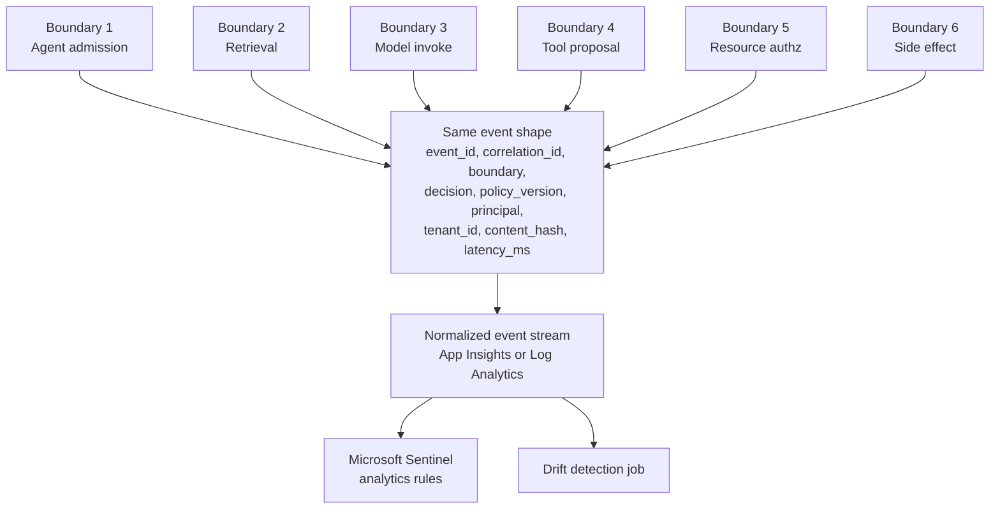

# RFC-016: GenAI Observability — Event Schema, Identity Correlation, and Detection

**Status:** Draft for review
**Owner:** Principal Security Architect, AI Platform
**Reviewers:** AI Platform Eng, Security Engineering, SOC / Detection Engineering, Data Governance
**Target rollout:** Phased — normalized event schema and correlation IDs first, policy-drift detection second
**Related RFCs:** [RFC-014 Microsoft-Native Control-Plane Enforcement](/content/control-plane.md), [RFC-015 Agent Security](/content/agent-security.md)

> **Prerequisite reading:** the [Control-Plane Pattern overview](/content/pattern.md). This RFC defines the evidence model produced by the six enforcement boundaries described there.

> **Rendering note.** This document is authored for two audiences: human reviewers and automated agents / crawlers ingesting the raw Markdown. Diagrams are provided in both a Mermaid block and an ASCII block. When they disagree, the ASCII form is authoritative.

---

## 1. Context: from published guidance to a portfolio pattern

Umesh Nagdev and I published a three-part series on the Microsoft Defender for Cloud Blog, [Securing GenAI Workloads in Azure: A Complete Guide to Monitoring and Threat Protection](https://techcommunity.microsoft.com/blog/microsoftdefendercloudblog/securing-genai-workloads-in-azure-a-complete-guide-to-monitoring-and-threat-prot/4463145), covering how to collect and operationalize security signals from Azure GenAI workloads — application telemetry, Azure OpenAI diagnostic logs, Defender for Cloud, and Microsoft Sentinel, wired through Application Insights and Log Analytics into detection engineering, investigation, and incident response.

That series answers *how to collect signals*. It does not answer the architectural question behind them: *which* signals, in *what shape*, carrying *whose* identity, with *what* evidence of why a decision was made. Two SOC analysts investigating the same incident, working from two enforcement points that emit differently-shaped events, end up reconstructing the same story from scratch every time. This RFC defines the normalized schema that the enforcement points in [RFC-014](/content/control-plane.md) and [RFC-015](/content/agent-security.md) must produce so that the pipeline described in the published series has consistent evidence to consume — not a replacement for that pipeline, its missing input contract.

## 2. What the published series already covers — not repeated here

- Application telemetry instrumentation for GenAI applications.
- Azure OpenAI diagnostic settings and log categories.
- Defender for Cloud's AI Security Posture Management and Threat Protection for AI.
- Microsoft Sentinel analytics rules and workbooks for GenAI threats.
- Application Insights instrumentation patterns.
- Log Analytics workspace design for AI workloads.
- Detection engineering, investigation playbooks, and incident-response process for GenAI incidents.

If none of this exists in your environment yet, start there — this RFC assumes an equivalent collection pipeline and defines what has to flow into it, not how to stand the pipeline up.

## 3. The gap: signals without a common schema don't correlate

Three failure modes recur when every enforcement point defines its own log shape:

- **Attribution collapses.** A request's `user_id` gets logged at the edge, the agent's own identity gets logged at the origin, and neither ever appears in the same event — an investigator has to manually stitch three log sources together to answer "who did this."
- **"Why" is missing even when "what" is present.** Most logs capture that a request was blocked; few capture which policy version made that decision, or why the review band (not block, not allow) was chosen — which is exactly the information a SOC analyst needs to tell a real incident from a false positive.
- **Drift is invisible until it's an incident.** A classifier's score distribution can shift by 15 percentage points over a month with no single request looking anomalous — because nothing is comparing this week's decision distribution to last month's for the same policy version.

## 4. The normalized event schema

Every enforcement point identified in the [Control-Plane Pattern's six boundaries](/content/pattern.md) emits one event per decision, in the same shape, regardless of which boundary it came from.

**ASCII (authoritative):**

```
   Boundary 1        Boundary 2        Boundary 3        Boundary 4        Boundary 5        Boundary 6
   Agent admission   Retrieval         Model invoke      Tool proposal     Resource authz    Side effect
        │                 │                 │                 │                 │                 │
        ▼                 ▼                 ▼                 ▼                 ▼                 ▼
   ┌─────────────────────────────────────────────────────────────────────────────────────────────────┐
   │                     every boundary emits the SAME event shape                                    │
   │   event_id · correlation_id · boundary · decision · policy_version · principal{user,workload,    │
   │   agent} · tenant_id · content_hash · latency_ms · timestamp · sink_signature                     │
   └─────────────────────────────────────────────────────────────────────────────────────────────────┘
                                          │
                                          ▼
                          ┌───────────────────────────────┐
                          │   Normalized event stream      │
                          │   (Application Insights /      │
                          │    Log Analytics custom table)  │
                          └───────────────┬────────────────┘
                                          │
                          ┌───────────────┴────────────────┐
                          ▼                                 ▼
                ┌──────────────────┐              ┌──────────────────────┐
                │ Microsoft Sentinel│              │ Drift detection job  │
                │ analytics rules   │              │ (this RFC, §6)        │
                └──────────────────┘              └──────────────────────┘
```

**Mermaid (renders for humans; source for PNG export):**



### 4.1 Field reference

| Field | Type | Purpose |
|---|---|---|
| `event_id` | UUIDv4 | Unique per emitted event. |
| `correlation_id` | UUIDv4 | Shared across every boundary a single request touches — the join key for reconstructing a full request trace. |
| `boundary` | int (1–6) | Which of the six enforcement boundaries emitted this event. |
| `decision` | enum | `allow` \| `review` \| `block` \| `require_approval`. |
| `policy_version` | string | Signed policy bundle version that produced the decision — required to distinguish "the policy changed" from "the input changed" during an investigation. |
| `decision_reason` | string (enum-like) | Short machine-readable reason code, e.g. `classifier_score_high`, `tenant_filter_denied`, `tool_not_allowlisted`. Never free text containing prompt content. |
| `principal` | object | `{user_id, workload_id, agent_id, delegation_chain}` — see §5. |
| `tenant_id` | string | Resolved from the token, never from the request body (per RFC-014 §3.2). |
| `content_hash` | string (SHA-256) | Hash of the content evaluated, never the content itself — consistent with the ZDR mandate in RFC-014 §1.3. |
| `retrieval_provenance` | array | For boundary 2 events: source document IDs and a `content_source` provenance tag (RFC-014 §3.2). |
| `tool_provenance` | object | For boundary 4/5 events: tool name, argument hash, target resource. |
| `latency_ms` | float | Time spent at this boundary — used for both performance and anomaly detection (a boundary suddenly taking 5x longer can indicate a downstream compromise). |
| `timestamp` | ISO 8601 | Event emission time. |
| `sink_signature` | string | HMAC over the event, chained to the previous event in the same sink partition — see §8. |

A minimal reference implementation of the schema, shared by every enforcement point regardless of which boundary or which language it's implemented in:

```python
# observability/event.py — canonical event schema, shared by every enforcement point
# across all six boundaries. Never add a raw-content field here; anything that
# isn't a hash, an ID, or an enum does not belong in this schema.

from __future__ import annotations

import hashlib
import hmac
import time
import uuid
from dataclasses import asdict, dataclass, field
from enum import Enum


class Boundary(int, Enum):
    AGENT_ADMISSION = 1
    RETRIEVAL = 2
    MODEL_INVOKE = 3
    TOOL_PROPOSAL = 4
    RESOURCE_AUTHZ = 5
    SIDE_EFFECT = 6


class Decision(str, Enum):
    ALLOW = "allow"
    REVIEW = "review"
    BLOCK = "block"
    REQUIRE_APPROVAL = "require_approval"


@dataclass
class Principal:
    user_id: str | None = None
    workload_id: str | None = None
    agent_id: str | None = None
    delegation_chain: list[str] = field(default_factory=list)


@dataclass
class ObservabilityEvent:
    correlation_id: str
    boundary: Boundary
    decision: Decision
    policy_version: str
    decision_reason: str
    principal: Principal
    tenant_id: str
    content_hash: str
    latency_ms: float
    event_id: str = field(default_factory=lambda: uuid.uuid4().hex)
    timestamp: float = field(default_factory=time.time)
    retrieval_provenance: list[dict] = field(default_factory=list)
    tool_provenance: dict | None = None
    sink_signature: str = ""

    def sign(self, key: bytes, prev_signature: str) -> None:
        # HMAC chain: each event's signature covers its own fields plus the
        # previous event's signature, so the sink can detect a deleted or
        # reordered event, not just a tampered field.
        payload = repr(asdict(self)) + prev_signature
        self.sink_signature = hmac.new(key, payload.encode(), hashlib.sha256).hexdigest()
```

## 5. Identity correlation: user, workload, and agent

A single request can carry up to three distinct identities, and collapsing them into one field is the single most common cause of failed attribution during an investigation:

- **User** — the human (or upstream service) that originated the request.
- **Workload** — the application or pipeline making the call on the user's behalf.
- **Agent** — the specific agent identity (RFC-015's Agent ID) that is acting, which may differ from the workload if a supervisor agent has delegated to a subordinate.

The `principal.delegation_chain` field captures the ordered path — user → workload → supervisor agent → subordinate agent — so an investigator reconstructing "who did this" gets the full chain in one query, not a reconstruction exercise across three log sources.

## 6. Evaluation signals and policy-drift detection

Two signals matter beyond individual request decisions:

- **Classifier score distribution over time.** The three-band classifier in RFC-014 §2.3 should have its score distribution tracked per policy version, per tenant. A distribution shift — more requests landing in the review band this week than last, for the same policy version — indicates either an input-population change (new attack pattern, new legitimate use case) or classifier degradation, and both are worth paging on.
- **Decision-outcome drift.** If the same policy version starts producing a different allow/review/block ratio for a statistically similar input population, that's drift in the policy engine or its dependencies (a stale threat-intel feed, a misconfigured bundle), not in the traffic. Comparing `policy_version` against `decision` distribution over a rolling window is how this gets caught before it becomes an incident rather than after.

Neither signal is visible from individual request logs. Both require the normalized schema in §4, aggregated over `policy_version` and `boundary`, which is exactly what the published series' Sentinel and Log Analytics pipeline is built to aggregate — once it has a consistent field to aggregate on.

## 7. Wiring into the existing stack

This is deliberately short: the pipeline is the one described in the published series. This RFC's job is to define what lands in it.

- **Application Insights** — each `ObservabilityEvent` is emitted as a custom event, with `correlation_id` set as the Application Insights operation ID so the existing distributed-tracing view stitches boundaries together automatically.
- **Log Analytics** — events land in a custom table (e.g. `AIObservabilityEvents_CL`) with the schema in §4.1, partitioned by `tenant_id` and `boundary`.
- **Microsoft Sentinel** — analytics rules query the normalized table directly. A rule that would have needed six different queries against six differently-shaped logs becomes one query against one schema:

```kql
// Illustrative — schema names match §4.1, not a literal production query.
AIObservabilityEvents_CL
| where TimeGenerated > ago(7d)
| summarize ReviewRate = countif(decision_s == "review") * 1.0 / count()
    by policy_version_s, tenant_id_s, bin(TimeGenerated, 1d)
| where ReviewRate > 0.15
```

- **Defender for Cloud** — Threat Protection for AI alerts are correlated against this schema by `correlation_id`, so a Defender alert and the control-plane's own decision trail resolve to the same incident timeline instead of two separate ones.

## 8. Evidence integrity and privacy controls

The same two disciplines that govern the audit sink in RFC-014 §1.3 and §2 apply here without exception:

- **Hash, never content.** `content_hash` is a SHA-256 digest. No field in this schema holds a raw prompt, completion, or retrieved document. This is a ZDR requirement, not a storage-cost optimization.
- **HMAC-chained, append-only.** Each event's `sink_signature` covers the previous event's signature (§4.1's reference implementation), so deleting or reordering an event in the sink is detectable, not just theoretically prevented.
- **Retention matches the audit sink's, not the application's.** Observability events are compliance evidence; they follow the retention schedule Governance sets for the audit sink (RFC-014), independent of how long the application itself retains anything.

## 9. What this RFC adds beyond the published series

The published series' contribution was collecting and operationalizing security signals from Azure GenAI workloads — the pipeline, the log sources, the detection rules. This RFC adds the architectural layer that pipeline was missing:

1. **A common event schema across all six enforcement boundaries** — one shape, not six, so a Sentinel rule or an investigator's query works everywhere at once.
2. **Policy version and decision reason on every event** — not just what was decided, but which policy produced it and why, which is what separates "the policy changed" from "the input changed" during an investigation.
3. **User, workload, and agent identity correlation** — a full delegation chain in one field, not a manual join across three log sources.
4. **Retrieval and tool provenance** — which documents were retrieved and which tools were invoked, tagged with enough provenance to support the RAG isolation and tool-authorization controls in RFC-014 and RFC-015.
5. **Detection of policy drift** — comparing decision-outcome distributions against policy version over time, not just alerting on individual anomalous requests.
6. **Evidence integrity and privacy controls** — an HMAC-chained, hash-only sink that meets the same ZDR bar as the rest of the control plane, so the evidence itself is never the leak.

This is a progression, not a rewrite: the published series remains the correct starting point for standing up GenAI monitoring in Azure. This RFC is what to build once that pipeline exists and the next question becomes "can I actually correlate and trust what it's collecting."

## Where to go next

- [The AI Control-Plane Pattern](/content/pattern.md) — the six-boundary model this RFC's schema is built around.
- [RFC-014 Microsoft-Native Control-Plane Enforcement](/content/control-plane.md) — the API Management gateway, AI mediation service, and retrieval/model boundaries that emit boundary 1–3 events.
- [RFC-015 Agent Security](/content/agent-security.md) — tool authorization and delegation chains that emit boundary 4–6 events.
- [Securing GenAI Workloads in Azure: A Complete Guide to Monitoring and Threat Protection](https://techcommunity.microsoft.com/blog/microsoftdefendercloudblog/securing-genai-workloads-in-azure-a-complete-guide-to-monitoring-and-threat-prot/4463145) — the published pipeline this RFC's schema feeds, co-authored with Umesh Nagdev.

