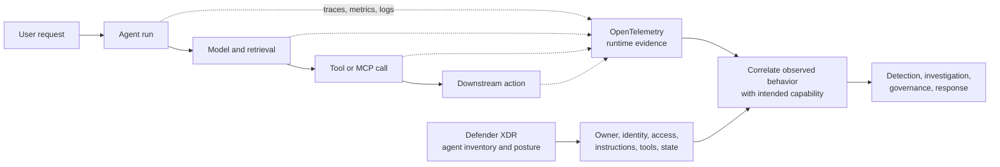

# OpenTelemetry, Agent 365, and Security Observability

> **Core message:** OpenTelemetry records the runtime journey of an agent. Microsoft Agent 365 builds on that open telemetry foundation with agent-aware context. Microsoft Defender XDR adds the security and governance view of the agent itself. Together, they show both **what an agent did** and **what it was configured and allowed to do**.

This page is designed for two uses: read it independently as an introduction, or use the headings and diagrams as a talk track in an architecture or security discussion. For the implementation-level event schema and correlation model, continue to [RFC-016: GenAI Observability](/content/observability.md).

---

## The 30-second explanation

Think of **OpenTelemetry (OTel)** as a flight recorder for a distributed application. It gives applications a vendor-neutral way to emit traces, metrics, and logs and to preserve context as a request crosses services.

That matters more for AI agents because one user request can become a chain of model calls, retrieval operations, tool selections, API calls, and actions. Agent 365 uses the OTel model and adds the agent-specific context needed to describe those runs consistently. Defender XDR complements that runtime evidence with security inventory and posture: the agent's owner, identity, instructions, access, tools, and administrative state.

```text
OpenTelemetry   = What happened during the execution?
Agent 365       = How do we describe and correlate an agent execution consistently?
Defender XDR    = What is this agent, who governs it, and what can it access?
```

The important point is that these are complementary layers, not competing monitoring products.

## 1. Start with OpenTelemetry

Before OTel, teams often depended on product-specific agents, formats, and correlation conventions. OTel standardizes how software **instruments**, **collects**, and **exports** telemetry. It does not, by itself, decide where telemetry must be stored or which security detections should run.

OTel centers on three signals:

| Signal | The question it answers | Agent examples |
|---|---|---|
| **Traces** | What happened during this request? | Agent invocation, model call, retrieval, tool call, downstream API, error location. |
| **Metrics** | How much is happening over time? | Request rate, model latency, token use, tool-call volume, error rate. |
| **Logs** | What detailed event was recorded? | Authentication failure, authorization denial, tool error, orchestration exception. |

The practical value comes from **correlation**. A trace gives one request a shared context and represents each important operation as a span:

```text
User prompt
  -> Agent invocation
    -> Model call
      -> Knowledge retrieval
        -> Tool invocation
          -> External API
            -> Agent response
```

Logs without this context may prove that six events occurred. A trace helps establish that the same agent execution caused all six.

## 2. Why agents make runtime monitoring harder

A conventional application usually follows a path developers selected in code:

```text
Input -> Predetermined business logic -> Output
```

An agent can select its path at runtime:

```text
Input -> Model and orchestration -> Knowledge -> Tool choice -> Action -> Output
```

The model may choose a tool, the tool may call another service, and a connected agent may delegate work again. As a result, monitoring has to preserve more than uptime and latency. Investigators need to reconstruct:

- which agent and user initiated the run;
- which model, knowledge source, tool, and dependency participated;
- where delegation crossed an identity or system boundary;
- which action succeeded, failed, or was denied; and
- how the entire chain relates to a conversation without treating the prompt as the correlation key.

OTel supplies the distributed context needed for that reconstruction. It does not automatically supply every AI, identity, governance, or security field.

## 3. What Agent 365 adds to the OTel foundation

Saying that Agent 365 "extends OTel" is useful shorthand, but the precise meaning matters: **Agent 365 retains the OpenTelemetry data model and adds conventions and agent-specific attributes that make agent runs understandable across supported agent platforms.** It does not replace OTel with a proprietary tracing system.

Agent-aware telemetry can represent concepts such as:

- an agent invocation and its child operations;
- the agent and conversation associated with a run;
- model, retrieval, and tool activity;
- latency, token usage, status, and errors; and
- context that allows activity from the same run to be viewed together.

This creates a common operational story for developers and operators. A trace can show that an agent received a request, called a model, searched a knowledge source, invoked a tool, and received an error from a downstream API.

Agent 365 still depends on good instrumentation and ingestion practices. A successful HTTP response from a telemetry endpoint should not be treated as proof that every span was accepted; validate the per-span ingestion result and monitor for rejected or missing telemetry. Sampling, redaction, retention, and access controls also remain design decisions.

## 4. What Defender XDR adds

Runtime traces answer **what happened**. Security teams also need to know what the agent **is** and what it **could have done**.

Microsoft Defender XDR advanced hunting provides an agent inventory and posture view through the `AgentsInfo` schema. Earlier preview documentation and tenants may refer to this as `AIAgentsInfo`; queries and dashboards should use the table name supported in the target tenant. Agent 365 records are identified by `RegistrySource == "A365"`.

Useful areas of that security context include:

| Security area | Example context | Question answered |
|---|---|---|
| Ownership | Creator, owners, modifier, publisher | Who is accountable for the agent? |
| Intended behavior | Instructions or system prompt | What boundaries was the agent intended to follow? |
| Tools and triggers | Configured actions, MCP tools, action triggers | What can cause the agent to act? |
| Authentication | Authentication type and trigger | How and when is a user authenticated? |
| Access control | Authorized groups, users, capabilities | Who can use the agent and what access is granted? |
| Identity | Agent application, Entra object, blueprint, inventory IDs | Which enterprise principal represents the agent? |
| Model and orchestration | Model, generative orchestration, connected or child agents | How dynamically can it select or delegate work? |
| Administrative state | Published status, blocked state, version, platform | Is the agent active and administratively allowed? |

This is why the XDR view is more than another application dashboard. It supports posture review, threat hunting, incident investigation, and owner-based remediation.

## 5. The combined monitoring model

**ASCII (authoritative):**

```text
                           ONE AGENT SECURITY STORY

  RUNTIME EVIDENCE                                      SECURITY CONTEXT
  OpenTelemetry + Agent 365                             Defender XDR
  -------------------------                             ------------
  conversation and agent IDs                            owner and publisher
  model and retrieval spans                             identity and access
  tool and dependency calls       correlate by IDs      configured tools / MCP
  latency, tokens, status       <------------------>     instructions and auth
  errors and outcomes                                   blocked / published state
              |                                                  |
              +---------------------+----------------------------+
                                    |
                                    v
                     Investigation and detection
                 observed behavior vs. intended capability
```

**Mermaid:**



| Question | Primary view |
|---|---|
| Which model, tool, or dependency was called? | OTel runtime telemetry |
| Where did latency or failure occur? | OTel traces and metrics |
| Who owns or last modified the agent? | Defender XDR agent inventory |
| Which tools and MCP capabilities are configured? | Defender XDR agent inventory |
| Is the agent blocked or broadly accessible? | Defender XDR agent inventory |
| Did observed tool use match configured capability and policy? | Correlation of both views |

## 6. Investigation example: an agent sends data externally

Assume an alert indicates that an agent sent data to an external service.

### Runtime reconstruction

Use the OTel trace to establish:

1. Which user request and agent run preceded the action.
2. Which model and orchestration steps selected the tool.
3. Which tool or MCP server was invoked.
4. Which downstream endpoint was called.
5. Whether the operation succeeded, its latency, and where errors occurred.

### Security and governance reconstruction

Use Defender XDR agent context to establish:

1. Who owns, created, modified, and published the agent.
2. Whether its instructions define appropriate operating boundaries.
3. Whether generative orchestration is enabled.
4. Whether the external tool or MCP capability is configured and still required.
5. Who is authorized to use the agent.
6. Which Entra identity represents it and whether it is blocked.

The runtime trace alone cannot prove that the tool was approved or appropriately scoped. The inventory alone cannot prove that the agent actually used it. Correlating stable agent, conversation, trace, and identity identifiers turns the two records into one investigation timeline.

## 7. A practical discussion walkthrough

For a 10-minute architecture or security conversation, use this sequence:

1. **Start with the three OTel signals.** Traces show the journey, metrics show aggregate behavior, and logs show detailed events.
2. **Show why agents are different.** One prompt can dynamically become retrieval, model, tool, API, and side-effect activity.
3. **Position Agent 365.** It uses the open OTel foundation and adds agent-aware conventions and correlation context.
4. **Add the XDR view.** Runtime behavior is incomplete without ownership, identity, access, tools, instructions, and administrative state.
5. **Use the external-service example.** Ask the group which questions runtime telemetry answers and which require security inventory.
6. **Close on correlation.** The operational goal is to compare observed behavior with intended and authorized capability.

Useful questions to ask the audience:

- Can we follow one agent run across model, retrieval, tool, and downstream service boundaries?
- Can we identify the originating user, workload, and agent without using prompt content?
- Can the SOC find the owner and configured capabilities of the acting agent?
- Can we tell whether a tool call was expected, merely possible, or explicitly unauthorized?
- Do telemetry sampling and retention preserve the evidence needed for an investigation?

## 8. Design requirements that make the model work

- **Keep identifiers consistent.** Reuse stable conversation, trace, agent, user, workload, and Entra identity identifiers across runtime and security records. Do not create disconnected identifier spaces for the same run.
- **Instrument every important boundary.** Model telemetry alone misses retrieval, tool selection, resource authorization, and side effects.
- **Minimize sensitive content.** Prefer IDs, classifications, hashes, and outcome codes over raw prompts, completions, retrieved documents, or tool arguments.
- **Treat telemetry as security data.** Apply access control, regional and retention requirements, integrity controls, and monitoring for collection gaps.
- **Validate ingestion.** Alert on rejected spans and unexpected drops in telemetry volume; transport success is not the same as usable evidence.
- **Plan for schema evolution.** Agent 365 and Defender agent schemas evolve. Validate field and table names in the target tenant before production hunting or dashboards depend on them.
- **Separate current posture from historical fact.** An inventory table may show the agent's current configuration, while a trace represents a past execution. Preserve configuration-change events when an investigation must prove what was configured at execution time.

## 9. The takeaway

> OTel is the open runtime evidence layer. Agent 365 makes that evidence agent-aware and easier to correlate. Defender XDR adds the security inventory and posture needed to interpret it. Effective AI monitoring needs all three perspectives: execution, context, and security.

## Where to go next

- [RFC-016: GenAI Observability](/content/observability.md) — the normalized decision-event schema, identity correlation, detection, and evidence-integrity model.
- [The Secure Agent Lifecycle: Observe and Operate](/content/agent-lifecycle-06-observe-operate.md) — how monitoring and drift detection apply to a running agent.
- [Microsoft Learn: Agent 365 observability concepts](https://learn.microsoft.com/en-us/microsoft-agent-365/developer/observability-concepts) — the Agent 365 OpenTelemetry data model.
- [Microsoft Learn: agent inventory in Defender XDR advanced hunting](https://learn.microsoft.com/en-us/defender-xdr/advanced-hunting-aiagentsinfo-table) — schema details and hunting scenarios; confirm the current table name in your tenant.
- [OpenTelemetry documentation](https://opentelemetry.io/docs/what-is-opentelemetry/) — the vendor-neutral telemetry foundation.
